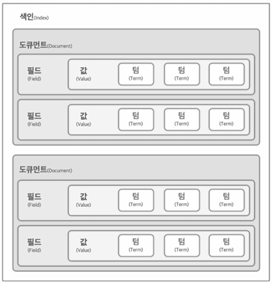

# Elasticsearch 개념과 용어

## Elasticsearch 소개

루씬 기반의 검색엔진으로 복잡한 데이터 셋에서 정보를 신속하고 정확하게 검색하며, APM, 로그, 인프라 메트릭 데이터 분석 부터 시각화 모니터링까지 다양한 데이터 관리를 지원한다. JSON 형식 색인화와 개발자를 위한 RESTful API 및 다양한 언어 SDK를 지원하며, 샤드 개념을 통한 빠른 복구와 데이터 롤업 및 인덱스 수명 주기를 관리할 수 있다.

 - __다기능 검색엔진__: 복잡한 데이터 분석, 실시간 처리 가능
 - __RESTful API 및 확장성__: RESTful API를 통한 쿼리 수행, 다 기종 OS와의 연계
 - __Kibana 연계__: 데이터를 다양한 형태로 시각화, 데이터 분석 및 실시간 모니터링
 - __다양한 산업 분야 활용__: 웹 사용자 경험 개선, 사이버 보안, 문서 검색

## Elastic 에코시스템 이해

### Elastic Stack이 지원하는 기능

 - __자동완성, 필터, 랭킹 기능을 통한 검색결과 제공__: 검색엔진을 활용하여 사용자에게 가장 적합한 결과를 자동 완성, 필터링 및 랭킹 시스템을 통해 제공
 - __강력한 보안 기능__: 인증로그, 감사로그를 활용하여 보안 위협에 대응, 데이터 보호와 신뢰도 향상
 - __APM 도구로서의 역할__: 미들웨어와 애플리케이션 로그 수집 및 관찰을 통한 알람 활용, 애플리케이션 성능 모니터링 수행
 - __풍부한 매트릭스 시각화 기능__: 다양한 데이터를 메트릭스로 시각화하고 통합 분석할 수 있는 기능 제공
 - __서비스 모니터링 기능__: 서비스에 영향을 미치기 전에 자원을 모니터링 체크, 잠재적 문제를 예방하고  시스템의 안정성 및 가용성 향상

### Elastic Stack의 구성요소

Elastic Stack의 각 구성 요소는 단계별로 데이터를 처리한다. 예를 들어, Filebeat가 서버 로그를 수집하면 Logstash가 데이터를 전처리 및 필터링하여 Elasticsearch로 전달하고, Kibana는 Elasticsearch에 저장된 데이터를 시각화한다.

 - __Elasticsearch__
    - 역할: Elastic Stack의 핵심 엔진으로, 데이터를 저장하고 빠르게 검색 및 분석
    - 특징: 분산형 구조로, 데이터를 샤드와 복제본으로 관리해 확장성과 내구성을 보장하며, RESTful API를 통해 JSON 형태의 데이터에 빠른 쿼리를 수행
    - 용도: 로그 데이터, 애플리케이션 검색 엔진, 실시간 분석 및 통계
 - __Logstash__
    - 역할: 데이터 파이프라인 역할로, 다양한 소스에서 데이터를 수집하고 필터링, 변환해 Elasticsearch로 전송
    - 특징: 여러 소스에서 데이터를 수집할 수 있으며, 수집한 데이터를 JSON 형식으로 변환한 뒤 Elasticsearch에 저장, filter 플러그인으로 데이터를 가공하고 원하는 필드로 정리
    - 용도: 로그 데이터 수집, 실시간 ETL(추출, 변환, 적재) 작업
 - __Kibana__
    - 역할: 데이터 시각화 및 대시보드 역할을 하며, Elasticsearch에 저장된 데이터를 쉽게 탐색하고 시각화
    - 특징: 직관적인 사용자 인터페이스로, 검색 결과를 차트, 테이블, 맵 등 다양한 시각화 형태로 제공하며, 실시간 모니터링 대시보드를 구성
    - 주요 용도: 실시간 대시보드 생성, 로그 및 메트릭 데이터 분석, 보안 이벤트 모니터링
 - __Beats__
    - 역할: 경량 데이터 수집 에이전트로, 각 서버의 특정 데이터를 Logstash나 Elasticsearch로 전송하는 역할을 수행
    - 종류: 다양한 종류의 Beats가 있어 목적에 맞게 사용할 수 있다.
        - Filebeat: 로그 파일 수집
        - Metricbeat: 시스템 메트릭(예: CPU, 메모리) 수집
        - Packetbeat: 네트워크 트래픽 정보 수집
        - Winlogbeat: Windows 이벤트 로그 수집
        - Heartbeat: 애플리케이션 가용성 모니터링
        - Auditbeat: 보안 감사 데이터 수집
    - 용도: 분산 환경에서 서버 로그, 메트릭 수집 자동화 및 효율적인 모니터링

## 노드 구성 및 역할의 이해

### 인덱스 구성

 - 인덱스: 데이터 저장 및 검색을 위한 주요 데이터 구조
 - 도큐먼트: 인덱스 내에 JSON 형식의 데이터 기본 단위
 - 필드와 값: 각 문서는 데이터 속성이나 특성을 나타내는 필드로 구성
 - 텀(Term): 필드 내 데이터의단 위로, Elasticsearch에 색인되고 검색 할 단어 저장

    

 

### 노드 개념

Elasticsearch에서 **노드(Node)**는 Elasticsearch 클러스터 내에서 데이터를 저장하고 검색 요청을 처리하는 단일 서버 또는 인스턴스를 말한다. 각 노드는 클러스터의 일부로서 협력하며, 클러스터 내에 여러 개의 노드가 있을 때 성능과 데이터의 안정성이 향상된다.

 - __단일 Elasticsearch 인스턴스__
    - Elasticsearch는 분산 시스템이기 때문에, 여러 대의 서버에 설치된 Elasticsearch 인스턴스들이 모여 하나의 클러스터를 형성한다.
    - 각각의 Elasticsearch 인스턴스는 독립된 노드로서 작동한다.
 - __역할에 따른 노드의 종류__
    - Elasticsearch에서는 노드가 특정 역할을 담당하도록 설정할 수 있습니다. 각 노드의 역할에 따라 분산 처리의 성능과 효율성이 달라집니다. 주로 사용하는 노드 역할은 다음과 같습니다:
    - __마스터 노드 (Master Node)__
        - 클러스터 상태를 관리하고, 인덱스 생성 및 삭제, 노드 추가 및 제거와 같은 관리 작업을 수행합니다.
        - 클러스터 내에 하나 이상의 마스터 후보 노드가 있지만, 오직 하나의 마스터 노드만 활성화 상태로 클러스터를 관리합니다.
    - __데이터 노드 (Data Node)__
        - 실제 데이터를 저장하고, 검색 및 집계 쿼리를 처리합니다.
        - 데이터 노드가 많을수록 데이터 처리 속도가 향상되며, 샤드를 분산 배치해 확장성과 성능을 높일 수 있습니다.
    - __인제스트 노드 (Ingest Node)__
        - 데이터를 Elasticsearch에 저장하기 전에 전처리 작업을 수행합니다. 예를 들어, 데이터를 변환하거나 특정 필드를 추가할 때 사용합니다.
    - __코디네이팅 노드 (Coordinating Node)__
        - 클라이언트 요청을 받아 다른 데이터 노드에 분산하고, 검색 결과를 모아 반환합니다.
        - 모든 노드가 기본적으로 코디네이팅 노드 역할을 할 수 있지만, 이를 전담하는 노드를 구성할 수도 있습니다.
    - __머신 러닝 노드 (Machine Learning Node)__
        - 데이터 이상 탐지나 예측 모델링을 수행하는 노드로, Elastic의 머신 러닝 기능을 사용할 때 지정할 수 있습니다.

#### 마스터 노드

마스터 노드는 Elasticsearch 클러스터의 핵심 관리자로 클러스터의 안정적인 운영을 책임진다. 클러스터 내 인덱스 생성 및 삭제, 노드 관리, 샤드 분배 등 중요한 결정을 내리며, 클러스터의 연속적인 서비스 제공을 위해 적어도 한 개 이상의 마스터 노드가 필요하다. __운영 환경에서는 3개 이상의 마스터 노드를 두어 장애 발생 시 안정적을 보장하는 것을 권장한다.__ 클러스터 상태를 모니터링하며, 필요한 경우 마스터 노드 역할을 수행 할 수 있는 노드로의 전환을 관리한다.  

 - 마스터 노드 선출
    - 마스터 노드는 클러스터의 안정성 유지와 새로운 마스터 노드 선출 과정을 관리
    - 마스터 노드가 장애 발생시 다른 마스터 후보 노드가 새로운 마스터로 선출될 수 있게 마스터 선출 프로세스 진행
    - 운영 환경에서는 마스터 선출을 위해 마스터 후보 노드를 최소 3대 이상 유지하는 것을 권장
    - Voting-only 마스터 후보 노드는 마스터 노드의 선출에만 참여하며, 실제 마스터 노드 역할을 하지 않음
    - elasticsearch.yml 파일을 통해 구성할 수 있으며, 각각의 노드는 마스터 노드의 역할도 가질 수 있다.

#### 데이터 노드

데이터 노드는 Elasticsearch 클러스터에서 데이터를 실제로 저장하고 관리하는 역할을 한다. 색인, 검색, 집계 등을 담당하며, CPU, I/O, 메모리와 같은 하드웨어 리소스를 많이 소모한다. 클러스터 안정성을 위해, 데이터 노드는 적절한 수의 노드를 유지하고 장애 발생 시를 대비해 적절한 샤드 운영을 해야 한다. 데이터 노드의 종류는 여러 가지가 있으며 데이터의 특성과 접근 패턴에 맞게 조정한다. 데이터 노드 구성은 성능 최적화와 클러스터의 안정성, 비용적인 측면에서 직접적인 영향을 끼친다.
 - data_content: 지속적으로 유지되어야 하는 데이터를 저장, 주로 읽기 작업이 많은 검색 및 집계 쿼리에 사용
 - data_hot: 최신 시계열 데이터를 바르게 읽고 쓰는 데 필요하며, 고성능 SSD 같은 저장 장치를 사용하여 최근 데이터 액세스
 - data_warm: 쿼리 빈도가 낮은 데이터를 보관하며, 비용 효율적인 HDD를 사용하여, 몇 주 전 데이터를 저장
 - data_cold: 빠르게 검색할 필요가 없는 오래된 데이터를 보관하며, 필요에 따라 데이터를 이동시켜 저장 공간을 효율적으로 사용
 - data_frozen: 거의 사용되지 않거나 아카이브 목적의 데이터를 저장하며, 데이터 보존이 주된 목적일 때 사용, s3등 보관

#### 인제스트 노드

 - 데이터수집, 가공 및 색인 전달 과정을 관리하는 노드
 - 데이터를 전처리하여 다양한 소스의 데이터를 효과적으로 처리하고, 필터링, 파싱, 변환 등 데이터를 최적화 형식으로 가공
 - 로그, 센서 데이터, 웹 크롤링 결과 등 다양한 데이터 유형을 처리할 수 있으며, 가공된 데이터를 데이터노드에 색인하여 저장
 - 데이터 처리 과정에서 리소스 사용이 높기 때문에 인제스트 노드와 데이터노드들을 분리하여 운영하는 것이 좋음
 - 인제스트 노드는 데이터 노드와 함께 구성되어 데이터 처리 및 색인 프로세스를 효율적으로 수행
