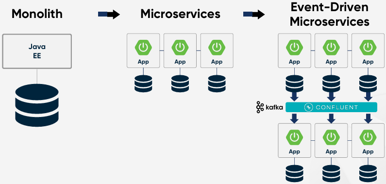

# Apache Kafka 소개

## 1. Apache Kafka 소개

Apache Kafka는 대량의 데이터를 빠르고 안정적으로 처리할 수 있는 분산 메시징 시스템입니다. LinkedIn에서 개발되었으며, 현재는 Apache Software Foundation에서 오픈소스로 관리하고 있습니다. 고성능, 확장성, 내결함성을 제공하여 실시간 데이터 스트리밍 및 이벤트 기반 시스템 구축에 널리 사용됩니다.

### Kafka 탄생 배경

Apache Kafka는 2011년 LinkedIn에서 개발되어 오픈소스로 공개된 분산 메시징 시스템입니다. Kafka가 탄생하게 된 배경은 LinkedIn이 기존 메시징 시스템으로는 해결할 수 없는 문제들에 직면했기 때문입니다.

 - __기존 메시징 시스템의 성능 한계__
    - LinkedIn은 수백만 명의 사용자가 활동하는 대규모 SNS 플랫폼이었으며, 사용자의 행동(예: 프로필 업데이트, 좋아요, 친구 요청, 메시지 전송 등)을 실시간으로 처리해야 했습니다.
    - 당시 RabbitMQ, ActiveMQ 같은 전통적인 메시지 큐(Message Queue) 시스템을 사용했지만, 대량의 데이터를 실시간으로 처리하기엔 성능이 부족했습니다.
    - 기존 메시지 큐는 메시지를 일반적으로 RAM에서 처리하며, 디스크에 저장하는 기능이 제한적이었습니다.
 - __로그 데이터 저장과 분석의 어려움__
    - LinkedIn에서는 사용자의 클릭, 검색, 프로필 조회 등의 이벤트 데이터를 로그로 저장하고 이를 분석하여 추천 시스템 및 광고 타겟팅에 활용하려 했습니다.
    - 하지만 기존의 로그 저장 방식은 파일 기반 시스템(HDFS, RDBMS 등)에 데이터를 저장하고, 배치 프로세싱(Hadoop, MapReduce)으로 분석하는 형태였기 때문에 실시간 분석이 불가능했습니다.
    - 또한, 로그 데이터는 다양한 팀(검색팀, 추천팀, 광고팀 등)에서 필요했는데, 각 팀이 개별적으로 로그 데이터를 복제하고 가공해야 하는 비효율적인 구조였습니다.
 - __확장성과 유지보수 문제__
    - 기존의 메시징 시스템은 __수직 확장(Scale-Up)__ 이 주된 방식이었기 때문에 트래픽이 증가할수록 시스템을 확장하는 것이 어려웠습니다.
    - 트래픽이 급증할 때마다 메시지 큐 서버를 직접 확장해야 했으며, 장애가 발생하면 전체 시스템이 영향을 받는 구조였습니다.

### Kafka의 핵심 설계 원칙

 - __로그 기반 데이터 저장__
    - Kafka는 메시지를 로그 파일(Append-Only Log) 형태로 저장합니다.
    - 전통적인 메시징 시스템과 달리, 메시지를 즉시 삭제하지 않고, 지정된 기간 동안 보관할 수 있습니다.
    - 이를 통해, 여러 Consumer가 같은 데이터를 공유할 수 있고, 메시지 유실 없이 재처리가 가능합니다.
 - __고성능 및 확장성__
    - Kafka는 Topic을 여러 개의 Partition으로 분할하여 데이터를 저장합니다.
    - 각 Partition은 여러 개의 Broker(서버)에서 병렬로 처리되므로 __수평 확장(Scale-Out)__ 이 가능하며, 대량의 데이터를 빠르게 처리할 수 있습니다.
 - __고가용성과 내결함성__
    - Kafka는 Replication(복제) 메커니즘을 활용하여 데이터 손실을 방지합니다.
    - Partition의 Leader-Follower 구조를 통해, 한 노드가 장애가 발생해도 자동으로 대체될 수 있도록 설계되었습니다.
 - __Consumer가 직접 데이터를 관리__
    - 기존 메시징 시스템은 메시지를 소비하면 삭제하지만, Kafka는 메시지를 보관하면서 Consumer가 필요한 시점에 가져가도록 설계되었습니다.
    - Consumer는 __Offset(읽은 메시지의 위치 정보)__ 을 직접 관리할 수 있습니다.
    - 이를 통해 다른 Consumer 그룹이 같은 데이터를 중복해서 사용할 수 있으며, 장애 발생 시 특정 시점에서 재처리할 수 있습니다.

## 2. Microservices and Event Driven Architecture

 - `Monolith Application`
   - 상호 의존적인 부분이 매우 많은 복잡한 애플리케이션
   - 다른 서비스에 영향을 주지 않고 배포하기 어려움
   - 열악한 개발자 경험 및 생산성 저하
   - 서비스 출시 시간 지연 초래
 - `Microservices Application`
   - 여러 개의 더 작은 단일 기능 애플리케이션
   - 독립적으로 배포 및 업그레이드 가능
   - 다른 프로그래밍 언어로 구축 가능
   - 서비스별로 확장 및 축소
   - 더 빠른 서비스 출시
 - `Event-Driven Architecture`
   - 시스템 간의 통신을 이벤트(Event)를 통해 비동기적으로 처리하는 아키텍처
   - Event Producer(이벤트 생산자)가 이벤트를 생성하고, Event Broker(이벤트 브로커, 예: Kafka, RabbitMQ)를 통해 Event Consumer(이벤트 소비자)가 이를 처리
   - 서비스 간의 결합도를 낮추고, 확장성을 높일 수 있음
 - `Microservices + EDA`
   - 서비스 간 의존성을 줄이고, 독립적인 배포 가능
   - 비동기 처리로 성능과 응답성을 높임
   - 확장성(Scalability)이 뛰어나며, 특정 기능만 독립적으로 확장 가능

<div align="center">
   
</div>

### 2-1. 사용 사례

 - `전자상거래 플랫폼 (E-Commerce)`
   - __시나리오__
      - 사용자가 상품을 주문하면, 다양한 서비스(Order, Payment, Inventory, Notification)가 협업하여 주문을 처리해야 함
      - 이를 동기적인 방식으로 처리하면 각 서비스가 API 호출에 의존해야 하고, 장애 발생 시 전체 프로세스가 멈출 위험이 있음
   - __마이크로서비스 구조 (EDA 적용)__
      - Order Service: 주문 생성 및 상태 관리
      - Payment Service: 결제 처리
      - Inventory Service: 재고 확인 및 감소
      - Notification Service: 이메일 및 SMS 알림 발송
   - __장점__
      - 주문 생성, 결제, 재고 관리, 알림 서비스가 독립적으로 운영될 수 있음
      - 주문 프로세스에서 특정 서비스(예: Payment Service)가 다운되더라도, 전체 시스템이 멈추지 않고 이벤트 큐에서 대기 후 재처리 가능
```
Order Service → OrderPlaced 이벤트 발행
Payment Service → OrderPlaced 이벤트 수신 후 결제 처리 → PaymentSuccessful 이벤트 발행
Inventory Service → PaymentSuccessful 이벤트 수신 후 재고 차감 → InventoryUpdated 이벤트 발행
Notification Service → InventoryUpdated 이벤트 수신 후 사용자에게 주문 완료 알림 발송
```

 - `금융 서비스 (Banking & Payment Processing)`
   - __시나리오__
      - 사용자가 계좌 이체를 요청하면, 잔고 확인 → 송금 → 수신자 알림의 흐름이 필요
      - 실시간으로 대량의 트랜잭션을 처리해야 하므로, Event-Driven Architecture를 활용하여 병렬 처리
   - __마이크로서비스 구조 (EDA 적용)__
      - Transaction Service: 계좌 이체 요청 처리
      - Balance Service: 계좌 잔액 검증
      - Notification Service: 이체 완료 알림 발송
   - __장점__
      - 동기 호출을 사용하면 은행 API가 지연되면 전체 시스템이 지연될 위험이 있지만, 이벤트 기반 처리로 이를 완화
      - 비정상 종료 시 이벤트 큐에 저장되어 재처리 가능
```
Transaction Service → TransactionInitiated 이벤트 발행
Balance Service → TransactionInitiated 이벤트 수신 후 잔액 확인 → BalanceVerified 이벤트 발행
Transaction Service → BalanceVerified 이벤트 수신 후 송금 진행 → TransactionCompleted 이벤트 발행
Notification Service → TransactionCompleted 이벤트 수신 후 사용자에게 알림 발송
```

 - `실시간 데이터 처리 (Real-Time Analytics & Logging)`
   - __시나리오__
      - 온라인 서비스(예: YouTube, Netflix)에서 사용자의 동영상 시청 데이터를 실시간 분석하여 추천 시스템을 강화
      - 대량의 이벤트 데이터를 저장하고 분석하는 것이 필요
   - __마이크로서비스 구조 (EDA 적용)__
      - Event Collector: 사용자 행동 데이터를 수집
      - Kafka (Event Broker): 이벤트 스트리밍 처리
      - Analytics Service: 실시간 데이터 분석
      - Recommendation Service: 분석된 데이터를 기반으로 맞춤 추천 제공
   - __장점__
      - 이벤트 기반으로 대량의 로그 데이터를 실시간으로 처리 가능
      - Kafka를 활용한 비동기 처리로 성능 최적화
```
Event Collector → UserWatchedVideo 이벤트 발행
Kafka → 이벤트를 수신하여 Analytics Service로 전달
Analytics Service → UserWatchedVideo 이벤트를 실시간 분석 → RecommendationUpdated 이벤트 발행
Recommendation Service → RecommendationUpdated 이벤트 수신 후 사용자 맞춤 추천 제공
```

 - `IoT & 스마트 홈 시스템`
   - __시나리오__
      - 스마트홈 기기(예: 온도 센서, 도어 센서, 조명 컨트롤러)를 관리하는 시스템이 있음
      - 특정 이벤트(예: 문이 열렸을 때, 특정 온도를 초과했을 때)에 따라 자동화된 작업을 수행
   - __마이크로서비스 구조 (EDA 적용)__
      - Sensor Service: IoT 센서 데이터 수집
      - Event Processing Service: 이벤트 분석 및 규칙 적용
      - Automation Service: 자동화 규칙 실행 (예: 온도 조절, 조명 제어)
   - __장점__
      - IoT 기기와 서버 간 비동기 통신으로 지연을 줄이고, 대량의 데이터를 효율적으로 처리 가능
      - 특정 서비스가 장애가 발생해도 이벤트 큐에서 대기 후 재처리 가능
```
Sensor Service → DoorOpened 이벤트 발행
Event Processing Service → DoorOpened 이벤트 수신 후 규칙 확인
Automation Service → TurnOnLights 이벤트 발행
Smart Light Controller → TurnOnLights 이벤트 수신 후 조명 켜기
```

## 3. Data Mesh

Data Mesh는 데이터를 도메인별로 분산 관리하고, 각 팀이 데이터를 자체적으로 운영할 수 있도록 설계된 아키텍처 패턴입니다. 기존의 중앙 집중식 데이터 레이크(Data Lake)와 데이터 웨어하우스(Data Warehouse) 접근 방식의 한계를 극복하기 위해 등장했습니다.

 - __도메인 중심 데이터 소유권 (Domain-Oriented Ownership)__
   - 데이터는 각 도메인 팀이 직접 관리하고 운영함
   - 예: 금융 서비스에서는 "결제 도메인", "고객 도메인", "거래 도메인" 등으로 분리
 - __데이터를 제품처럼 관리 (Data as a Product)__
   - 데이터를 단순한 저장소가 아니라, 다른 팀에서 사용할 수 있도록 최적화된 제품(Product)처럼 관리
   - 예: API를 제공하거나, 품질 검증을 자동화
 - __자율적인 데이터 플랫폼 (Self-Serve Data Platform)__
   - 팀들이 데이터를 쉽게 활용할 수 있도록 공통 데이터 플랫폼 제공
   - 예: AWS, GCP, Azure 같은 클라우드 기반 인프라에서 데이터 접근 관리 자동화
 - __연합 데이터 거버넌스 (Federated Computational Governance)__
   - 중앙 집중식 거버넌스 없이, 각 도메인이 자체적인 정책을 정의하고 운영
   - 데이터 품질, 보안, 개인정보 보호 등의 기준을 유지

### 3-1. 사용 사례

 - `대규모 전자상거래 플랫폼 (E-Commerce)`
   - 📌 시나리오
      - 글로벌 전자상거래 플랫폼(예: Amazon, eBay)에서 다양한 비즈니스 도메인(상품, 주문, 결제, 배송 등)이 존재.
      - 데이터 팀이 각 도메인의 데이터를 중앙에서 관리하면 병목현상이 발생하고, 팀 간 조율이 어려움.
   - 📌 Data Mesh 적용 방식
      - 각 도메인 팀(상품, 주문, 결제, 배송)이 자신의 데이터 제품(Data Product)을 관리.
      - 모든 데이터는 공통 플랫폼에서 제공하지만, 각 팀이 데이터 파이프라인과 품질 검증을 수행.
   - 📌 이벤트 흐름 예시
      - Order Service가 주문 생성 이벤트 발생.
      - Payment Service가 이를 수신하고, 결제 처리 후 결제 완료 이벤트 발생.
      - Shipping Service는 결제 완료 이벤트를 구독하고 배송 준비.
      - 각 서비스는 자신의 데이터셋을 독립적으로 관리하면서도, 필요할 때 데이터 공유 가능.
   - 📌 장점:
      - 중앙 데이터 팀에 의존하지 않고, 각 도메인이 자체 데이터 운영 가능.
      - 팀 간 협업 없이도 데이터 품질을 유지하고, API를 통해 쉽게 공유 가능.
      - 유연한 확장성으로, 새로운 도메인이 추가되더라도 기존 시스템을 변경하지 않고 확장 가능.

 - `금융 서비스 (Banking & FinTech)`
   - 📌 시나리오:
      - 은행 및 핀테크 기업에서 고객 데이터, 대출 데이터, 결제 데이터, 거래 데이터를 통합 관리해야 함.
      - 기존 데이터 웨어하우스는 고객별 맞춤 금융 서비스 제공이 어려움.
   - 📌 Data Mesh 적용 방식:
      - 각 도메인이 독립적인 데이터 제품을 관리.
      - Customer Data Product: 고객 기본 정보, 신용 점수.
      - Loan Data Product: 대출 신청 및 승인 내역.
      - Transaction Data Product: 고객의 금융 거래 내역.
   - 📌 이벤트 흐름 예시:
      - 고객이 대출 신청 → Loan Data Product에서 신용 점수를 조회.
      - Customer Data Product에서 고객 프로필과 과거 거래 내역을 가져옴.
      - 승인 후, Transaction Data Product에서 대출 실행 및 계좌 이체.
      - 데이터는 각 도메인에서 유지하지만, 필요할 때 API를 통해 상호 작용.
   - 📌 장점:
      - 보안 및 프라이버시 강화: 고객 데이터를 중앙에서 보관하지 않고, 필요한 경우에만 공유.
      - 규제 대응 용이: 각 도메인이 자체적인 컴플라이언스 정책을 적용 가능.
      - 데이터 품질 향상: 각 팀이 직접 데이터 관리하여 정확도 증가.
 - `미디어 & 스트리밍 서비스 (Netflix, YouTube)`
   - 📌 시나리오:
      - 넷플릭스와 유튜브 같은 스트리밍 서비스에서는 사용자의 시청 기록, 추천 시스템, 광고 데이터를 관리해야 함.
      - 기존 데이터 레이크는 분석 속도가 느리고, 실시간 추천 시스템 구축이 어려움.
   - 📌 Data Mesh 적용 방식:
      - User Behavior Data Product: 사용자의 시청 패턴 분석.
      - Recommendation Data Product: 맞춤형 콘텐츠 추천 데이터.
      - Ad Data Product: 광고 성과 데이터.
   - 📌 이벤트 흐름 예시:
      - 사용자가 영상을 시청하면, User Behavior Data Product에 데이터 저장.
      - Recommendation Data Product가 실시간으로 분석하여 추천 리스트 업데이트.
      - 광고 성과가 발생하면 Ad Data Product에서 광고 비용 최적화.
   - 📌 장점:
      - 실시간 분석 가능 → AI 기반 추천 시스템 강화.
      - 데이터 제품화로 확장성 증가 → 새로운 추천 알고리즘 도입 용이.
      - 데이터 사일로 제거 → 팀 간 데이터 공유가 쉬워짐.
