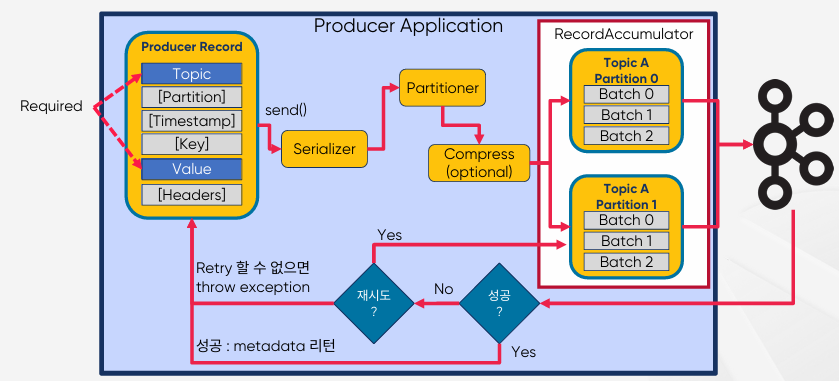
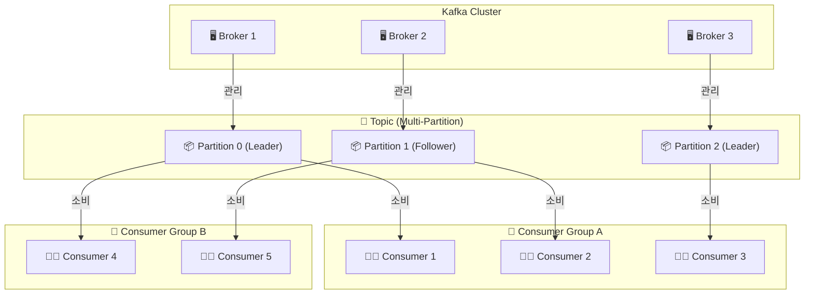

# Apache Kafka 기본 개념 및 이해

## 1. Topic, Partition and Segment

 - __Producer (생산자)__
    - 데이터를 Kafka의 Topic(토픽)에 전송하는 역할
    - 메시지를 하나 이상의 Partition(파티션)에 분배
    - ack=0, ack=1, ack=all 등의 옵션을 통해 데이터 손실 방지 가능
 - __Consumer (소비자)__
    - Topic에서 데이터를 가져와 처리하는 역할
    - Consumer Group 단위로 동작하여 병렬 소비 가능
    - Offset을 관리하여 어디까지 읽었는지 추적 가능
 - __Broker (브로커)__
    - Kafka 클러스터의 핵심 서버 역할
    - 여러 개의 Broker가 분산 환경에서 데이터를 저장 및 관리
    - Partition을 기반으로 메시지를 저장하고, 리더-팔로워(Leader-Follower) 구조로 복제
 - __Topic (토픽)__
    - 메시지가 저장되는 논리적인 단위
    - 하나의 Topic은 여러 개의 Partition(파티션) 으로 나뉨
    - 로그 기반 스토리지 구조(Append-Only Log)로 메시지를 일정 기간 저장
 - __Partition (파티션)__
    - Topic을 여러 개의 파티션으로 나누어 저장
    - 병렬 처리를 지원하여 고속 데이터 처리 및 확장성 제공
    - 각 파티션은 여러 개의 복제본(Replica)을 가질 수 있음

### Kafka 로그 구조

Kafka의 메시지는 Append-Only Log(추가만 가능한 로그) 구조로 저장되며, 하나의 Topic → Partition으로 나뉘고, 각 Partition은 여러 개의 Segment 파일로 구성됩니다.

Kafka에서 __Segment는 Partition 내에서 메시지를 저장하는 물리적인 파일 단위입니다.__

 - 각 Partition은 하나의 Log(로그) 파일처럼 동작.
 - Partition 내부에서 Segment 단위로 분할.
 - 새로운 메시지는 현재 활성 Segment(Active Segment)에 기록됨.
 - Segment 파일이 설정된 크기 또는 기간을 초과하면 새로운 Segment 파일 생성.

 - `Kafka Segment의 구성 요소`
    - Kafka의 Segment 파일은 여러 개의 메시지를 저장하며, 일정 크기나 시간이 지나면 새로운 Segment로 롤링(Rolling)됩니다.
    - *.log: Segment 데이터 파일 (메시지 저장)
    - *.index: Segment의 Offset 인덱스 파일 (검색 속도 향상)
    - *.timeindex: 타임스탬프 기반 인덱스 파일 (시간 기준 조회)
    - *.txnindex: 트랜잭션 인덱스 파일 (트랜잭션 정보 저장)
 - `Segment 파일이 생성되는 조건`
    - __파일 크기(log.segment.bytes) 초과__
        - 기본값: 1GB (log.segment.bytes=1073741824)
        - Segment 파일 크기가 설정된 크기(1GB 등)를 초과하면 새 Segment 생성
    - __설정된 시간(log.roll.ms) 초과__
        - 기본값: 7일 (log.roll.ms=604800000)
        - Segment 파일의 마지막 메시지가 설정된 시간을 초과하면 새 Segment 생성
 - `Segment 파일이 중요한 이유`
    - Kafka에서 Segment는 로그 데이터의 관리, 검색 성능, 메시지 보관 및 삭제(Retention Policy)에 영향을 줍니다.
    - __로그 관리 효율성__
        - 메시지를 Segment 단위로 분할하여 저장하면 파일 시스템 부담 감소
        - 전체 로그 파일을 한번에 삭제하는 것이 아니라, 특정 Segment만 삭제 가능
    - __검색 속도 향상 (Index 활용)__
        - 각 Segment에는 Offset 기반의 Index 파일이 존재하여 빠른 검색 가능
        - 예를 들어, Consumer가 특정 Offset에서 메시지를 읽을 때, Kafka는 Segment 파일 내에서 바로 Offset을 찾음
    - __Retention Policy (데이터 보존 정책)__
        - Kafka는 오래된 데이터를 삭제할 때 Segment 단위로 정리합니다.
        - log.retention.hours=168 (기본값: 7일)
        - log.retention.bytes (기본값: 무제한)
```
# Kafka는 각 Partition의 데이터를 Segment 파일로 저장합니다.
# 00000000000000000000.log: 첫 번째 Segment 파일.
# 00000000000000001000.log: Segment 파일이 설정된 크기/시간을 초과하면 새로 생성.
# .index 파일을 활용하여 Offset 검색 속도 최적화.


/kafka-logs/
│── topicA-0/  # Partition 0의 Segment 파일들
│   ├── 00000000000000000000.log
│   ├── 00000000000000000000.index
│   ├── 00000000000000000000.timeindex
│   ├── 00000000000000001000.log
│   ├── 00000000000000001000.index
│   ├── 00000000000000001000.timeindex
│
│── topicA-1/  # Partition 1의 Segment 파일들
│   ├── 00000000000000000000.log
│   ├── 00000000000000000000.index
│   ├── 00000000000000000000.timeindex
```

### 요약

 - Topic 생성시 Partition 개수를 지정. 개수 변경은 가능하나 운영시에는 변경 비권장
 - Partition 번호는 0부터 시작하고 오름차순
 - Topic 내의 Partition 들은 서로 독립적
 - Event(Message)의 위치를 나타내는 Offset이 존재
 - Offset은 하나의 Partition에서만 의미를 가짐.
 - Offset 값은 계속 증가하고 0으로 돌아가지 않음
 - Event(Message)의 순서는 하나의 Partition내에서만 보장
 - Partition에 저장된 데이터(Message)는 변경이 불가능
 - Partition에 Write되는 데이터는 맨 끝에 추가되어 저장
 - Partition은 Segment File들로 구성
    - log.segment.bytes (기본 1GB)
    - log.roll.hours

## 2. Broker, Zookeeper and KRaft

 - Broker: Kafka의 핵심 서버 역할, 메시지를 저장 및 전송
 - Zookeeper: 기존 Kafka 클러스터 관리 시스템(리더 선출, 메타데이터 관리)
 - KRaft: Zookeeper를 대체하는 Kafka 자체 메타데이터 관리 시스템(더 빠르고 확장 가능)

### 2-1. Broker

Bootstrap 서버를 Broker 서버로 볼 수 있다.

 - `역할`
    - Kafka의 핵심 서버 역할을 하는 구성 요소
    - 메시지를 저장하고 클라이언트(Producer, Consumer)와 통신
    - 여러 개의 Broker가 모여 Kafka 클러스터(Kafka Cluster)를 형성
 - `주요 기능`
    - __토픽과 파티션 관리__
        - Kafka의 데이터 저장소 역할을 하며, 특정 Topic의 Partition을 담당
        - 각 Partition의 리더/팔로워 역할을 분배하여 가용성 확보
    - __메시지 저장 및 전송__
        - Producer로부터 데이터를 받아 로그(Segment 파일)에 저장
        - Consumer가 요청하면 해당 데이터를 전송
    - __파티션 리더 관리__
        - Partition은 리더(Leader)와 팔로워(Follower)로 구성
        - 리더가 메시지를 관리하고, 팔로워는 이를 복제(Replication)
    - __클러스터 간 부하 분산__
        - 여러 개의 Broker를 운영하면 데이터가 자동으로 분산 저장(Partitioning)
        - 특정 Broker 장애 발생 시 다른 Broker가 역할을 대체

### 2-2. Zookeeper (주키퍼)

Zookeeper는 변경사항에 대해 Kafka에 알린다. (Topic 생성/제거, Broker 추가/제거 등)

Zookeeper는 홀수 개의 서버로 작동하게 설계되어 있다. (최소 3개, 권장 5개)

 - `역할`
    - Kafka 클러스터를 관리하는 중앙 조정 시스템
    - Apache Zookeeper를 사용하여 Kafka Broker의 메타데이터와 상태 정보를 관리
 - `주요 기능`
    - __Broker 등록 및 상태 관리__
        - Kafka Broker가 실행되면 Zookeeper에 자신의 존재를 등록
        - Zookeeper는 Broker의 상태(정상/비정상)를 지속적으로 감시
    - __리더 선출(Leader Election)__
        - Partition의 리더를 결정하는 역할
        - 기존 리더가 다운되면 자동으로 새로운 리더를 선출
    - __Kafka 클러스터 설정 정보 저장__
        - Topic, Partition 개수, Offset 정보, ACL 정보 등 메타데이터 저장.
        - 클러스터 변경 사항을 동기화하여 일관성 유지.
    - __Consumer 오프셋 관리 (이전 버전)__
        - Kafka 0.9 이전 버전에서는 Zookeeper가 Consumer의 Offset을 저장
        - 이후 Kafka 0.10부터는 Kafka 내부의 "__consumer_offsets" 토픽에서 관리

### 2-3. KRaft (Kafka Raft)

 - `역할`
    - Kafka 2.8부터 도입된 Zookeeper를 대체하는 자체 메타데이터 관리 시스템
    - Kafka의 Raft Consensus Algorithm을 기반으로 Zookeeper 없이 클러스터를 운영 가능
 - `주요 특징`
    - __Zookeeper 없이 Kafka 클러스터 운영 가능__
        - 기존 Kafka는 Zookeeper에 의존하여 클러스터를 관리했지만, KRaft는 이를 제거
        - Kafka 자체적으로 클러스터 메타데이터를 관리하도록 변경됨
    - __Raft 알고리즘 기반 리더 선출__
        - Kafka 내부에서 Raft 알고리즘을 사용하여 리더를 선출
        - Broker 중 하나가 Controller 노드 역할을 하며, 클러스터를 관리
    - __더 빠른 확장성과 성능 향상__
        - Zookeeper와의 네트워크 통신 부담이 사라짐
        - Kafka 자체적으로 확장성이 증가하고, 클러스터 성능 향상

### 요약

 - Broker는 Partition에 대한 Read 및 Write를 관리하는 소프트웨어
 - Broker는 Topic 내의 Partition 들을 분산, 유지 및 관리
 - 최소 3대 이상의 Broker를 하나의 Cluster로 구성해야 함
    - 4대 이상 권장
    - 업그레이드 등 작업시 Broker를 순차적으로 Shutdown시, 정상 동작을 위함
    - Zookeeper mode가 아닌 KRaft mode 에서는 3대 이상 권장
 - Zookeeper는 Broker, Topic, Partition 들의 목록/설정/상태 등을 관리하는 소프트웨어
 - Zookeeper는 홀수의 서버로 작동하게 설계되어 있음(최소 3, 권장 5)
 - Zookeeper를 사용하지 않는 KRaft mode의 Kafka는 AK 3.3 부터 "production-reeady" 상태

## 3. Producer

Kafka __Producer(생산자)__ 는 Kafka 브로커(Broker)에 데이터를 전송하는 역할을 합니다.

Producer는 특정 Topic으로 메시지를 전송하며, 메시지는 Partition에 저장됩니다.

 - __메시지 생성 및 Kafka 브로커로 전송__
    - Producer는 애플리케이션에서 생성한 데이터를 Kafka로 전송
    - Kafka Topic을 지정하고 메시지를 전송
 - __Partition 할당 (메시지 분배)__
    - 메시지는 Kafka의 Partition(파티션) 에 저장됨
    - Partition을 어떻게 분배할지 결정하는 전략(Partitioner) 사용
 - __메시지 전송 확인 (ACK)__
    - Kafka의 데이터 유실 방지를 위해 ACK 설정을 지원
 - __Batch 처리 및 압축__
    - Batch 전송을 활용하여 성능 최적화
    - 메시지를 압축하여 네트워크 트래픽 감소

### 3-1. Producer 동작 방식

 - __① Producer가 메시지를 생성__
    - 애플리케이션에서 메시지를 생성하고 Kafka로 보낼 데이터를 준비
    - Producer는 메시지와 함께 Key, Value, Timestamp, Partition 정보를 포함할 수 있음.
 - __② 메시지를 Kafka Broker로 전송__
    - bootstrap.servers에 설정된 Kafka Broker 중 하나에 먼저 연결
    - 해당 Broker로부터 Kafka 클러스터의 전체 Broker 및 Partition 정보(메타데이터)를 조회
 - __③ 메시지를 특정 Partition에 저장__
    - Producer가 어떤 Partition에 메시지를 보낼지 결정
    - Partition이 결정되면, Leader Broker에 메시지를 전송
 - __④ 메시지 전송 후 Acknowledgment(ACK) 확인__
    - Kafka는 데이터 유실을 방지하기 위해 ACK(응답) 설정을 제공
    - ACK 설정에 따라 Producer는 메시지 전송을 재시도하거나 성공을 확인

### 3-2. Producer 주요 개념

 - __Topic & Partition (토픽 & 파티션)__
    - Producer는 Topic을 지정하여 메시지를 전송
    - Partitioning(파티션 분배) 전략에 따라 메시지가 특정 Partition에 저장됨
 - __Partitioner (파티셔닝 전략)__
    - Kafka Producer는 어떤 Partition에 메시지를 보낼지 결정해야 합니다.
    - __Default Partitioner (기본 파티셔너)__
        - key 값이 없는 경우: Round Robin 방식으로 균등하게 분배
        - key 값이 있는 경우: 해시(Hash) 기반 분배
    - __Custom Partitioner (사용자 정의)__
        - 특정 조건에 따라 커스텀 파티셔닝 로직을 구현 가능
 - __Acknowledgment (ACK 설정)__
    - Kafka는 메시지 전송의 안정성을 위해 ACK(응답) 옵션을 제공합니다.
    - acks=0 -> Producer는 메시지를 보내고 응답을 기다리지 않음 (빠르지만 데이터 유실 위험)
    - acks=1 -> Leader Partition에만 저장되면 성공 응답 (적절한 성능 & 신뢰성)
    - acks=all -> Leader + 모든 Follower Partition에 복제되면 성공 응답 (가장 안전하지만 속도 저하 가능)
 - __Key-Value 메시지 구조__
    - key 값이 지정되면 같은 Key의 메시지는 같은 Partition에 저장됨
    - key 값이 없으면 Round Robin 방식으로 파티션이 자동 할당됨
 - __Producer의 데이터 전송 방식 (Batch & Compression)__
    - Kafka는 성능 최적화를 위해 Batch 처리 및 메시지 압축을 지원합니다.
    - __Batch 전송 (batch.size)__
        - 여러 메시지를 묶어서 한 번에 전송하여 네트워크 비용 절감
        - 기본값: 16384 (16KB)
    - __압축 전송 (compression.type)__
        - none: 압축 없음 (기본값).
        - gzip: 높은 압축률, CPU 사용량 높음
        - snappy: 빠른 압축, CPU 사용량 낮음
        - lz4: 중간 수준의 성능과 압축률

### 3-3. Kafka Producer의 성능 최적화

 - linger.ms 값 조정 (Batch 크기 설정)
    - 기본적으로 Kafka는 메시지를 바로 전송하지 않고, 일정 시간 동안 Batch를 생성
    - linger.ms=5 (5ms 동안 메시지를 모아서 전송하면 성능 최적화 가능).
 - batch.size 조정
    - batch.size=65536 (64KB)로 설정하여 Batch 크기를 늘려 전송 효율 증가.
 - compression.type 설정
    - compression.type=gzip을 사용하면 네트워크 트래픽 감소 가능.
 - acks=all 사용 (데이터 손실 방지)
    - acks=all 설정 시 데이터 안정성 보장

### 3-4. Kafka Producing 흐름 - 고레벨 아키텍처 설명

 - __Producer Record 생성__
    - Topic: 메시지를 전송할 Kafka Topic
    - Key: Partition을 결정하는 기준 (해시 기반)
    - Value: 전송할 실제 메시지 데이터
    - Headers: 추가 메타데이터 (Optional)
    - Partition: 특정 Partition에 직접 전송 가능 (Optional)
 - __Serializer를 통한 직렬화 (Serialization)__
    - Kafka는 네트워크 전송을 위해 Java 객체를 바이트(Byte) 형태로 변환해야 합니다. 이를 담당하는 것이 Serializer입니다.
    - 기본적으로 Kafka는 JSON, String, Avro 등의 데이터 포맷을 지원
    - Java 객체 → Kafka가 처리할 수 있는 Byte 배열로 변환
 - __Partitioner를 통한 Partition 할당__
    - Kafka Producer는 메시지를 보낼 때 어떤 Partition에 저장할지 결정해야 합니다. 이를 담당하는 것이 Partitioner입니다.
    - Key가 없는 경우: Round Robin 방식으로 분배
    - Key가 있는 경우: Key를 기반으로 해시(Hash) 연산을 수행하여 특정 Partition에 할당
    - 사용자 정의 Partitioner: Custom Partitioner를 적용 가능
 - __압축(Compression) 처리 (옵션)__
    - Kafka Producer는 성능 최적화를 위해 메시지를 압축할 수 있습니다.
    - 압축 과정: 메시지를 Batch 단위로 모음 > 설정된 compression.type에 따라 압축 적용 > 압축된 메시지를 Kafka Broker로 전송
    - 압축을 사용하면 네트워크 트래픽을 줄일 수 있지만, CPU 부하가 증가할 수 있음
 - Batching 및 Broker 전송
    - Kafka는 성능 최적화를 위해 메시지를 Batch 단위로 모아서 전송합니다.
```
1. ProducerRecord 생성  ─────────────────────────► 2. Serializer 직렬화
      (Topic, Key, Value, Header 등 포함)         (Java 객체 → Byte 배열)

3. Partition 할당  ────────────────────────────► 4. 메시지 압축 (옵션)
   (Key 기반 Hashing 또는 Round Robin)       (gzip, snappy, lz4)

5. Batch 및 메시지 전송 ─────────────────────► 6. Kafka Broker 저장
   (batch.size, linger.ms 설정)              (Leader Partition에 저장 후 Replica 복제)

7. ACK 응답 확인
   (acks 설정에 따라 성공 여부 결정)
```

<div align="center">
    
</div>
<br/>

## 4. Consumer

Kafka Consumer(소비자)는 Kafka Broker에 저장된 메시지를 읽고 처리하는 역할을 합니다.

Kafka는 고성능의 분산형 메시징 시스템으로, Consumer가 효율적으로 메시지를 처리할 수 있도록 다양한 기능을 제공합니다.

 - Kafka의 Partition에서 데이터를 소비(Consume)
 - Consumer Group을 통해 병렬 처리 가능
 - Offset(메시지 위치 정보) 관리로 데이터 중복/유실 방지
 - 자동 또는 수동으로 메시지 커밋(Commit) 가능

### 4-1. Consumer 동작 방식

 - __① Kafka Broker와 연결__
    - Consumer는 Bootstrap Servers를 통해 Kafka 클러스터에 연결합니다.
 - __② Consumer Group 참여__
    - Consumer는 특정 Consumer Group에 속합니다.
    - 동일한 Consumer Group 내에서는 Partition이 서로 다른 Consumer에 자동으로 분배됩니다.
 - __③ 메시지 가져오기 (Polling)__
    - Consumer는 Kafka Broker의 특정 Partition에서 메시지를 가져옴.
    - Kafka는 Push 방식이 아닌 Pull 방식을 사용.
 - __④ 메시지 처리__
    - Consumer는 메시지를 파싱 및 비즈니스 로직을 적용하여 처리합니다.
 - __⑤ Offset Commit (처리된 메시지 확인)__
    - Consumer가 메시지를 처리한 후 Offset(읽은 위치 정보)을 저장하여, 이후 중복 없이 메시지를 계속 읽을 수 있도록 함.

### 4-2. Consumer 주요 개념

 - `Topic & Partition`
    - Kafka의 데이터는 Topic 단위로 저장되며, 각 Topic은 여러 개의 Partition으로 구성됨
    - Consumer는 각 Partition에서 메시지를 읽음
    - Partition이 여러 개일 경우, Consumer는 분산 처리 가능
 - `Consumer Group (컨슈머 그룹)`
    - Consumer Group은 하나 이상의 Consumer가 그룹을 이루어 메시지를 처리하는 방식
    - 같은 Consumer Group 내에서는 동일한 메시지를 중복 소비하지 않음
    - Consumer Group을 사용하면 다수의 Consumer가 병렬로 메시지를 처리할 수 있어 성능이 향상됨
 - `Offset 관리 (메시지 위치 저장)`
    - Kafka는 Offset(읽은 메시지 위치)을 저장하여 중복 없이 데이터를 읽을 수 있도록 관리합니다.
    - auto.commit=true → Kafka가 자동으로 Offset 저장 (기본값)
    - auto.commit=false → 사용자가 직접 Offset을 Commit해야 함
    - auto.offset.reset=earliest: Consumer가 처음 시작하면 가장 처음 메시지부터 읽음
    - auto.offset.reset=latest: Consumer가 처음 시작하면 새로운 메시지만 읽음
    - auto.offset.reset=none: Offset이 없으면 오류 발생
 - `Polling & Heartbeat`
    - poll()을 호출하여 메시지를 가져옴.
    - Consumer는 주기적으로 Heartbeat(하트비트) 신호를 전송하여 Broker가 해당 Consumer가 정상적으로 실행 중인지 확인.
    - 하트비트가 실패하면, Kafka는 해당 Consumer가 비정상 종료되었다고 판단하고 Partition을 재할당.

### 4-3. Consumer 최적화 방법

 - `배치 메시지 처리 (max.poll.records)`
    - 한 번의 poll() 호출에서 가져오는 메시지 개수를 조정하여 성능 최적화 가능
```
max.poll.records=500
```

 - `Prefetch 사용 (fetch.min.bytes)`
    - 네트워크 오버헤드를 줄이고, 더 큰 데이터 블록을 한 번에 가져올 수 있음
```
fetch.min.bytes=1048576  # 최소 1MB 단위로 가져오기
fetch.max.wait.ms=500  # 500ms 동안 기다린 후 데이터 전송
```

 - `Offset Commit 최적화 (enable.auto.commit=false)`
    - 자동 커밋은 데이터 유실 가능성이 있기 때문에, 수동 커밋이 추천됨
    - commitSync()는 안전하지만 느리고, commitAsync()는 빠르지만 실패 가능성이 있음
```
consumer.commitAsync();
```

 - `Consumer Group을 활용한 병렬 처리`
    - Partition 개수 >= Consumer 개수 → Consumer가 병렬로 데이터 처리 가능

### 4-4. Consumer Group

Kafka Consumer Group(컨슈머 그룹)은 여러 개의 Consumer가 하나의 그룹을 이루어 메시지를 병렬로 처리할 수 있도록 하는 구조입니다.

Consumer Group을 활용하면 대용량 데이터 처리를 효과적으로 분산할 수 있으며, 같은 메시지를 중복 소비하지 않고 효율적으로 처리할 수 있습니다.
 - `주요 특징`
    - 메시지 병렬 처리 가능
    - 각 Partition은 하나의 Consumer에만 할당됨 (같은 Group 내에서는 메시지 중복 소비 없음)
    - Consumer 수가 Partition 개수보다 많으면 일부 Consumer는 대기 상태
    - Consumer 장애 발생 시 자동으로 다른 Consumer가 Partition을 재할당 (Rebalancing)
 - `메시지 순서`
    - __파티션이 2개 이상, 컨슈머가 1개인 경우__
        - 메시지에 대한 순서 보장이 불가능하다.
        - 파티션을 1개로 구성하면 컨슈머가 1개여도 메시지 순서 보장이 가능하지만, 처리량이 저하된다.
    - __Key를 사용하여 Partition별 메시지 순서 보장__
        - 동일한 Key를 가진 메시지는 동일한 Partition에만 전달되어 Key 레벨의 순서 보장 가능
        - 멀티 Partition 사용 가능 = 처리량 증가
        - 운영중에 Partition 개수를 변경하면 순서 보장이 되지 않는다. Partition 개수와 Consumer 개수가 동일해야 한다.
 - `Cardinality`
    - 특정 데이터 집합에서 유니크(Unique)한 값의 개수
    - Key 선택이 잘 못되면 작업 부하가 고르지 않을 수 있다.
    - Key는 Integer, String 등과 같은 단순한 유형일 필요가 없다.
    - 따라서, Partition 전체에 Record를 고르게 배포하는 Key를 만드는 것이 중요
 - `Consumer Failure`
    - 파티션과 컨슈머 그룹의 컨슈머가 n:n개가 매핑되었을 때
    - 컨슈머 하나가 죽으면, 살아있는 컨슈머 중에 하나가 실패한 Consumer를 대신하여 Partition에서 데이터를 가져와서 처리하게 된다.
    - 이러한 경우에도 Partition은 항상 Consumer Group 내의 하나의 Consumer에 의해서만 사용되어 메시지 순서가 보장된다.
 - `다이어그램`
    - __Kafka Cluster__
        - Kafka는 여러 개의 Broker(브로커)로 구성된 클러스터에서 동작합니다.
        - 브로커는 Kafka 메시지를 저장하고 관리하는 서버입니다.
    - __Topic & Multi-Partition__
        - Kafka의 메시지는 Topic(토픽) 단위로 관리됩니다.
        - 각 Topic은 여러 개의 Partition(파티션)으로 나뉘어 저장됩니다.
        - 특정 Broker가 Partition의 Leader 역할을 수행하고, 다른 Broker가 Follower 역할을 수행할 수도 있습니다.
    - __Consumer Group__
        - 같은 Consumer Group에 속한 Consumer들은 하나의 메시지를 나눠서 소비합니다.
        - Partition 개수보다 Consumer 수가 적으면 일부 Consumer는 여러 개의 Partition을 가져갑니다.
        - Partition 개수보다 Consumer 수가 많으면 일부 Consumer는 대기 상태가 됩니다.
    - __추가 설명__
        - Partition 개수 ≥ Consumer 개수 → Consumer들이 메시지를 병렬로 처리.
        - Partition 개수 < Consumer 개수 → 일부 Consumer가 Partition을 여러 개 할당받음.
        - Consumer Group을 사용하면 동일한 메시지가 중복 소비되지 않음.


### 요약

 - Consumer가 자동이나 수동으로 데이터를 읽은 위치를 commit하여 다시 읽음을 방지
 - consumer_offsets 라는 Internal Topic에서 Consumer Offset을 저장하여 관리
 - 동일한 group.id로 구성된 모든 Consumer들은 하나의 Consumer Group을 형성
 - 다른 Consumer Group의 Consumer들은 분리되어 독립적으로 작동
 - 동일한 Key를 가진 메시지는 동일한 Partition에만 전달되어 Key 레벨의 순서 보장 가능
 - Key 선택이 잘 못되면 작업 부하가 고르지 않을 수 있음
 - Consumer Group 내의 다른 Consumer가 실패한 Consumer를 대신하여 Partition에서 데이터를 가져와서 처리함

## 5. Replication

Kafka의 Replication(복제)은 데이터의 가용성과 내결함성(Fault Tolerance)을 보장하기 위한 핵심 메커니즘입니다.

Replication을 통해 Kafka 클러스터 내에서 데이터를 여러 Broker에 복제하여, 장애 발생 시에도 데이터 손실을 방지하고 서비스 지속성을 유지할 수 있습니다.

__Follwer는 Broker 장애시 안정성을 제공하기 위해서만 존재.__ Follower는 Leader의 Commit Log에서 데이터를 가져오기 요청으로 복제. (리더에서 팔로워로 PUSH가 아닌, 팔로워에서 리더의 데이터를 조회하여 관리)

 - Replication(복제)은 하나의 Partition 데이터를 여러 Broker에 복사하여 유지하는 기능입니다.
 - Kafka에서는 각 Partition이 Leader와 Follower Replica로 구성됩니다.
 - Replication Factor(복제 계수) 값을 설정하여 데이터가 몇 개의 Broker에 복제될지 결정합니다.

### 5-1. Replication 기본 개념

 - `Replication Factor (복제 계수)`
    - replication.factor=n 값을 설정하여 데이터 복제 개수를 결정할 수 있습니다.
    - 예를 들어, replication.factor=3이면 하나의 Partition 데이터가 총 3개의 Broker에 저장됨.
    - Replication Factor는 Broker 개수보다 클 수 없음. Kafka 클러스터에 3개의 Broker가 있다면 최대 3개까지 복제 가능
```bash
bin/kafka-topics.sh --create --topic my-topic --partitions 3 --replication-factor 3 --bootstrap-server localhost:9092
```

 - `Leader & Follower Replica`
    - Leader Replica: Producer와 Consumer가 데이터를 주고받는 메인 Partition.
    - Follower Replica: Leader의 데이터를 복제(Replication)하여 저장.
    - Kafka 클러스터 내에서 Leader는 항상 단 하나
    - Follower들은 Leader의 데이터를 주기적으로 복제(Sync)하여 장애 발생 시 대비
 - `ISR (In-Sync Replica)`
    - ISR(In-Sync Replicas)는 Leader와 동기화된 Follower들의 목록을 의미합니다.
    - Kafka는 ISR에 포함된 Follower만 Leader가 장애 시 승격될 수 있도록 허용합니다.
    - ISR은 일정 시간 동안 데이터 동기화에 실패한 Follower를 제거하여 데이터 일관성을 유지합니다.
```
ISR = { Leader, Follower1, Follower2 }

# 만약 Follower1이 네트워크 장애로 인해 동기화되지 않는다면?
ISR = { Leader, Follower2 }  # Follower1이 제거됨
```
 - `AR (Assigned Replicas)`
    - AR(Assigned Replicas)는 해당 Partition을 복제하는 모든 Replica 목록.
    - ISR은 AR의 서브셋이며, ISR에는 Leader와 정상적으로 동기화된 Follower Replica만 포함됨.
```
AR = { Leader, Follower1, Follower2 }
ISR = { Leader, Follower1 }  # Follower2가 장애로 인해 ISR에서 제외됨
```

### 5-2. Replication 동작 과정

 - __① Producer가 메시지를 Leader Partition에 전송__
    - Producer는 항상 Leader Partition에만 데이터를 전송합니다.
    - Follower들은 Leader로부터 데이터를 복제(Replication)하여 유지합니다.
 - __② Follower Replica가 Leader의 데이터를 복제__
    - Follower들은 주기적으로 Leader의 로그 데이터를 Pull하여 동기화합니다.
 - __③ ISR에서 동기화되지 않은 Follower 제거__
    - 특정 시간(replica.lag.time.max.ms) 동안 Follower가 Leader와 동기화되지 않으면 ISR에서 제거됨.
 - __④ Leader 장애 발생 시 새로운 Leader 선출__
    - 기존 Leader가 장애 발생하면 ISR 내의 Follower 중 하나가 자동으로 새로운 Leader가 됨.
    - Zookeeper 또는 KRaft가 새로운 Leader를 선출하는 역할을 수행.

### 5-3. Replication 최적화

 - __Replication Factor 설정__
    - 기본적으로 3을 추천 (replication.factor=3).
    - Broker 장애가 발생해도 최소한의 가용성을 유지 가능.
 - __Min ISR 최적화__
    - 너무 높은 값을 설정하면 Producer가 메시지를 전송하지 못할 수 있음.
    - 기본적으로 min.insync.replicas=2가 추천됨.
 - __Rebalancing 최소화__
    - Rebalancing이 자주 발생하면 성능 저하.
    - replica.lag.time.max.ms 값을 조정하여 ISR 유지 시간을 최적화.

### 요약

 - Partition을 복제하여 다른 Broker 상에서 복제물을 만들어서 장애를 미리 대비
 - Replicas는 Leader Partition, Follower Partition으로 구분
 - Producer는 Leader Partition에만 Write하고 Consumer는 Leader Partition으로부터만 Read 함
 - Follower는 Leader의 Commit Log에서 데이터를 가져오기 요청으로 복제
 - 복제본은 최대한 Rack 간에 균형을 유지하여 Rack 장애 대비하는 Rack Awareness 기능이 있음

## 6. In-Sync Replicas

Kafka에서 ISR(In-Sync Replicas)는 현재 Leader Partition과 정상적으로 동기화(Sync)된 Follower Replicas의 집합을 의미합니다.

__ISR 목록에 있는 Follower만 장애 발생 시 새로운 Leader로 승격될 수 있다.__

 - ISR은 Kafka의 데이터 내결함성(Fault Tolerance)과 가용성(High Availability)을 보장하는 핵심 메커니즘입니다.
 - ISR에 포함된 Follower Replica만 장애 발생 시 Leader로 승격될 수 있습니다.
 - ISR은 지속적으로 동기화되며, 특정 시간 동안 동기화되지 않는 Follower는 ISR에서 제거됩니다.

### 6-1. replica.lag.max.messages 사용시 문제점

 - __replica.lag.max.messages로 ISR 판단시 나타날 수 있는 문제점__
    - 메시지가 항상 일정한 비율(3msg/sec 이하)로 Kafka로 들어올 때, replica.lag.max.messages=5로 하면 5개 이상으로 지연되는 경우가 없으므로 ISR들이 정상적으로 동작
    - 메시지 유입량이 갑자기 늘어날 경우(10msg/sec), 지연으로 판단하고 OSR(Out-of-Sync Replica)로 상태를 변경시킴
    - 실제 Follower는 정상적으로 동작하고 단지 잠깐 지연만 발생했을 뿐인데, replica.lag.max.messages 옵션을 이용하면 OSR로 판단하게 되는 문제가 발생 (운영 중에 불필요한 error 발생 및 그로 인한 불필요한 retry 유발)
 - __replica.lag.time.max.ms로 판단해야 함__
    - Follower가 Leader로 Fet초 요청을 보내는 Interval을 체크
    - 예시: replica.lag.time.max.ms=10000 이라면 Follower가 Leader로 Fetch 요청을 10000ms(10초)내에만 요청하면 정상으로 판단. Follower가 10초 동안 Leader와 동기화되지 않으면 ISR에서 제외됨.
    - Confluent에서는 복잡성을 제거하기 위해 replica.lag.time.max.ms 옵션만 제공

### 6-2. Consumer 관련 Position들

Kafka에서 Offset은 Partition 내에서 메시지의 고유한 위치(번호) 를 의미합니다.

Consumer는 Offset을 기반으로 메시지를 읽으며, 이를 통해 중복 없이 데이터를 소비 가능합니다.

__Consumer는 Committed된 메시지만 읽을 수 있다.__

 - __Last Committed Offset__: Consumer가 마지막으로 커밋한 Offset (Kafka에 안전하게 저장됨)
   - Consumer가 마지막으로 Kafka에 저장한(Commit) Offset을 의미합니다.
   - Consumer가 장애 발생 후 재시작하면 이 Offset부터 다시 읽기 시작합니다.
```
# ✔ Consumer가 메시지를 읽고 Offset 5까지 Commit했다면, 
# Consumer가 다시 시작될 때 Offset 5 이후부터 읽기 시작.

Partition 0:
Messages:  [0] [1] [2] [3] [4] [5] [6] [7] [8] [9]
             ^                  ^
        Commit(2)           Commit(5)
```

 - __Current Position__: Consumer가 다음에 읽을 메시지의 Offset (Last Committed Offset + 1)
   - Consumer가 다음에 읽을 메시지의 Offset을 의미합니다.
   - poll() 호출 시 이 위치에서 메시지를 가져옵니다.
```
Last Committed Offset: 5
Current Position: 6  (Next poll() 호출 시 Offset 6부터 메시지 읽기)
```

 - __High Water Mark (HWM)__: Consumer가 읽을 수 있는 가장 최신 Offset (ISR이 동기화된 가장 마지막 위치)
   - Consumer가 현재 읽을 수 있는 가장 최신 Offset을 의미합니다.
   - ISR(In-Sync Replicas)에 동기화된 가장 최신 메시지의 Offset.
   - HWM 이전의 메시지만 Consumer가 읽을 수 있음.
```
# ✔ HWM이 6이라면, Consumer는 Offset 6 이전의 메시지만 읽을 수 있음.
# ✔ Offset 7~9는 아직 Follower Replicas와 동기화되지 않아 읽을 수 없음.

Partition 0:
Messages:  [0] [1] [2] [3] [4] [5] [6] [7] [8] [9]  (전체 로그)
                                ^
                         High Water Mark (HWM)
```

 - __Log End Offset (LEO)__: Broker에 저장된 가장 최신 메시지의 Offset
   - Broker(Partition Leader)가 저장한 가장 최신 메시지의 Offset을 의미합니다.
   - Kafka에서 메시지가 Append-Only Log 구조로 저장되므로, 새로운 메시지가 추가될 때마다 증가.
```
# LEO는 Kafka에 기록된 가장 마지막 메시지의 Offset을 나타냄.

Partition 0:
Messages:  [0] [1] [2] [3] [4] [5] [6] [7] [8] [9]
                                            ^
                                     Log End Offset (LEO)
```

 - __Offset 개념 간의 관계__
```
# ✔ Last Committed Offset = 2
# ✔ Current Position = 6 → Consumer가 다음으로 읽을 메시지
# ✔ High Water Mark (HWM) = 5 → 현재 Consumer가 읽을 수 있는 최신 Offset
# ✔ Log End Offset (LEO) = 9 → Kafka Broker에 저장된 가장 최신 메시지

Partition 0:
Messages:  [0] [1] [2] [3] [4] [5] [6] [7] [8] [9]
             ^         ^         ^         ^
        Commit(2)   HWM(5)     Position(6)  LEO(9)
```

### 요약

 - In-Sync Replicas(ISR)는 High Water Mark 라고 하는 지점까지 동일한 Replicas의 목록
 - High Water Mark(Committed): ISR간에 복제된 Offset
 - Consumer는 Committed 메시지만 읽을 수 있음
 - Kafka Cluster 내의 Broker 중 하나가 Controller가 됨
 - Controller는 Zookeeper를 통해 Broker Liveness를 모니터링
