# Apache Kafka 심화 개념 및 이해

## 1. Producer Acks, Batch, Page Cache and Flush

### 1-1. Acks(Acknowledgements)

Kafka에서 acks 설정은 메시지 전송의 안정성(내구성)을 결정합니다.

 - `acks=0`
    - ack가 필요하지 않음. 이 수준은 자주 사용되지 않음. 메시지 손실이 다소 있더라도 빠르게 메시지를 보내야 하는 경우에 사용.
    - Producer는 브로커의 응답을 기다리지 않음.
    - 가장 빠르지만, 데이터 손실 가능성이 큼.
 - `acks=1`
    - Leader가 메시지를 수신하면 ack를 보냄. Leader가 Producer에게 ACK를 보낸 후, Follower가 복제하기 전에 Leader에 장애가 발생하면 메시지가 손실. "At most once(최대 한 번)" 전송을 보장
    - Leader 파티션만 메시지를 수신하면 성공으로 간주.
    - 중간 수준의 안정성과 성능.
 - `acks=all 또는 acks=-1`
    - 메시지가 Leader가 모든 Replica까지 Commit 되면 ack를 보냄. Leader를 잃어도 데이터가 살아남을 수 있도록 보장. 그러나 대기 시간이 더 길고 특정 실패 사례에서 반복되는 데이터 발생 가능성이 있음. "At least once(최소 한 번)" 전송을 보장
    - 메시지가 Leader와 ISR(In-Sync Replica) 전체에 복제된 후 성공 응답.
    - 가장 안전하지만 가장 느림.

### 1-2. Retry

재시도(retry)는 네트워크 또는 시스템의 일시적인 오류를 보완하기 위해 모든 환경에서 중요하다.

 - __acks=0에서 retry는 무의미하다.__
 - `retries`
    - 메시지를 send하기 위해 재시도하는 횟수
    - 기본값: MAX_INT
 - `retry.backoff.ms`
    - 재시도 사이에 추가되는 대기 시간
    - 기본값: 100
 - `request.timeout.ms`
    - Producer가 응답을 기다리는 최대 시간
    - 기본값: 30,000(30초)
 - `delivery.timeout.ms`
    - send() 후 성공 또는 실패를 보고하는 시간의 상한
    - 기본값: 120,000(2분)

### 1-3. Batching

Producer는 여러 메시지를 하나의 배치로 묶어 전송하여 네트워크 효율을 높입니다. Batch 처리는 RPC 수를 줄여서 Broker가 처리하는 작업이 줄어들기 때문에 더 나은 처리량을 제공한다.

 - `batch.size`
    - 하나의 파티션에 대해 버퍼링할 메시지 크기(Byte)
    - 기본값: 16KB
 - `linger.ms`
    - 배치가 꽉 차지 않더라도 최대 지연 시간(ms) 동안 대기 후 전송
    - 기본값: 0ms

<div align="center">
    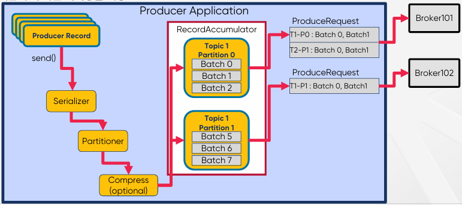
</div>
<br/>

#### Delivery Timeout

<div align="center">
    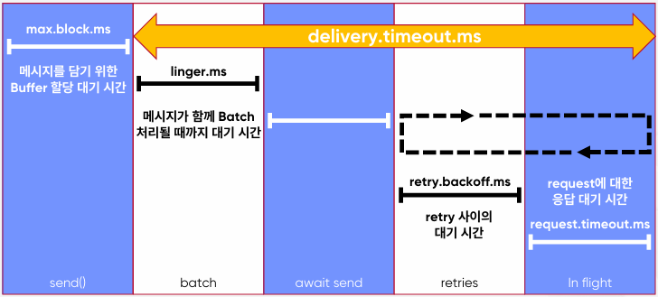<br/>
    send() 후 성공 또는 실패를 보고하는 시간의 상한<br/>
</div>
<br/>

#### Message Send 순서 보장

 - 진행 중(in-flight)인 여러 요청(request)을 재시도하면 순서가 변경될 수 있음
 - 메시지 순서를 보장하려면 Producer에서 enable.idempotence를 true로 설정

### 1-4. Page Cache (OS Page Cache)

Kafka는 메시지를 디스크에 쓰되, 디스크 I/O를 최적화하기 위해 OS의 Page Cache를 활용합니다.

 - 메시지는 Partition에 기록됨
 - Partition은 Log Segment File로 구성 (기본값: 1GB마다 새로운 Segment 생성)
 - 성능을 위해 Log Segment는 OS Page Cache에 기록됨
 - 로그 파일에 저장된 메시지의 데이터 형식은 Broker가 Producer로부터 수신한 것, 그리고 Consumer에게 보내는 것과 정확히 동일하므로 Zero-Copy가 가능
 - Page Cache는 다음과 같은 경우 디스크로 Flush 됨
    - Broker가 완전히 종료
    - OS Background Flusher Thread 실행
```
메시지는 브로커에서 메모리 버퍼(Page Cache)로 먼저 기록
이후 OS가 알아서 디스크로 Flush (sync) 처리
acks=all이라 하더라도 메시지가 실제 디스크에 기록되지 않았을 수 있음
```

### 1-5. Flush

Flush는 메시지를 Page Cache → 실제 디스크에 쓰는 작업입니다.

 - log.flush.interval.messages: N개의 메시지마다 flush 수행
 - log.flush.interval.ms: N ms마다 flush 수행
 - log.flush.scheduler.interval.ms: flush 스케줄러가 주기적으로 체크하는 간격

#### Flush 되기 전에 Broker 장애가 발생하면?

 - OS가 데이터를 디스크로 Flush 하기 전에 Broker의 시스템 장애가 발생하면 해당 데이터가 손실됨
 - Partition이 Replication(복제)되어 있다면, Broker가 다시 온라인 상태가 되면 필요시 Leader Replica(복제본)에서 데이터가 복구됨
 - Replication이 없다면, 데이터는 영구적으로 손실될 수 있음

#### Kafka 자체 Flush 정책

 - 마지막 Flush 이후의 메시지 수(log.flush.interval.messages) 또는 시간(log.flush.interval.ms)으로 Flush(fsync)를 트리거하도록 설정할 수 있음
 - Kafka는 운영 체제의 background Flush 기능(예: pdflush)을 더 효율적으로 허용하는 것을 선호하기 때문에 이러한 설정은 기본적으로 무한(기본적으로 fsync비활성화)으로 설정
 - 이러한 설정을 기본값으로 유지하는 것을 권장
 - *.log 파일을 보면 디스크로 Flush된 데이터와 아직 Flush되지 않은 Page Cache (OS Buffer)에 있는 데이터가 모두 표시됨
 - Flush된 항목과 Flush되지 않은 항목을 표시하는 Linux 도구(예: vmtouch)도 있음

## 2. Replica Failure

### 2-1. In-Sync Replicas 리스트 관리

메시지가 ISR 리스트의 모든 Replica(복제본)에서 수신되면 Commit 된 것으로 간주한다. Leader는 Kafka Cluster의 Controller에 의해 모니터링되는 ZooKeeper의 ISR 목록에 대한 변경 사항을 유지한다. n개의 Replica가 있는 경우 n-1개의 장애를 허용할 수 있다.

 - `Follower가 실패하는 경우`
    - Leader에 의해 ISR 리스트에서 삭제
    - Leader는 새로운 ISR을 사용하여 Commit
 - `Leader가 실패하는 경우`
    - Controller는 Follower 중에서 새로운 Leader를 선출
    - Controller는 새 Leader와 ISR 정보를 먼저 ZooKeeper에 Push한 다음 로컬 캐싱을 위해 Broker에 Push
 - `ZooKeeper에 ISR 업데이트, Controller가 ZooKeeper로부터 수신`
    - Follower가 너무 느리면 Leader는 ISR에서 Follower를 제거하고 ZooKeeper에 ISR을 유지
    - Controller는 Partition Metadata에 대한 변경 사항에 대해서 ZooKeeper로부터 수신
 - `Partition Leader가 없으면`
    - Partition에 Leader가 없으면 Leader가 선출될 때까지 해당 Partition을 사용할 수 없게 됨
    - Producer의 send()는 retries 파라미터가 설정되어 있으면 재시도함
    - 만약, retries=0 이면, NetworkException이 발생함


## 3. Replica Recovery 상황

### 3-1. acks=all의 중요성

 - 3개의 Replica로 구성된 하나의 Partition이 존재
 - Producer가 M1, M2, M3, M4 4개의 메시지를 전송한 상태
    - 메시지 M1, M2가 ISR 리스트 전체에 복제 및 Commit
    - Follower Y는 M3를 복제했지만 Commit은 못한 상태
    - Follower Z는 M2까지만 복제한 상태

<div align="center">
    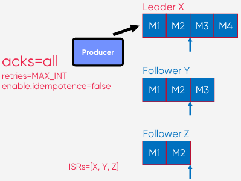
</div>

#### Broker X가 장애가 발생했다고 가정

 - 새로운 Leader가 선출됨. COntroller가 Y를 Leader로 선출했다고 가정
 - M3, M4를 Commit하기 전에 Broker X 장애 발생
 - Follower Y가 Leader로 선출. Leader Epoch가 0에서 1로 증가
 - Follower Z는 M3를 Fetch함
 - Y는 High Water Mark를 진행
 - Z는 fetch 다시 수행하고 High Water Mark를 수신하고 진행

<div align="center">
    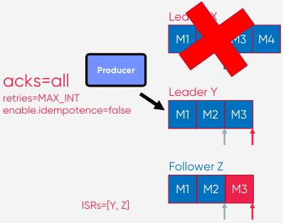
</div>
<br/>

 - Producer는 M3, M4에 대한 ack를 미수신한 상태로 M3, M4를 Leader(Y)로 송신 재시도
 - idempotence=false 이므로 M3는 중복 발생
 - Z는 M3(중복), M4를 fetch함
 - Z는 fetch 다시 수행하고 High Water Mark를 수신하고 진행

<div align="center">
    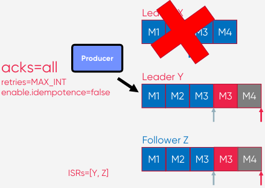
</div>

#### 장애가 발생했던 X가 복구되면

 - X가 복구되면 ZooKeeper에 연결
 - X는 Controller로부터 metadata를 받음
 - X는 Leader Y로부터 Leader Epoch를 fetch
 - X는 Leadership이 변경된 시점부터 Truncate

<div align="center">
    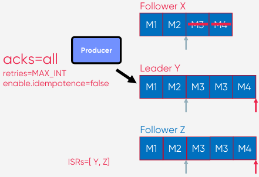<br/>
    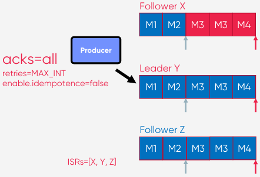
</div>

### 3-2. acks=1인 경우

 - Leader X가 장애나기 전에 Producer는 M4에 대한 ack를 수신
    - Producer가 M4 송신을 재시도하지 않게 되므로, M4는 영원히 잃어버리게 되는 결과 초래

<div align="center">
    
</div>

### 3-3. 가용성과 내구성 중 선택

 - `Topic 파라미터 - unclean.leader.election.enable`
    - ISR 리스트에 없는 Replica를 Leader로 선출할 것인지에 대한 옵션 (기본값: false)
    - ISR 리스트에 Replica가 하나도 없으면 Leader 선출을 안 함(서비스 중단)
    - ISR 리스트에 없는 Replica를 Leader로 선출함(데이터 유실)
 - `Topic 파라미터 - min.insync.replicas`
    - 최소 요구되는 ISR의 개수에 대한 옵션 (기본값: 1)
    - ISR이 min.insync.replicas 보다 적은 경우, Producer는 NotEnoughReplicas 예외를 수신
    - Producer에서 acks=all과 함께 사용할 때 더 강력한 복장 + min.insync.replicas=2
    - n개의 Replica가 있고, min.insync.replicasc=2인 경우 n-2개의 장애를 허용할 수 있음
 - `데이터 유실이 없게 하려면`
    - Topic: replication.factor는 2보다 커야 함(최소 3 이상)
    - Producer: acks는 all 이어야 함
    - Topic: min.insync.replicas는 1보다 커야 함(최소 2 이상)
 - `데이터 유실이 다소 있더라도 가용성을 높게 하려면`
    - Topic: unclean.leader.election.enable를 true로 설정

## 4. Consumer Rebalance

 - Consumer는 메시지를 가져오기 위해 Partiton에 연속적으로 Poll 함
 - 가져온 위치를 나타내는 offset 정보를 `__consumer_offsets` 토픽에 저장하여 관리

<div align="center">
    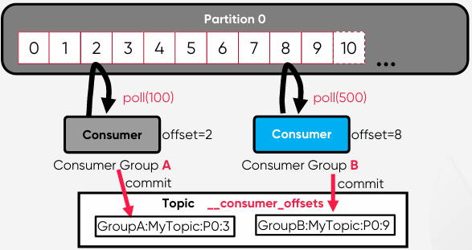
</div>
<br/>

 - `Consumer Load Balancing`
    - 동일한 group.id로 구성된 모든 Consumer들은 하나의 Consumer Group을 형성
    - Consumer Group의 Consumer들은 작업량을 어느 정도 균등하게 분할함
    - 동일한 Topic에서 consume하는 여러 Consumer Groupd이 있을 수 있음
 - `Partition Assignment`
    - 하나의 Consumer Group에서의 Partition 할당
    - 하나의 Partition을 Consumer에게 Assign(할당) 할 때, 하나의 Partition은 지정된 Consumer Group 내의 하나의 Consumer만 사용
    - 동일한 Key를 가진 메시지는 동일한 Consumer가 사용
    - Consumer의 설정 파라미터 중에서 partition.assignment.strategy로 할당 방식 조정
    - Consumer Group은 Group Coordinator라는 프로세스에 의해 관리됨
 - `Consumer Group을 등록하고 Consumer 전체에 Partition을 할당하는 프로세스`
    - __Consumer 등록 및 Group Coordinator 선택__
        - 각 Consumer는 group.id로 Kafka 클러스터에 자신을 등록
        - Kafka는 Consumer Group을 만들고 Consumer의 모든 Offset은 `__consumer_offsets` 토픽의 하나의 Partition에 저장.
        - 이 Partition의 Leader Broker는 Consumer Group의 Group Coordinator로 선택
        - hash(group.id) % offsets.topic.num.partition 수식을 사용하여 group.id가 저장될 `__consumer_offset`의 Partition을 결정
    - __JoinGroup 요청 순서에 따라 Consumer 나열__
        - Group Coordinator는 Group의 Consumers 카탈로그를 생성하기 전에 Consumers의 JoinGroup 요청에 대해 group.initial.rebalace.delay.ms(기본값 3초)를 대기
        - Consumer들이 Consume할 최대 Partition 수까지 JoinGroupo 요청을 수신하는 순서대로 Consumer를 나열
    - __Consumer Leader 결정 및 Partitiion 할당__
        - JoinGroup 요청을 보내는 최초 Consumer는 Group Leader로 지정되며, Group Coordinator로부터 Consumer 목록을 받음
        - Group Leader는 구성된 partition.assignment.strategy를 사용하여 각 Consumer에게 Partition을 할당
    - __Consumer -> Partition 매핑 정보를 Group Coordinator에게 전송__
        - Group Leader는 Consumer -> Partition 매핑 정보를 Group Coordinator에게 다시 보냄
        - Group Coordinator는 매핑 정보를 메모리에 캐시하고 ZooKeeper에 유지
    - __각 Consumer에게 할당된 Partition 정보를 보냄__
        - Group Coordinator는 각 Consumer에게 할당된 Partition 정보를 보냄
        - 각 Consumer는 할당된 Partition에서 Consume을 시작
 - `왜 Group Coordinator(Broker)가 직접 Partition을 할당하지 않는가?`
    - Kafka의 한 가지 원칙은 가능한 한 많은 계산을 클라이언트에 수행하도록 하여 Broker의 부담을 줄이는 것이다.
    - 많은 Consumer Group와 Consumer들이 있고 Broker 혼자서 Rebalance를 위한 계산을 한다고 생각하면 Broker에 엄청난 부담이 된다.
 - `Consumer Rebalancing Trigger`
    - 불필요한 Rebalancing은 피해야 한다.
    - __Rebalancing Trigger__
        - Consumer가 Consumer Group에서 탈퇴
        - 신규 Consumer가 Consumer Group에 합류
        - Consumer가 토픽 구독을 변경
        - Consumer Group은 Topic 메타데이터의 변경 사항을 인지 (예시: Partition 증가)
    - __Rebalancing Process__
        - Group Coordinator는 Heartbeats의 플래그를 사용하여 Consumer에게 Rebalance 신호를 보냄
        - Consumer가 일시 중지하고 Offset을 Commit
        - Consumer는 Consumer Group의 새로운 Generation에 다시 합류
        - Partition 재할당
        - Consumer는 새 Partition에서 다시 Consume을 시작
 - `Consumer Heartbeats`
    - heartbeat.interval.ms
        - 기본값: 3초
        - Consumer는 poll()과 별도로 백그라운드 Thread에서 Heartbeats를 보냄
    - session.timeout.ms
        - 기본값: 10초
        - 해당 시간동안 Heartbeats가 수신되지 않으면 Consumer는 Consumer group에서 삭제
    - max.poll.interval.ms
        - 기본값: 5분
        - poll()은 Heartbeats와 상관없이 주기적으로 호출되어야 함
 - `과도한 Rebalancing을 피하는 방법`
    - __Consumer Grgoup 멤버 고정__
        - Group의 각 Consumer에게 고유한 group.instance.id를 할당
        - Consumer는 LeaveGroupRequest를 사용하지 않아야 함
        - Rejoin(재가입)은 알려진 group.instance.id에 대한 Rebalance를 Trigger 하지 않음
    - __session.timeout.ms 튜닝__
        - heartbeat.interval.ms를 session.timeout.ms의 1/3로 설정
        - group.min.session.timeout.ms와 group.max.session.timeout.ms의 사이 값
        - 장점: Consumer가 Rejoin(재가입) 할 수 있는 더 많은 시간을 제공
        - 단점: Consumer 장애를 감지하는데 시간이 더 오래 걸림
    - __max.poll.interval.ms 튜닝__
        - Consumer에게 poll()한 데이터를 처리할 수 있는 충분한 시간 제공
        - 너무 크게 하면 안됨

## 5. Partition Assignment Strategy

 - `할당 방식`
    - Consumer 설정 파라미터 중에서 partition.assignment.strategy로 할당 방식 조정
    - org.apache.kafka.clients.consumer.RangeAssignor: 토픽별로 작동하는 기본 Assignor
    - org.apache.kafka.clients.consumer.RoundRobinAssignor: Round Robin 방식으로 Consumer에게 Partition을 할당
    - org.apache.kafka.clients.consumer.StickyAssignor: 최대한 많은 기존 Partition 할당을 유지하면서 최대 균형을 이루는 할당을 보장
    - org.apache.kafka.clients.consumer.CooperativeStickyAssignor: 동일한 StickyAssignor 논리를 따르지만 협력적인 Rebalance을 허용
    - org.apache.kafka.clients.consumer.ConsumerPartitionAssignor: 인터페이스를 구현하면 사용자 지정 할당 전략을 사용할 수 있음
 - `Range Assignor`
    - 기본 Assignor
    - 동일한 Key를 가지고 있는 메시지들에 대한 토픽들 간에 "co-partitioning" 하기 유리
    - 예시: Delivery ID를 Key로 가지고 있는 delivery_status 메시지와 delivery_location 메시지
 - `Round Robin Assignor`
    - Round Robin 방식으로 Partition들과 Consumer들을 분배하여 할당
    - Reassign(재할당) 후 Consumer가 동일한 Partition을 유지한다고 보장하지 않음
    - 예시: Consumer 0이 지금 토픽0의 Partition0에 할당되어 있지만, 재할당이 발생하면 토픽0의 Partition0이 다른 Consumer에게 할당될 수 있음
    - __할당 불균형이 발생할 가능성이 존재__
        - 컨슈머간 Subscribe 해오는 토픽이 다른 경우, 할당 불균형이 발생할 가능성이 있음
 - `Sticky Assignor`
    - Range 방식보다 Rebalancing 오버헤드를 줄임
    - 가능한 한 균형적 할당을 보장
        - 컨슈머들에게 할당된 Topic Partition의 수는 최대 1만큼 다름
        - 특정 컨슈머가 다른 컨슈머들에 비해 2개 이상 더 적은 Topic Partition이 할당된 경우, A에 할당된 토픽의 나머지 Partition들은 B에 할당될 수 없음

## 6. Cooperative Sticky Assignor

 - `시간 흐름에 따른 Consumer Rebalance 과정`
    - Consumer들이 JoinGroup 요청을 Group Coordinator에 보내면서 리밸런싱 시작
    - JoinGroup의 응답이 Consumer들에게 전송되고 (Group Leader는 Consumer들 정보를 수신)
    - 모든 구성원은 Broker에 SyncGroup 요청을 보내야 하며 (Group Leader는 각 Consumer의 Partition 할당을 계산해서 Group Coordinator에게 전송)
    - Broker는 SyncGroup 응답에서 각 Consumer별 Partition 할당을 보냄

<div align="center">
    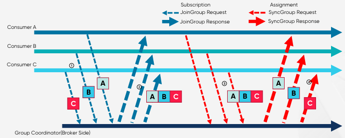
</div>
<br/>

 - `Eager Rebalancing 프로토콜`
    - 오랫동안 사용되었던 방식으로 최대한 단순하게 유지하기 위해 만들어짐
    - 각 구성원은 JoinGroup 요청을 보내고 재조정에 참여하기 전에 소유한 모든 Partition을 취소해야 함
    - 안전면에서는 좋지만 "Stop-the-World" 프로토콜은 그룹의 구성원이 재조정 기간 동안 작업을 수행할 수 없는 단점

<div align="center">
    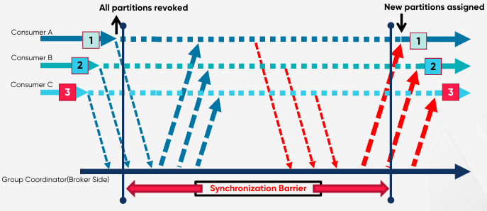
</div>
<br/>

 - `Incremental Cooperative Rebalancing 프로토콜`
    - Consumer A, B가 Consume하고 있는 상태에서 처리량을 늘리기 위해서 Consumer C를 추가하는 경우를 가정
        - Consumer A에 할당된 Partition중 하나만 Consumer C로 이동하는 것이 가장 이상적
        - 전체 재조정동안 모두 정지 상태로 있는 대신, Consumer A만 하나의 Partition을 취소하는 동안만 가동 중지
        - 이슈: Consumer는 자신의 Partition 중 어느 것을 다른 곳으로 재할당되어야 하는지 알지 못함
    - Rebalancing을 두 번 수행
        - JoinGroup 요청을 보내면서 시작하지만, 소유한 모든 Partition을 보유하고, 그 정보를 Group Coordinator에게 보냄
        - Group Leader는 원하는 대로 Consumer에 Partition을 할당하지만, 소유권을 이전하는 Partition들만 취소함
        - Partition을 취소한 구성원은 그룹에 ReJoin하여 취소된 Parition을 할당할 수 있도록 두 번째 재조정을 트리거

<div align="center">
    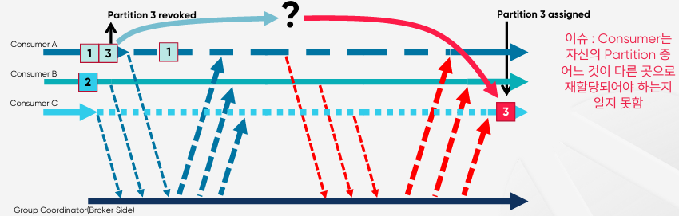<br/>
    
</div>

## 7. Kafka Log File

 - Partition은 Broker들에 분산되며, 각 Partition은 Segment File들로 구성됨
 - Rolling Strategy: log.segment.bytes(기본값 1GB), log.roll.hours(기본값 168 hours)

<div align="center">
    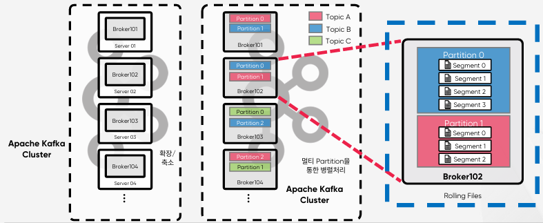
</div>
<br/>

### 7-1. Log Segment File Directory

 - `각 Broker의 log.dirs 파라미터로 정의`
    - Kafka Log Segment File은 Data File이라고 불림
    - Segment File이 생성되는 위치는 각 Broker의 server.properties 파일 안에서 log.dirs 파라미터로 정의
        - log.dirs=/data/kafka/kafka-log-1,/data/kafka/kafka-log-b
    - 각 토픽과 그 Partition은 log.dirs 아래에 하위 디렉토리루 구성됨
        - test_topic의 Partition 0은 /data/kafka/kafka-log-a/test_topic-0 디렉토리로 생성
 - `Partition 디렉토리 안의 Log File들`
    - Log Segment File(.log): 메시지와 metadata 저장
    - Index File(.index): 각 메시지의 Offset을 Log Segment 파일의 Byte 위치에 매핑
    - Time-based Index File(.timeindex): 각 메시지의 timestamp를 기반으로 메시지를 검색하는 데 사용
    - Leader Epoch Checkpoint File: Leader Epoch와 관련 Offset 정보 저장
    - .snapshot: Idempotent Producer 사용시 생성됨
    - .txnindex: Transactional Producer 사용시 생성됨
```bash
$ ls /data/kafka/kafka-log-a/test_topic-0
00000000000000123453.index
00000000000000123453.timeindex
00000000000000123453.log
00000000000007735204.index
00000000000007735204.timeindex
00000000000007735204.log
leader-epoch-checkpoint
```

 - `Log Segment File 특징`
    - 첫 번째로 저장되는 메시지의 Offset이 파일명이 된다.
    - Log Segment File의 파일명은 해당 Segment File에 저장된 첫 번째 메시지의 Offset

<div align="center">
    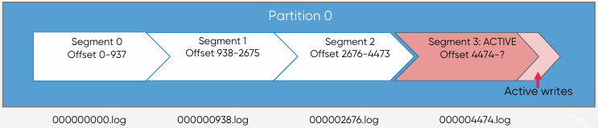
</div>
<br/>

 - `Log Segment File Rolling`
    - log.segment.bytes (기본값 1GB)
    - log.roll.ms (기본값 168시간)
    - log.index.size.max.bytes (기본값 10MB)
 - `Checkpoint File`
    - 각 Broker에는 2개의 Checkpoint File이 존재 (log.dirs 디렉토리에 위치)
    - replication-offset-checkpoint: 마지막으로 Commit된 메시지의 ID인 High Water Mark 시작시 Follower가 이를 사용하여 Commit되지 않은 메시지를 Truncate
    - reecovery-point-offset-checkpoint: 데이터가 디스크로 Flush된 지점. 복구 중 Broker는 이 시점 이후의 메시지가 손실되었는지 여부를 확인

## 8. Log Retention & Cleanup Policy

### 8-1. Log Cleanup Policy

로그는 Consume되어도 지우지 않는다. 많은 Consumer들이 서로 다른 시간에 Log 데이터를 Consume 할 수 있다.

 - 브로커 혹은 토픽 단위로 Cleanup 정책을 설정한다.
 - log.cleanup.policy
    - 정리 정책
    - delete: segment 파일에 저장된 가장 최신의 메시지가 log.retention.ms보다 오래된 segment를 삭제
    - compact: 주어진 Key의 최신 Value만 유지하는 정책
 - log.retention.ms
    - 로그 보관 주기
    - 기본값: 7일
 - log.retention.check.interval.ms
    - Log Segment를 체크하는 주기
    - 기본값: 5분
 - 현재 Active Segment의 Log는 cleanup 대상이 아니다.

### 8-2 토픽의 메시지를 모두 삭제하는 방법

 - retention.ms 활용(운영환경에서는 권장하지 않음)
```bash
# 1. Producer와 Consumer를 모두 shutdown
# 2. 토픽의 retention.ms를 0으로 세팅
kafka-config.sh --zookeeper ${zookeeper ip address} --alter --entity-name topics --entity-name test_topic --add-config retention.ms=0

# 3. Cleanup Threa가 동작할 동안 대기 (기본값 5분마다 동작)

# 4. 메시지 삭제 확인 후 원래 설정으로 원복
kafka-config.sh --zookeeper ${zookeeper ip address} --alter --entity-name topics --entity-name test_topic --delete-config retention.ms
```

### 8-3. Compact Cleanup Policy

 - 주어진 Key의 최신 Value만 유지하는 정책
    - Key가 있는 메시지를 사용하면 Custom Partitioner를 사용하지 않는 한, 특정 Key를 가지는 모든 메시지는 동일한 Partition으로 전송됨
    - Compact(압축) 정책은 Partition 별로 특정 Key의 최신 Value만 유지하며 압축
    - 동일한 Key를 가진 메시지가 다른 Partition에 있는 경우, 동일한 Key를 가진 여러 메시지가 여전히 있을 수 있음
        - 중복 제거용 기술이 아님
 - `Log Compaction 동작 원리`
    - Write 되고 있는 Active Segment는 Compact 대상에서 제외한다.
    - 이미 Cleanup이 된 Segment 이전 파일들을 Tail이라고 하고, Cleaner Point 이후 데이터 파일들을 Head라고 한다.
        - Head 부분의 Key로 Map을 만들고, Tail 부분의 Key로 Map을 만든다.
        - 양쪽을 비교하여 유지 및 삭제를 하고 Cleaner Point를 변경한다.
    - __처리 흐름 요약__
        - Tail segment들 스캔: 오래된 segment 파일들에서 (key, value)를 스캔함
        - 키를 메모리에 보관: 최신 값을 찾기 위해 Map 구조로 키와 offset을 메모리에 저장함. (tail에서 수집)
        - cleaner point 이후(head)와 비교: 같은 키가 head에 더 최신 offset으로 있다면, tail의 키는 삭제 대상
        - 새로운 compacted segment 생성: 유효한 (가장 최신) (key, value)만 남겨서 새로운 파일 생성
        - 파일 교체 및 cleaner point 업데이트
 - `Log Compaction 설정`
    - log.cleaner.min.cleanable.ratio
        - Head 영역 데이터가 Tail 영역보다 크면 Cleaner 시작
        - 기본값: 0.5 (50%)
    - log.cleaner.io.max.bytes.per.seconds
        - Log Cleaner의 Read/Write의 처리량을 제한하여 시스템 리소스 보호 가능
        - 기본값: 무제한
    - 동일한 Key를 갖는 메시지가 매우 많은 경우, 더 빠른 정리를 위해서 Thread와 버퍼 사이즈를 증가시킨다.
        - log.cleaner.threads (기본값: 1)
        - log.cleaner.dedupe.buffer.size (기본값: 134,217,728)

<div align="center">
    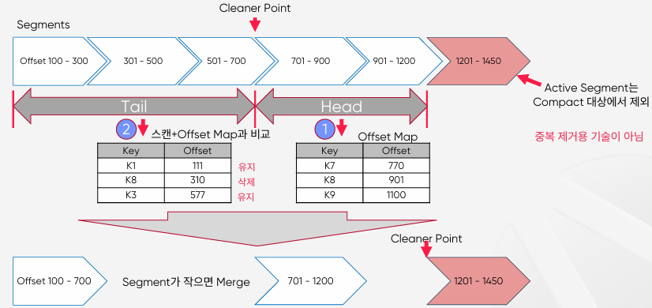
</div>
<br/>

## 9. Exactly Once Semantics(EOS)

 - `At most once(최대 한번)`
    - 메시지를 최대 한 번 처리 (중복 없음, but 손실 가능)
    - 확인 시간이 초과되거나 오류가 반환될 때 Producer가 재시도하지 않으면 메시지가 Kafka Topic에 기록되지 않아 Consumer에게 전달되지 않을 수 있음
    - 중복 가능성을 피하기 위해 때때로 메시지가 전달되지 않을 수 있음을 허용
 - `At least once(최소 한번)`
    - 메시지를 최소 한 번 처리 (손실 없음, but 중복 가능)
    - Producer가 Kafka Broker로부터 ack를 수신하고 acks=all 이면 메시지가 Kafka Topic에 최소 한 번 작성되었음을 의미함
    - 그러나 ack가 시간 초과되거나 오류를 수신하면 메시지가 Kafka Topic에 기록되지 않았다고 가정하고 메시지 전송을 다시 시도할 수 있음
    - Broker가 ack를 보내기 직전에 실패했지만 메시지가 Kafka Topic에 성공적으로 기록된 후에 이 재시도를 수행하면 메시지가 두 번 기록되어 최종 Consumer에게 두 번 이상 전달되어 중복 작업과 같은 잘못된 결과로 이어질 수 있음
 - `Exactly once(정확히 한번)`
    - 메시지를 정확히 한 번만 처리 (손실도 중복도 없음)
    - Producer가 메시지 전송을 다시 시도하더라도 메시지가 최종 Consumer에게 정확히 한 번 전달됨
    - 메시징 시스템 자체와 메시지를 생성하고 소비하는 애플리케이션 간의 협력이 반드시 필요함
    - 예를 들어, 메시지를 성공적으로 사용한 후 Kafka Consumer를 이전 Offset으로 되감으면 해당 Offset에서 최신 Offset까지 모든 메시지를 다시 수신핳게 됨

### 9-1. Exactly Once Semantics(EOS)의 필요성

데이터가 정확히 한 번 처리되도록 보장해야 하는 실시간 미션 크리티컬 스티리밍 애플리케이션
 - 클라이언트(Idempontent Producer)에서 생성되는 중복 메시지 방지
 - Transaction 기능을 사용하여, 하나의 트랜잭션내의 모든 메시지가 모두 Write 되었는지 또는 전혀 Write 되지 않았는지 확인

### 9-2. Exactly Once Semantics 관련 파라미터

 - Idempotent Producer
    - Producer의 파라미터중 enable.idempotence를true 로 설정
    - Producer가 Retry(재시도)를 하더라도, 메시지 중복을 방지
    - 성능에 영향이 별로 없음
 - Transaction
    - 각 Producer에 고유한 transactional.id 를 설정
    - Producer를 Transaction API를 사용하여 개발
    - Consumer에서 isolation.level 을 read_committed 로 설정

### 9-3. Transaction

 - Transaction Coordinator
    - Consumer Group Coordinator와 비슷하게, 각 Producer에게는 Transaction Coordinator가 할당되며, PID 할당 및 Transaction 관리의 모든 로직을 수행
 - Transaction Log
    - 새로운 Internal Kafka Topic으로써, Consumer Offset Topic과 유사하게, 모든 Transaction의 영구적이고 복제된 Record를 저장하는 Transaction Coordinator의 상태 저장소
 - TransactionalId
    - Producer를 고유하게 식별하기 위해 사용되며, 동일한 TransactionalId를 가진 Producer의 다른 인스턴스들은 이전 인스턴스에 의해 만들어진 모든 Transaction을 재개(또는 중단)할 수 있음
 - `Transaction 관련 파라미터`
    - __Broker Config__
        - transactional.id.expiration.ms
        - transaction.max.timeout.ms
        - transaction.state.log.replication.factor
        - transaction.state.log.num.partitions
        - transaction.state.log.min.isr
        - transaction.state.log.segment.bytes
    - __Producer Config__
        - enable.idempotence
        - transaction.timeout.ms
        - transactional.id
    - __Consumer Config__
        - isolation.level
        - enable.auto.commit

