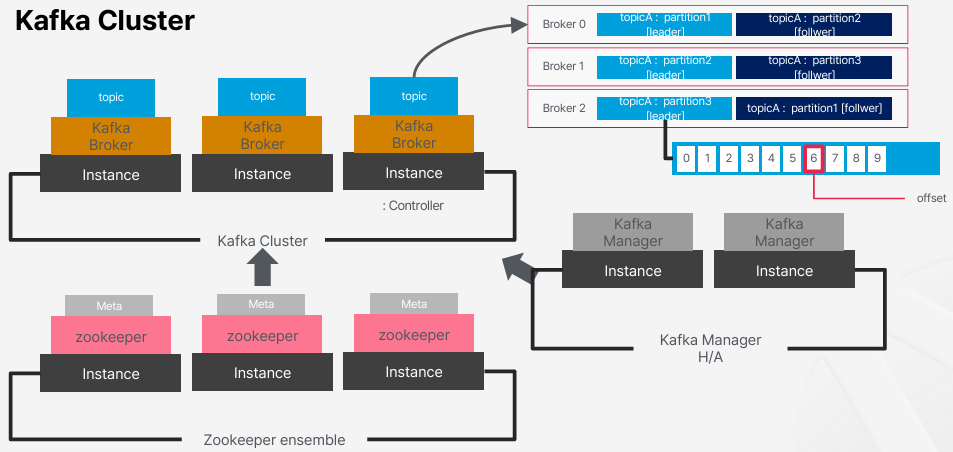
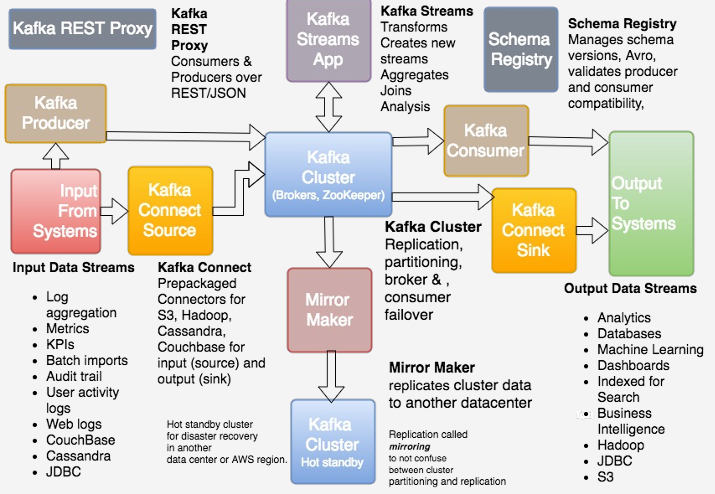

# 멀티클러스터와 Kafka Eco System 구축 및 활용

## 1. Kafka와 Kafka 아키텍처 주요 구성 요소

 - 목적: Event/Message 전송을 위해 사용
 - 장점: 고가용성, 빠른 처리
 - 단점: 순서 보장이 어렵다. 아주 작게 사용이 어렵다.
 - Distributed: 나눠서 작업할 수 있다. 빠르게 작업할 수 있다.
 - pub/sub: 전달하는 쪽은 전달받는 곳을 관여할 필요가 없다.
 - Producer, Consumer가 존재. Consumer는 Consumer Group 하위 개념
 - Server: Broker, Zookeeper는 Broker 간의 분산 처리 정보가 관리된다. (Meta, Controller, Topic, Partition 정보)
 - 3개 이상 Broker로 구성
 - KSQL, Connector, Kstream 등의 추가 모듈
 - KRaft 통해 zookeeper 제거 할 수 있음

### 1-1. Kafka와 Zookeeper의 역할

 - Zookeeper: 클러스터 및 하위 요소에 대한 전반적인 메타정보, Controller 정보, 선출, Broker 정보 등
 - Broker: 실제 data를 받아 저장하고 있음
 - Controller: Broker들의 리더격. 리더 선정, 토픽 생성, 파티션 생성, 복제본 관리

### 1-2. Kafka Object

 - Topic: 폴더, 특정 목적으로 생성된 data 집합
 - Partition: 하위폴더, Topic의 하위개념으로 분산을 위해 나누어 처리되는 단위, Leader/Follower 존재하며 실제 Read/Write는 리더에서만 발생된다 Follower는 Leader를 복사
 - Replica: Leader의 장애를 대응하기 위해 만들어놓은 복사본. Pull 방식으로 Leader에서 복제함
    - ISR(In Sync Replica): Replica의 Group을 의미. 리더로 전환될 수 있는 Replica Partition의 그룹이며, Leader가 Commit, Lag를 확인하여 Group에서 제외하기도 한다.
 - Producer: Data를 퍼블리싱하는 주체
 - Consumer: Data를 구독하는 주체
 - Offset: 책갈피, Consumer가 어디까지 가져갔는지 저장하는 값. Consumer Group 별로 상이.

    
   

 

