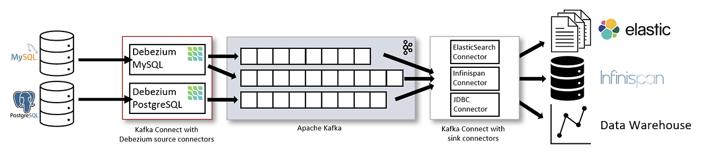
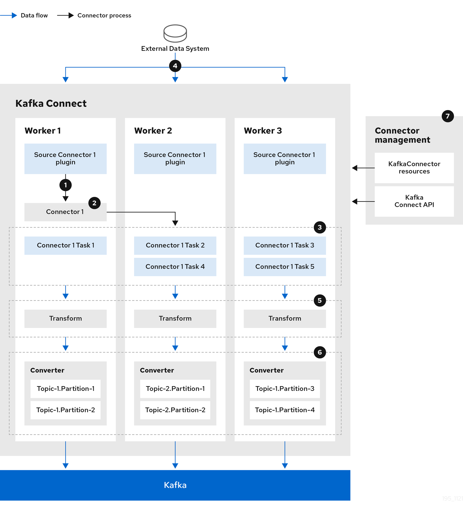
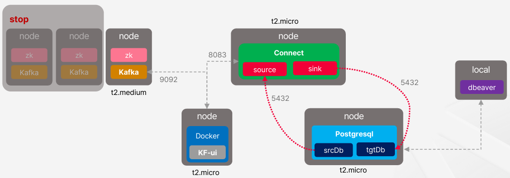

# Kafka Connect와 MirrorMaker2

## 1. Kafka Connect의 필요성과 역할

Kafka Connect는 Apache Kafka의 구성 요소 중 하나로, 외부 시스템(예: 데이터베이스, 파일 시스템, 클라우드 서비스 등)과 Kafka 간의 데이터 스트리밍을 쉽게 연결할 수 있도록 해주는 데이터 통합 프레임워크입니다.

Kafka Connect는 Kafka와 다른 시스템(예: MySQL, PostgreSQL, Elasticsearch, S3 등) 간에 데이터를 자동으로 가져오거나 내보내는 역할을 합니다. 즉, 데이터를 Kafka 토픽으로 수집하거나, Kafka에서 다른 시스템으로 내보내는 것을 코드 없이 구성만으로 처리할 수 있게 도와줍니다.

 - Source: Debezium (MySQL/Postgres CDC), JDBC Source, FileStream Source
 - Sink: Elasticsearch Sink, S3 Sink, JDBC Sink, Kafka to MongoDB Sink
 - Standalone Mode: 테스트나 소규모 프로젝트에 적합. 단일 프로세스로 동작.
 - Distributed Mode: 프로덕션 환경에서 사용. 여러 작업자(worker)가 클러스터를 구성하며 자동 분산, 장애 복구 지원.

<div align="center">
    
</div>
<br/>

### 1-1. Kafka Connect 구성 요소

 - `Connector (커넥터)`
    - Kafka Connect의 최상위 구성 요소
    - Source 또는 Sink 역할을 함
    - 실제 작업을 수행할 Task를 생성하고 관리
    - 설정 파일 또는 REST API를 통해 정의됨
    - 예: MySQL Source Connector, Elasticsearch Sink Connector
 - `Task (태스크)`
    - Connector가 생성한 작업 단위
    - 병렬로 실행 가능하며, 커넥터 설정에서 몇 개의 태스크로 분할할지 지정 가능
    - 실제 데이터 읽기/쓰기 로직을 수행
    - 예: MySQL 커넥터가 3개의 테이블을 각각 1개의 Task로 분할해서 동시 처리
 - `Worker (작업자)`
    - Kafka Connect 클러스터를 구성하는 프로세스 단위
    - Connector와 Task를 실제로 실행하는 주체
    - Standalone(단일 worker) 또는 Distributed(다수 worker) 모드로 운영 가능
    - 각 worker는 Kafka 토픽에 작업 상태, 오프셋 등을 저장하고 공유함
 - `Offset Storage (오프셋 저장소)`
    - Source Connector가 외부 시스템에서 어디까지 데이터를 읽었는지 저장
    - Kafka 토픽에 저장됨 (connect-offsets, connect-status, connect-configs 등)
 - `Converter (컨버터)`
    - Kafka Connect가 데이터를 Kafka에 저장할 때, 또는 외부 시스템에 보낼 때 직렬화/역직렬화하는 역할
    - 가장 흔한 포맷: JSONConverter, AvroConverter, ProtobufConverter
    - Schema Registry를 사용하는 경우 Avro 또는 Protobuf와 함께 사용 가능
 - Transformation (Single Message Transform, SMT)
    - Kafka Connect가 처리 중인 각 메시지를 수정할 수 있는 기능
    - 예: 특정 필드 제거, 이름 변경, 데이터 정규화 등
    - 커넥터 설정에 간단히 추가하여 가공 가능

```
🔄 전체 흐름 예시
1. Worker가 실행됨 → Connector 로드됨
2. Connector가 설정을 읽고 Task를 분할
3. 각 Task가 외부 시스템에서 데이터를 읽거나 Kafka로 데이터를 씀
4. 데이터는 Converter를 통해 직렬화되어 Kafka 토픽에 저장
5. Offset은 Kafka 내부 토픽에 저장되어 다음 실행 시 이어서 처리
```

### 1-2. Source Connectors와 Sink Connectors

<div align="center">
    <br/>
    Kafka로 데이터를 스트리밍하는 소스 커넥터<br/>
    <br/>
    Kafka의 싱크 커넥터 스트리밍 데이터<br/>
    https://docs.redhat.com/ko/documentation/red_hat_streams_for_apache_kafka/2.5/html/amq_streams_on_openshift_overview/kafka-connect-components_str#connectors
</div>
<br/>

 - `JDBC Source Connector (MySQL → Kafka)`
    - connector.class: 사용할 커넥터 클래스 (JDBC Source)
    - mode: 데이터를 가져오는 방식 (incrementing: auto-increment ID 기준)
    - topic.prefix: Kafka에 생성할 토픽 이름 접두사 (mysql-users)
    - poll.interval.ms: 주기적으로 DB에서 데이터를 읽는 간격
```json
{
  "name": "mysql-jdbc-source",
  "config": {
    "connector.class": "io.confluent.connect.jdbc.JdbcSourceConnector",
    "connection.url": "jdbc:mysql://localhost:3306/my_database",
    "connection.user": "root",
    "connection.password": "password",
    "table.whitelist": "users",
    "mode": "incrementing",
    "incrementing.column.name": "id",
    "topic.prefix": "mysql-",
    "poll.interval.ms": "10000"
  }
}
```

 - `Elasticsearch Sink Connector (Kafka → Elasticsearch)`
    - topics: Kafka에서 읽을 토픽 이름
    - connection.url: Elasticsearch 호스트 주소
    - key.ignore: 메시지 키 무시 여부
    - schema.ignore: 스키마 무시 (Avro 등을 쓰지 않는 경우 유용)
```json
{
  "name": "elasticsearch-sink",
  "config": {
    "connector.class": "io.confluent.connect.elasticsearch.ElasticsearchSinkConnector",
    "topics": "mysql-users",
    "connection.url": "http://localhost:9200",
    "type.name": "_doc",
    "key.ignore": "true",
    "schema.ignore": "true",
    "name": "elasticsearch-sink-connector"
  }
}
```

 - `적용 방법 (REST API)`
```bash
# 파일 내용 전달
curl -X POST -H "Content-Type: application/json" \
     --data @mysql-source.json \
     http://localhost:8083/connectors

# 직접 전달
curl -X POST -H "Content-Type: application/json" \
     --data '{
       "name": "mysql-jdbc-source",
       "config": {
         ...
       }
     }' \
     http://localhost:8083/connectors
```

## 2. Kafka Connect 구성 및 실행

<div align="center">
    
</div>
<br/>

### 2-1. Kafka 서버 구성

 - `zookeeper.service`
```bash
[Unit]
Requires=network.target remote-fs.target
After=network.target remote-fs.target

[Service]
Type=simple
User=ubuntu
ExecStart=/home/ubuntu/confluent-7.5.2/bin/zookeeper-service-start /home/ubuntu/confluent-7.5.2/etc/kafka/zookeeper.properties
ExecStop=/home/ubuntu/confluent-7.5.2/bin/zookeeper-service-stop
Restart=on-abnormal

[Install]
WantedBy=multi-user.target
```

 - `kafka.service`
```bash
[Unit]
Requires=zookeeper.service
After=zookeeper.service

[Service]
Type=simple
User=ubuntu
ExecStart=/bin/sh -c '/home/ubuntu/confluent-7.5.2/bin/kafka-server-start /home/ubuntu/confluent-7.5.2/etc/kafka/server.properties > /home/ubuntu/kafka/kafka.loog 2>&1'
ExecStop=/home/ubuntu/confluent-7.5.2/bin/kafka-server-stop
Restart=on-abnormal

[Install]
WantedBy=multi-user.target
```

```bash
# zookeeper.service, kafka.service 등록 및 활성화
sudo systemctl daemon-reload
sudo systemctl enable zookeeper.service
sudo systemctl enable kafka.service
sudo systemctl start zookeeper.service
sudo systemctl start kafka.service

# 동작 확인
service kafka status
ps -ef|grep kafka
```

### 2-2. Connect 서버 구성

 - Kafka Connect를 systemd 서비스로 등록해서 시스템 부팅 시 자동 시작 가능
 - systemctl start|stop|restart로 제어 가능
 - 비정상 종료 시 자동 재시작 가능
```bash
cd /home/ubuntu/confluent-7.5.2/etc/kafka
vi connect-distributed.properties

bootstrap.servers={Kafka-Server-Private-IP}:9092

# systemd 서비스 유닛 생성
cd /etc/systemd/sysmte
vi connect.service
[Unit]
Description=My Connect Service
After=network.target

[Service]
Type=simple
User=ubuntu
ExecStart=/home/ubuntu/confluent-7.5.2/bin/connect-distributed /home/ubuntu/confluent-7.5.2/etc/kafka/connect-distributed.properties
Restart=on-abnormal

[Install]
WantedBy=multi-user.target

# connect.service 등록 및 활성화
sudo systemctl daemon-reload
sudo systemctl enable connect.service
sudo service connect stat

# 플러그인 설치
apt-get update
wget https://repo1.maven.org/maven2/io/debezium/debezium-connector-postgres/2.3.5.Final/debezium-connector-postgres-2.3.5.Final-plugin.tar.gz
tar –xvf debezium-connector-postgres-2.3.5.Final-plugin.tar.gz
```

### 2-3. PostgreSQL 서버 구성

```bash
# postgresql 설치
sudo apt-get update
sudo apt install postgresql-14

# postgresql 접근 설정
cd /etc/postgresql/14/main
vi pg_hba.conf
local all postgres trust (peer를 변경)
local all all password (perr를 변경)

vi postgresql.conf
wal_level = logical

# popostgresql 재실행
service postgresql restart

# postgresql 접근
psql -U postgres -d postgres

# 계정 생성
CREATE USER fastadnm WITH PASSWORD 'fastadm' SUPERUSER;
```

### 2-4. Kafka UI 서버 구성

```bash
sudo apt-get update
sudo wget -qO- http://get.docker.com/ | sh. 
docker run -d -p 8080:8080 -e DYNAMIC_CONFIG_ENABLED=true provectuslabs/kafka-ui
```


## 3. Kafka Source Connector 실습

### 3-1. 테스트 데이터 생성 (Postgre)

```sql
create table fast_jdbc_test (
	row_id			varchar(144) PRIMARY KEY NOT NULL,
	contents			varchar(144),
	created_dt 		timestamp
);

insert into fast_jdbc_test 
values ('1', 'connect test', NOW());
insert into fast_jdbc_test 
values ('2', 'connect test 2', NOW());
insert into fast_jdbc_test 
values ('3', 'connect test 3', CAST(now() AS DATE));
insert into fast_jdbc_test 
values ('4', 'CT4', NOW());
insert into fast_jdbc_test 
values ('5', 'CT5', NOW());
insert into fast_jdbc_test 
values ('6', 'CT6', NOW());
insert into fast_jdbc_test 
values ('7', 'CT7', NOW());
insert into fast_jdbc_test 
values ('8', 'CT8', NOW());
insert into fast_jdbc_test 
values ('9', 'CT9', NOW());
insert into fast_jdbc_test 
values ('10', 'CT10', NOW());
insert into fast_jdbc_test 
values ('11', 'CT11', NOW());
insert into fast_jdbc_test 
values ('12', 'CT12', NOW());
insert into fast_jdbc_test 
values ('13', 'CT13', NOW());
```

### 3-2. Source Connector

 - `my-avro-src-connector.json`
```json
{
  "name":"debe-avro-postgres-source-connector",
  "config": {
    "connector.class": "io.debezium.connector.postgresql.PostgresConnector",
    "tasks.max": "1",
    "database.hostname": "IP 주소",
    "database.port": "5432",
    "database.user": "fastadm",
    "database.password": "fastadm",
    "database.dbname": "srcDB",
    "database.server.name": "fastdb",
    "table.whitelist": "fast_jdbc_test",
    "topic.prefix": "debeavro-source-",
    "transforms": "unwrap",
    "transforms.unwrap.type": "io.debezium.transforms.ExtractNewRecordState",
    "transforms.unwrap.drop.tombstones": "false",
    "transforms.unwrap.delete.handling.mode": "rewrite"
  }
}
```

 - `my-avro-src-connector.json`
```json
{
  "name":"debe-json-postgres-source-connector",
  "config": {
    "connector.class": "io.debezium.connector.postgresql.PostgresConnector",
    "tasks.max": "1",
    "database.hostname": "IP 주소",
    "database.port": "5432",
    "database.user": "fastadm",
    "database.password": "fastadm",
    "database.dbname": "srcDB",
    "database.server.name": "fastdb",
    "table.whitelist": "fast_jdbc_test",
    "topic.prefix": "debe-json-source-",
    "transforms": "unwrap",
    "transforms.unwrap.type": "io.debezium.transforms.ExtractNewRecordState",
    "transforms.unwrap.drop.tombstones": "false",
    "transforms.unwrap.delete.handling.mode": "rewrite",
    "key.converter": "org.apache.kafka.connect.json.JsonConverter",
    "key.converter.schemas.enable": "false",
    "value.converter": "org.apache.kafka.connect.json.JsonConverter",
    "value.converter.schemas.enable": "false"
  }
}
```

 - `Source Connector 등록`
```bash
# 등록
curl -X POST -H "Content-Type: application/json" --data @my-avro-src-connector.json http://localhost:8083/connectors

# 상태 확인
curl -X GET http://localhost:8083/connectors/debe-json-postgre-source-connector/status
```


## 4. Kafka Sink Connector 실습

 - `Sink 관련 Plugin 다운로드`
```bash
wget -O https://repo1.maven.org/maven2/io/debezium/debezium-connector-jdbc/2.5.0.Final/debezium-connector-jdbc-2.5.0.Final-plugin.tar.gz

tar -xvf debezium-connector-jdbc-2.5.0.Final-plugin.tar.gz
```

```bash
cd /usr/share/java

vi debe-avro-postgre-sink-connector.json 
{
    "name": "kafka-to-rdb",
    "config": {
        "connector.class": "io.debezium.connector.jdbc.JdbcSinkConnector",
        "tasks.max": "1",
        "connection.url": "jdbc:postgresql://{ip}/tgtDB",
        "connection.username": "fastadm",
        "connection.password": "fastadm",
        "insert.mode": "upsert",
        "delete.enabled": "true",
        "primary.key.mode": "record_key",
        "schema.evolution": "basic",
        "database.time_zone": "UTC",
        "topics": "debe-avro-source-.public.test_jdbc_test",
        "transforms": "unwrap",
        "transforms.unwrap.type": "io.debezium.transforms.ExtractrNewRecordState",
        "transforms.unwrap.drop.tombstones": "false",
        "transforms.unwrap.delete.handling.mode": "none"
    }
}

curl -X POST -H "Content-Type: application/json" --data @debe-avro-postgre-sink-connector.json 
http://localhost:8083/connectors
```
