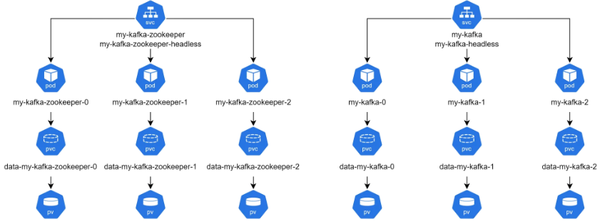

# 카프카 클러스터 구축하기

## 1. 카프카 클러스터 구축 과정

 - `구축 과정`
    - 클러스터 구성 설정
    - 카프카 클러스터 설치
    - 테스트 클라이언트 pod 배포
 - `사전 준비 사항`
    - Kubernetes 클러스터
        - Version 1.23+
        - AWS EKS, GCP GKE, Azure AKE 혹은 동등한 Kubernetes 클러스터
        - 3대 이상의 Worker Node 필요
        - PV provisioner 필요함
    - Helm 도구
        - K8S 컨트롤 노드에 접속 가능한 콘솔 시스템
        - Helm 3.8.0+
        - Kafka Helmchart - Bitnami

## 2. Kubernetes(EKS) 환경 준비 - Terraform을 이용하여 AWS에 EKS 구성

### 2-1. 사전 준비

 - aws 계정
 - 테라폼 CLI 콘솔

### 2-2. 테라폼 CLI 콘솔 준비하기

#### ec2 인스턴스 생성

 - terraform으로 EKS 설치
 - helm으로 kafka 클러스터 설치
 - kubectl으로 k8s에 설치된 카프카 워크로드 관리
 - kafka CLI 사용

#### 필요한 도구 설치

 - `terraform v1.3+`
    - https://developer.hashicorp.com/terraform/install
```bash
# 테라폼 설치
sudo yum install -y yum-utils shadow-utils
sudo yum-config-manager --add-repo https://rpm.releases.hashicorp.com/AmazonLinux/hashicorp.repo
sudo yum -y install terraform

# 테라폼 설치 확인
terraform -version
```

 - `aws cli v2.7.0/v1.24.0 or newer`
    - https://docs.aws.amazon.com/ko_kr/cli/latest/userguide/getting-started-install.html
```bash
# AWS CLI 설치
curl "https://awscli.amazonaws.com/awscli-exe-linux-x86_64.zip" -o "awscliv2.zip"
unzip awscliv2.zip
sudo ./aws/install

# AWS CLI 설치 확인
aws --version
```

 - `aws iam authenticator`
    - https://docs.aws.amazon.com/ko_kr/eks/latest/userguide/what-is-eks.html
    - IAM 사용자 생성 및 필요한 권한 설정 + AccessKey 생성
        - AmazoneEC2FullAccess, CloudWatchFullAccess, EKSFullAccess, IAMFullAccess 권한 부여
    - AWS Client Profile 설정
    - AWS Client Profile 테스트
```bash
# IAM 사용자 생성 및 필요한 권한 설정
{
    "version": "2012-10-17",
    "Statement": [
        {
            "Sid": "VisualCditor0",
            "Effect": "Allow",
            "Action": [
                "eks:CreateCluster",
                "eks:*"
            ],
            "Resource": "*"
        }
    ]
}

# AWS Client Profile 설정
# 명령어 입력 후 AccessKey와 Secret Key 입력
aws configure

# AWS Client Profile 테스트
aws sts get-caller-identity
```

 - kubectl v1.24.0+
    - https://kubernetes.io/docs/tasks/tools/install-kubectl-linux/
    - kubectl 치트 시트: https://kubernetes.io/ko/docs/reference/kubectl/cheatsheet/
```bash
# kubectl 설치
curl -LO "https://dl.k8s.io/release/$(curl -L -s https://dl.k8s.io/release/stable.txt)/bin/linux/amd64/kubectl"
chmod a+x kubectl && sudo mv kubectl /usr/local/bin/kubectl

# 설치 확인
kubectl version

# kubectl 자동 완성 Extension
source <(kubectl completion bash)
echo "source <(kubectl completion bash)" >> ~/.bashrc
```

### 2-3. 테라폼으로 EKS 생성

```bash
# 테라폼 구성 파일 다운로드
git clone https://github.com/hashicorp/learn-terraform-provision-eks-cluster

# 구성 파일 수정
# terraform cloud 설정 제거: terraform.tf
# aws region 변경: variables.tf
cd learn-terraform-provision-eks-cluster
vi terraform.tf
terraform {
  # cloud 블록 삭제
}

vi variables.tf
variable "region" {
  description = "AWS region"
  type        = string
  default     = "ap-northeast-2"
}

# 테라폼 초기화
terraform init

# 테라폼 적용 - EKS 클러스터 생성
terraform apply

# kubectl 설정
aws eks --region $(terraform output -raw region) update-kubeconfig \
--name $(terraform output -raw cluster_name)

# EKS 클러스터 확인
kubectl cluster-info

# 참고 : EKS 클러스터 삭제
# EKS 클러스터 생성 시 매우 많은 컴포넌트가 생성되고 서로 얽혀있어 수작업 삭제는 매우 어려움 (63가지 이상의 리소스가 자동으로 생성되었음)
terraform destroy
```

## 3. 카프카 클러스터 구축

 - Helm 도구 설치
 - Helmchart 준비하기
 - 카프카 클러스터 구성을 설정
 - 카프카 클러스터 생성

### 3-1. Helm 도구 설치

 - https://helm.sh/ko/docs/intro/install/
```bash
# Helm 설치
curl -fsSL -o get_helm.sh https://raw.githubusercontent.com/helm/helm/main/scripts/get-helm-3
chmod 700 get_helm.sh
./get_helm.sh

# 설치 확인
helem version
```

### 3-2. 카프카 Helmchart 다운로드

 - https://artifacthub.io/packages/helm/bitnami/kafka
 - Chart.yml, README.md, charts 폴더, templates 폴더, values.yaml 파일이 존재
```bash
# Kafka 설치를 위한 HelmChart 다운로드
helm pull oci://registry-1.docker.io/bitnamicharts/kafka --version 20.0.0
tar zxfv kafka-20.0.0.tgz
mv kafka kafka-20.0.0-3.3.1
```

### 3-3. 카프카 클러스터 구성 설정

 - `kafka-20.0.0-3.3.1/values.yaml`
```yml
# 1. 노드 개수 설정
# line 426 : # of brokers
# change to 3
replicaCount: 3

zookeeper:
	# line 1712 : # of zookeepers
	# change to 3
	replicaCount: 3


# 2. 데이터 디렉토리 크기 설정
persistence:
	# line 930 : size of kafka data dir
	# change to 10Gi
	size: 10Gi

zookeeper:
  # ...
  persistence:
    # line 1744 : size of zookeeper data dir
    # change to 5Gi
    size: 5Gi
```

### 3-4. 카프카 클러스터 생성

 - `카프카 클러스터 생성`
```bash
# 카프카 클러스터 생성
helm install my-kafka -n default -f kafka-20.0.0-3.3.1/values.yaml kafka-20.0.0-3.3.1

# 간편한 설정 방법
# values.yaml 파일을 수정하지 않고 변경이 필요한 항목만 따로 설정
cat > my-kafka-override.yaml <<EOF
replicaCount: 3
persistence:
  size: 10Gi
zookeeper:
  replicaCount: 3
  persistence:
    size: 5Gi
offsetsTopicReplicationFactor: 3
EOF

# helmchart 다운로드 없이 변경된 설정을 적용하여 카프카 클러스터 생성
helm install my-kafka oci://registry-1.docker.io/bitnamicharts/kafka \
--version 20.0.0 --values my-kafka-override.yaml

# pod 생성 확인
kubectl get pods -n default -w

# statefulset 상태 확인
kubectl get statefulset -n default

# pvc 확인
kubectl get pvc -n default

# svc 확인
kubectl get svc -n default
```

 - `카프카 클러스터 확인`
```bash
# 카프카 클라이언트 pod 생성
kubectl run my-kafka-client --restart='Never' \
--image docker.io/bitnami/kafka:3.3.1-debian-11-r19 \
--namespace default --command -- sleep infinity

# 테스트 클라이언트 pod 접속
# Kafka 클라이언트용 파드로 접속한다.
kubectl exec --tty -i my-kafka-client --namespace default -- bash

# 테스트 메시지 전송
# my-kafka-0 파드로 카프카 메시지를 발행한다.
/opt/bitnami/kafka/bin/kafka-console-producer.sh \
--broker-list my-kafka-0.my-kafka-headless.default.svc.cluster.local:9092 \
--topic test

# 테스트 메시지 확인
# my-kafka 서비스로 접근시 my-kafka-0, 1, 2 중에 한군데로 전달된다.
/opt/bitnami/kafka/bin/kafka-console-consumer.sh \
--bootstrap-server my-kafka.default.svc.cluster.local:9092 \
--topic test \
--from-beginning
```

<div align="center">
    <br/>
    생성된 카프카 클러스터 구조
</div>

## 4. 테스트 클라이언트 배포

### 4-1. 테스트 클라이언트 배포

 - `테스트 토픽 생성`
```bash
# 카프카 클라이언트 파드로 접속
kubectl exec --tty -i my-kafka-client -- bash

# 토픽 생성
/opt/bitnami/kafka/bin/kafka-topics.sh --bootstrap-server my-kafka-headless:9092 \
--create --topic test-datagen-orders --replication-factor 2 --partitions 3 \
--config retention.ms=300000 --config segment.ms=120000
```

 - `테스트 프로듀서 생성`
```bash
cat > test-producer-deployment.yaml <<EOF
apiVersion: apps/v1
kind: Deployment
metadata:
  labels:
    spitha.io: test-datagen
  name: test-producer
spec:
  replicas: 1
  selector:
    matchLabels:
      spitha.io: test-producer
  strategy:
    type: Recreate
  template:
    metadata:
      labels:
        spitha.io: test-producer
    spec:
      containers:
      - image: confluentinc/ksqldb-examples:latest
        name: test-producer
        command:
        - "ksql-datagen"
        args:
        - bootstrap-server=my-kafka-headless:9093
        - quickstart=orders
        - topic=test-datagen-orders
        - msgRate=10
        - printRows=false
      restartPolicy: Always
EOF

# 테스트용 프로듀서 파드 생성
kubectl apply -f test-producer-deployment.yaml

# 테스트 프로듀서 파드 확인
kubectl get pods -n default
```

 - `테스트 컨슈머 생성`
```bash
cat > test-consumer-deployment.yaml <<EOF
apiVersion: apps/v1
kind: Deployment
metadata:
  labels:
    spitha.io: test-consumer
  name: test-consumer
spec:
  replicas: 1
  selector:
    matchLabels:
      spitha.io: test-consumer
  strategy:
    type: Recreate
  template:
    metadata:
      labels:
        spitha.io: test-consumer
    spec:
      containers:
      - image: docker.io/bitnami/kafka:3.3.1-debian-11-r19
        name: test-consumer
        command:
        - "/opt/bitnami/kafka/bin/kafka-console-consumer.sh"
        args: 
        - --bootstrap-server
        - my-kafka-headless:9092
        - --group
        - test-consumer-group
        - --topic
        - test-datagen-orders
      restartPolicy: Always
EOF

# 테스트용 컨슈머 파드 생성
kubectl apply -f test-consumer-deployment.yaml

# 테스트 컨슈머 파드 확인
kubectl get pods -n default

# 로그 확인
kubectl logs -f test-consumer-id
```
