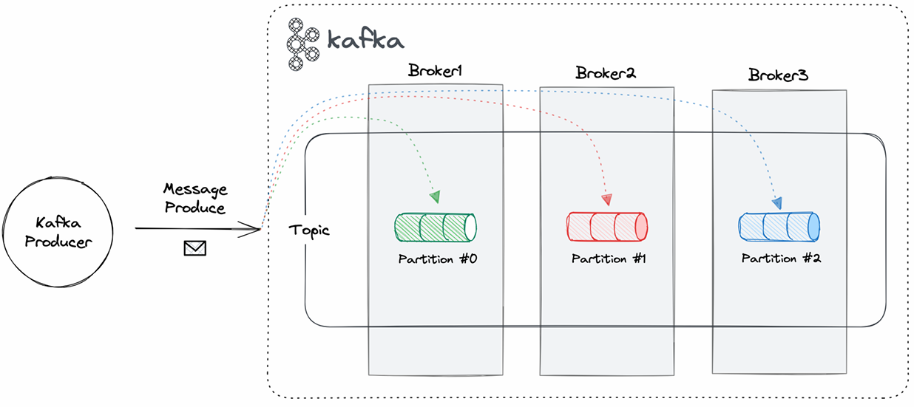
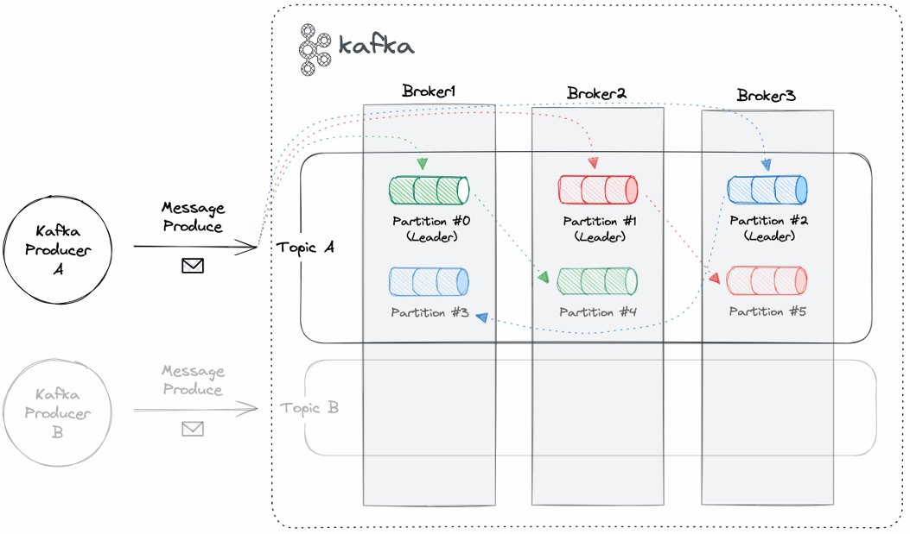

# Kafka를 다루기 위한 도구 소개

## 1. 실습을 위한 인프라 세팅

 - `docker-compose.yml`
```yml
version: '3'
services:
  zookeeper:
    image: 'bitnami/zookeeper:3.7.2'
    container_name: zookeeper
    ports:
      - 2181:2181
    environment:
      - ALLOW_ANONYMOUS_LOGIN=yes
    volumes:
      - ./.data/zookeeper/data:/bitnami/zookeeper/data
      - ./.data/zookeeper/datalog:/bitnami/zookeeper/datalog
      - ./.data/zookeeper/logs:/bitnami/zookeeper/logs
  kafka1:
    image: 'bitnami/kafka:3.6.0'
    container_name: kafka1
    hostname: kafka1
    ports:
      - 19092
      - "9092:9092"
    environment:
      - KAFKA_BROKER_ID=1
      - KAFKA_CFG_ZOOKEEPER_CONNECT=zookeeper:2181
      - ALLOW_PLAINTEXT_LISTENER=yes
      - KAFKA_CFG_LISTENER_SECURITY_PROTOCOL_MAP=CLIENT:PLAINTEXT,EXTERNAL:PLAINTEXT
      - KAFKA_CFG_LISTENERS=CLIENT://:19092,EXTERNAL://:9092
      - KAFKA_CFG_ADVERTISED_LISTENERS=CLIENT://kafka1:19092,EXTERNAL://localhost:9092
      - KAFKA_INTER_BROKER_LISTENER_NAME=CLIENT
    depends_on:
      - zookeeper
    volumes:
      - ./.data/kafka1:/bitnami/kafka/data
  kafka2:
    image: 'bitnami/kafka:3.6.0'
    container_name: kafka2
    ports:
      - 19092
      - "9093:9093"
    environment:
      - KAFKA_BROKER_ID=2
      - KAFKA_CFG_ZOOKEEPER_CONNECT=zookeeper:2181
      - ALLOW_PLAINTEXT_LISTENER=yes
      - KAFKA_CFG_LISTENER_SECURITY_PROTOCOL_MAP=CLIENT:PLAINTEXT,EXTERNAL:PLAINTEXT
      - KAFKA_CFG_LISTENERS=CLIENT://:19092,EXTERNAL://:9093
      - KAFKA_CFG_ADVERTISED_LISTENERS=CLIENT://kafka2:19092,EXTERNAL://localhost:9093
      - KAFKA_INTER_BROKER_LISTENER_NAME=CLIENT
    depends_on:
      - zookeeper
    volumes:
      - ./.data/kafka2:/bitnami/kafka/data
  kafka3:
    image: 'bitnami/kafka:3.6.0'
    container_name: kafka3
    ports:
      - 19092
      - "9094:9094"
    environment:
      - KAFKA_BROKER_ID=3
      - KAFKA_CFG_ZOOKEEPER_CONNECT=zookeeper:2181
      - ALLOW_PLAINTEXT_LISTENER=yes
      - KAFKA_CFG_LISTENER_SECURITY_PROTOCOL_MAP=CLIENT:PLAINTEXT,EXTERNAL:PLAINTEXT
      - KAFKA_CFG_LISTENERS=CLIENT://:19092,EXTERNAL://:9094
      - KAFKA_CFG_ADVERTISED_LISTENERS=CLIENT://kafka3:19092,EXTERNAL://localhost:9094
      - KAFKA_INTER_BROKER_LISTENER_NAME=CLIENT
    depends_on:
      - zookeeper
    volumes:
      - ./.data/kafka3:/bitnami/kafka/data
  kafka-ui:
    image: 'provectuslabs/kafka-ui:v0.7.1'
    container_name: kafka-ui
    ports:
      - "8081:8080"
    environment:
      - KAFKA_CLUSTERS_0_NAME=local
      - KAFKA_CLUSTERS_0_BOOTSTRAPSERVERS=kafka1:19092,kafka2:19092,kafka3:19092
    depends_on:
      - zookeeper
      - kafka1
      - kafka2
      - kafka3
  cmak:
    image: 'hlebalbau/kafka-manager:3.0.0.5'
    container_name: cmak
    ports:
      - "9000:9000"
    environment:
      - ZK_HOSTS=zookeeper:2181
    depends_on:
      - zookeeper
      - kafka1
      - kafka2
      - kafka3
  redpanda-console:
    image: 'docker.redpanda.com/redpandadata/console:v2.3.7'
    container_name: redpanda-console
    ports:
      - "8989:8080"
    environment:
      - KAFKA_BROKERS=kafka1:19092,kafka2:19092,kafka3:19092
    depends_on:
      - zookeeper
      - kafka1
      - kafka2
      - kafka3
  mysql:
    image: 'mysql:8.0.35'
    container_name: mysql
    ports:
      - "3306:3306"
    environment:
      - MYSQL_ROOT_PASSWORD=1234
      - MYSQL_DATABASE=campus
      - MYSQL_USER=myuser
      - MYSQL_PASSWORD=mypassword
    volumes:
      - ./.data/mysql:/var/lib/mysql
```

 - `명령어`
```bash
docker compose up -d
docker ps

# 특정 컨테이너 로그 확인
docker logs {container-id}

# 특정 컨테이너에 명령어 실행
docker exec {container-id} {command}
docker compose exec kafka1 kafka-topics.sh --create --topic my-topic --bootstrap-server localhost:9092,localhost:9093,localhost:9094 --replication-factor 1 --partitions 1
```

## 2. Kafka CLI

 - `토픽에 메시지 프로듀스`
```bash
# Bash1: 토픽 생성
docker compose exec kafka1 \
    kafka-topics.sh \
    --bootstrap-server localhost:19092 \
    --create --topic my-topic \
    --replication-factor 1 \
    --partitions 1

# Bash2: 컨슈머(메시지 구독)
docker compose exec kafka1 kafka-console-consumer.sh --bootstrap-server localhost:19092 --topic my-topic --from-beginning

# Bash3: 프로듀서(메시지 발행)
docker compose exec kafka1 kafka-console-producer.sh --bootstrap-server localhost:19092 --topic my-topic
1st
2nd
3rd
4th
5th
6th
```

 - `파티션이 나뉘어 있는 토픽에 메시지 프로듀스`
    - 토픽에 파티션 3개 구성
        - 특정 키에 대한 메시지는 정해진 파티션에만 들어가게 된다.
        - 키가 1인 값이 파티션1에 들어갔다면, 키가 1인 값을 새로 발행한 경우 파티션1에 가는게 보장된다.
    - 토픽은 카프카 메시지에 대한 논리적인 저장소
        - 토픽내에서 메시지 순서 보장이 되지 않는다.
        - 토픽이 파티션이 1개인 경우에만 순서 보장
    - 카프카 메시지는 실제로 브로커안에 파티션에 저장된다.
        - 파티션내에서 메시지 순서는 보장된다.
```bash
# Bash1: 토픽 변경(파티션 1개 -> 3개)
docker compose exec kafka1 \
    kafka-topics.sh \
    --bootstrap-server localhost:19092 \
    --topic my-topic \
    --alter --partitions 3

# Bash2: 컨슈머(메시지 구독)
docker compose exec kafka1 \
    kafka-console-consumer.sh \
    --bootstrap-server localhost:19092 \
    --topic my-topic \
    --from-beginning

# Bash2: 컨슈머(순서 보장 확인을 위해 특정 파티션만 컨슘)
docker compose exec kafka1 \
    kafka-console-consumer.sh \
    --bootstrap-server localhost:19092 \
    --topic my-topic \
    --from-beginning \
    --partition 1

# Bash3: 프로듀서(메시지 발행)
docker compose exec kafka1 \
    kafka-console-producer.sh \
    --bootstrap-server localhost:19092 \
    --topic my-topic \
    --property="parse.key=true" \
    --property="key.separator=:"
1:1st
2:2nd
3:3rd
4:4th
5:5th
6:6th
```

<div align="center">
    
</div>
<br/>

 - `레플리케이션`
    - 동일한 파티션에 대해서 서로 다른 브로커에 복제가 된다.
```bash
# Bash1: 토픽 생성
# replication-factor2: 1개는 원본, 1개만 복제
docker compose exec kafka1 \
    kafka-topics.sh \
    --bootstrap-server localhost:19092 \
    --create --topic my-distributed-topic \
    --replication-factor 2 \
    --partitions 3

# Bash2: 컨슈머(메시지 구독)
docker compose exec kafka1 \
    kafka-console-consumer.sh \
    --bootstrap-server localhost:19092 \
    --topic my-distributed-topic \
    --from-beginning \

# Bash3: 프로듀서(메시지 발행)
docker compose exec kafka1 \
    kafka-console-producer.sh \
    --bootstrap-server localhost:19092 \
    --topic my-distributed-topic \
    --property="parse.key=true" \
    --property="key.separator=:"
1:1st
2:2nd
3:3rd
4:4th
5:5th
6:6th
```

<div align="center">
    
</div>
<br/>

## 3. Kcat

Kcat은 Kafka 브로커와 상호작용할 수 있도록 만든 경량의 유틸리티 도구로, Kafka의 기본적인 기능을 빠르고 간단하게 사용할 수 있도록 설계되었습니다.

 - Kafka 토픽의 메시지 조회(consume)
 - Kafka 토픽으로 메시지 전송(produce)
 - Kafka 메타데이터 조회 (브로커, 토픽, 파티션 등)
 - JSON, Avro와 같은 다양한 메시지 포맷 지원
 - 파이프라인 및 스크립팅에 유용하게 활용 가능

### Kcat 기본 사용법

 - `모드 옵션`
    - P: Produce 모드
    - C: Consume 모드
    - L: Metadata List 모드
    - Q: Query 모드
```bash
docker run -it --rm \
    --name=kcat \
    --network=fastcompus-kafka-message-queue-default \
    edenhill/kcat:1.7.1 \
    -b kafka1:19092,kafka2:19092,kafka3:19092 \
    {mode option}
```

 - `사용 예제`
    - Kcat으로 토픽을 만들 수 없기 때문에, 만들때는 Kafka CLI를 이용한다.
```bash
# 토픽 생성
docker compose exec kafka1 \
    kafka-topics.sh \
    --bootstrap-server localhost:19092 \
    --create --topic my-json-topic \
    --replication-factor 2 \
    --partitions 3

# 토픽에서 메시지 소비(Consume)
# -b : Kafka 브로커 주소 지정 (localhost:9092)
# -t : 조회할 Kafka 토픽 (test-topic)
# -C : 소비(Consumer) 모드
# -p : 특정 파티션 지정
docker run -it --rm \
    --name=kcat \
    --network=fastcompus-kafka-message-queue-default \
    edenhill/kcat:1.7.1 \
    -b kafka1:19092,kafka2:19092,kafka3:19092 \
    -C -t my-distributed-topic

# 토픽에 메시지 전송(Produce)
# 파일의 내용으로 토픽 전송
docker run -it --rm \
    --name=kcat \
    --network=fastcompus-kafka-message-queue-default \
    edenhill/kcat:1.7.1 \
    -b kafka1:19092,kafka2:19092,kafka3:19092 \
    -P -t my-json-topic -l -K: /app/file.txt
```

 - `file.txt`
```txt
18:{"id":1,"age":18,"name":"Quinn","content":"I'm Quinn, a software engineering student exploring the tech world."}
17:{"id":2,"age":17,"name":"Peter","content":"Greetings! I'm Peter, a young coder with big dreams."}
19:{"id":3,"age":19,"name":"Ivy","content":"I am a coding enthusiast with a keen interest in AI."}
17:{"id":4,"age":17,"name":"Jack","content":"Greetings! I'm Jack, a high school student who loves programming."}
19:{"id":5,"age":19,"name":"Sara","content":"Hello, I'm Sara. Coding and design are my creative outlets."}
17:{"id":6,"age":17,"name":"Vince","content":"Hi, I'm Vince. Let's discuss the latest trends in technology."}
19:{"id":7,"age":19,"name":"Dylan","content":"Nice to meet you! I'm Dylan, a software engineer with a passion for innovation."}
17:{"id":8,"age":17,"name":"David","content":"Hey there! I enjoy playing video games in my free time."}
18:{"id":9,"age":18,"name":"Ryan","content":"Nice to meet you! I'm Ryan, passionate about software development."}
19:{"id":10,"age":19,"name":"Ada","content":"Hello world! I'm Ada, a computer science major with a curiosity for AI."}
17:{"id":11,"age":17,"name":"Mia","content":"Hey, I'm Mia. Let's talk about technology and innovation."}
19:{"id":12,"age":19,"name":"Uma","content":"Hey! I'm Uma, a software developer interested in AI and machine learning."}
17:{"id":13,"age":17,"name":"Alice","content":"Hi, my name is Alice."}
18:{"id":14,"age":18,"name":"Karen","content":"Hello world! I'm Karen, a computer science major."}
19:{"id":15,"age":19,"name":"Olivia","content":"Hi, I'm Olivia. I love building software that makes a difference."}
17:{"id":16,"age":17,"name":"Henry","content":"Aspiring software developer here! Let's connect."}
18:{"id":17,"age":18,"name":"Cara","content":"Hi, I'm Cara. Let's code together and create something amazing."}
19:{"id":18,"age":19,"name":"Frank","content":"Nice to meet you! I specialize in web development."}
17:{"id":19,"age":17,"name":"Yara","content":"Hey there! I'm Yara, a young coder passionate about innovation."}
18:{"id":20,"age":18,"name":"Wendy","content":"I'm Wendy, a coding enthusiast who enjoys building cool projects."}
19:{"id":21,"age":19,"name":"Leo","content":"I enjoy solving complex problems through coding."}
17:{"id":22,"age":17,"name":"Ben","content":"I'm Ben, a high school student interested in programming and technology."}
18:{"id":23,"age":18,"name":"Nathan","content":"Coding is my passion, and I'm always eager to learn new things."}
19:{"id":24,"age":19,"name":"Travis","content":"I am a software engineer."}
17:{"id":25,"age":17,"name":"Grace","content":"Hi, I'm Grace. I love reading books and learning new things."}
18:{"id":26,"age":18,"name":"Zack","content":"I'm Zack, a software engineering student with a love for coding challenges."}
19:{"id":27,"age":19,"name":"Tom","content":"I'm Tom, a computer science enthusiast with a love for algorithms."}
17:{"id":28,"age":17,"name":"Ivy","content":"I am a coding enthusiast with a keen interest in AI."}
18:{"id":29,"age":18,"name":"Xavier","content":"Greetings! I'm Xavier, exploring the world of software engineering."}
19:{"id":30,"age":19,"name":"Eva","content":"I am passionate about creating software applications."}
```

## 4. CMAK

__CMAK (Cluster Manager for Apache Kafka)__ 는 Kafka 클러스터를 관리하기 위한 웹 기반 UI 도구입니다.

기존에는 Kafka Manager라고 불렸으며, Yahoo에서 개발했습니다.

 - Kafka 클러스터 및 브로커 상태 모니터링
 - 토픽 및 파티션 관리 (생성, 삭제, 이동 등)
 - 컨슈머 그룹(Consumer Group) 상태 조회 및 관리
 - 리플리케이션 상태 및 리더 선출 확인
 - 브로커 별 트래픽 및 메시지 처리량 모니터링

### 4-1. CMAK 설치

 - `CMAK 설치`
    - CMAK은 Scala 기반이므로 JDK 8이 필요합니다.
```bash
# JDK 설치
sudo apt install openjdk-8-jdk -y

# CMAK 다운로드 및 빌드
git clone https://github.com/yahoo/CMAK.git
cd CMAK
./sbt clean dist

# 설정 파일 수정
vi conf/application.conf
cmak.zkhosts="zookeeper:2181"

# CMAK 실행
./bin/cmak -Dconfig.file=conf/application.conf
```

### 4-2. Balancing Metrics

 - `현재 상태(Leader Skewed: 리더 쏠림 현상)`
    - 브로커 1, 2, 3이 존재
    - 각각의 브로커에 파티션이 2개씩 존재
    - 리더 파티션이 1번 브로커에 1개, 2번 브로커에 2개, 3번 브로커에 0개
        - 브로커 1: 파티션0, 파티션1(리더)
        - 브로커 2: 파티션0(리더), 파티션2(리더)
        - 브로커 3: 파티션1, 파티션2
  - `해결`
    - Manual Partition Assignments
        - 브로커 2의 파티션2(리더)를 브로커 3로 변경
        - 브로커 3의 파티션2를 브로커 2로 변경
    - Reassign Partitions
        - 변경 후 Reassign Partitions을 클릭하여야 반영이 된다.


## 5. Redpanda Console

Redpanda Console(이전 명칭: Kowl)은 Kafka 및 Redpanda 클러스터를 관리할 수 있는 웹 기반 UI 도구입니다.

Kafka를 더 쉽게 모니터링하고 관리할 수 있도록 설계되었으며, Redpanda(Kafka와 호환되는 고성능 스트리밍 플랫폼)와도 완벽하게 동작합니다.

 - __Kafka 토픽 관리__
    - 토픽 생성, 삭제, 파티션 관리
    - 메시지 브라우징 (기본적으로 Kafka CLI보다 직관적)
 - __브로커 & 컨슈머 모니터링__
    - 브로커 상태 확인
    - 컨슈머 그룹 모니터링 및 오프셋 관리
 - __JSON / Avro / Protobuf 메시지 조회 및 변환__
    - 메시지 포맷을 자동 감지하고 가독성 있게 변환
 - __Kafka ACL & 보안 지원__
    - Kafka의 ACL (Access Control List) 및 RBAC 관리
 - __UI 기반의 간편한 사용성__
    - Kafka CLI 없이 웹 UI로 모든 기능을 사용 가능
```bash
docker run -d --name redpanda-console \
  -p 8080:8080 \
  -e KAFKA_BROKERS=localhost:9092 \
  docker.redpanda.com/vectorized/console:latest
```

## 6. Kafka UI

Kafka UI는 Apache Kafka를 관리하고 모니터링할 수 있는 웹 기반 UI 도구입니다.

Provectus에서 오픈소스로 개발했으며, Kafka 클러스터를 시각적으로 관리하는데 유용합니다.

 - 깃허브: https://github.com/provectus/kafka-ui
 - Kafka 토픽 관리
    - 토픽 생성, 삭제, 파티션 개수 조정
    - 토픽 메시지 조회 및 필터링
 - 브로커 & 컨슈머 모니터링
    - Kafka 클러스터의 브로커 상태 확인
    - 컨슈머 그룹 및 오프셋 모니터링
 - 메시지 조회 및 포맷 변환
    - JSON, Avro, Protobuf 지원
    - 메시지 필터링 및 특정 키/값 검색 가능
 - Kafka ACL 관리
    - Kafka의 Access Control List (ACL) 설정 가능
    - 사용자 역할 기반 접근 제어 (RBAC) 지원
 - Schema Registry & Connect 지원
    - Schema Registry 연동 가능 (Avro, Protobuf 관리)
    - Kafka Connect 모니터링 가능
 - 다양한 배포 옵션
    - Docker, Kubernetes, Helm Chart 지원
    - Kafka, Redpanda, Confluent Kafka 모두 지원
```bash
docker run -d --name kafka-ui \
  -p 8080:8080 \
  -e KAFKA_CLUSTERS_0_NAME=local \
  -e KAFKA_CLUSTERS_0_BOOTSTRAPSERVERS=localhost:9092 \
  provectuslabs/kafka-ui
```
