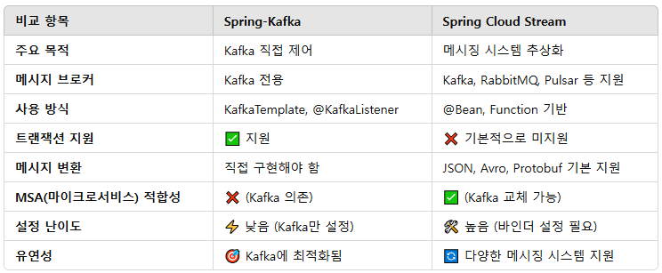
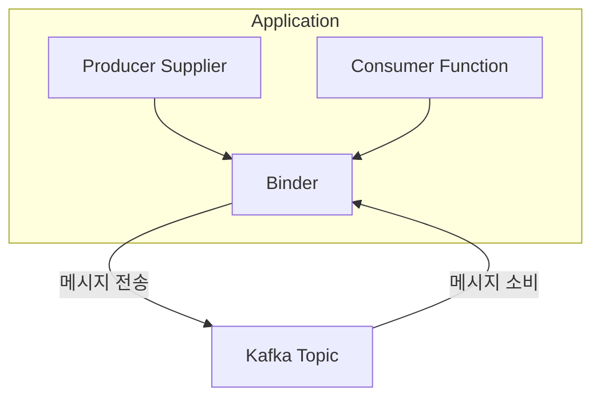
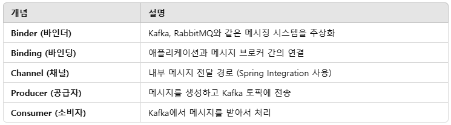

# Spring Boot에서 kafka 환경 설정하기

## 1. spring-kafka와 spring-cloud-stream 소개

 - spring-kafka는 Kafka를 직접 제어하며, Kafka의 강력한 기능을 활용 가능
 - spring-cloud-stream은 메시징 시스템을 추상화하여 유연한 개발이 가능
 - 마이크로서비스 아키텍처에서는 spring-cloud-stream이 유리할 수 있음
 - Kafka 기능을 세밀하게 다뤄야 한다면 spring-kafka가 더 적합
 - ✅ Kafka에 최적화된 애플리케이션을 개발한다면 → spring-kafka
 - ✅ Kafka 외에도 RabbitMQ, Pulsar 등을 사용할 가능성이 있다면 → spring-cloud-stream
 - ✅ 마이크로서비스 아키텍처에서 메시징을 추상화하려면 → spring-cloud-stream
 - ✅ Kafka의 고급 기능(트랜잭션, 재시도, Seek 등)을 사용하려면 → spring-kafka

<div align="center">
    
</div>
<br/>

### 1-1. Spring for Apache Kafka (spring-kafka)

__spring-kafka__는 Kafka Producer & Consumer API를 Spring 방식으로 쉽게 사용할 수 있도록 지원하는 라이브러리입니다.

Kafka를 직접 컨트롤할 수 있으며, 세밀한 설정이 가능합니다.

 - Kafka Producer, Consumer API를 Spring 방식으로 쉽게 사용 가능
 - KafkaTemplate을 사용하여 메시지를 전송
 - @KafkaListener를 사용하여 메시지를 소비
 - 트랜잭션 및 에러 핸들링을 세밀하게 조정 가능
 - Kafka의 고급 기능 지원 (예: SeekToCurrentErrorHandler, 재시도 정책 등)

```xml
<dependency>
    <groupId>org.springframework.kafka</groupId>
    <artifactId>spring-kafka</artifactId>
    <version>3.0.10</version>
</dependency>
```

 - `Producer`
```java
import org.springframework.kafka.core.KafkaTemplate;
import org.springframework.stereotype.Service;

@RequiredArgsConstructor
@Service
public class KafkaProducerService {
    private final KafkaTemplate<String, String> kafkaTemplate;

    public void sendMessage(String topic, String message) {
        kafkaTemplate.send(topic, message);
    }
}
```

 - `Consumer`
```java
import org.apache.kafka.clients.consumer.ConsumerRecord;
import org.springframework.kafka.annotation.KafkaListener;
import org.springframework.stereotype.Service;

@Service
public class KafkaConsumerService {

    @KafkaListener(topics = "my-topic", groupId = "my-group")
    public void listen(ConsumerRecord<String, String> record) {
        System.out.println("Received message: " + record.value());
    }
}
```

### 1-2. Spring Cloud Stream (spring-cloud-stream)

spring-cloud-stream은 Kafka, RabbitMQ 등 메시징 시스템을 쉽게 연결할 수 있도록 지원하는 프레임워크입니다.

Kafka뿐만 아니라 RabbitMQ, Pulsar 등도 같은 방식으로 사용 가능하며, 메시징 기반 마이크로서비스 개발을 쉽게 만들어 줍니다.

 - Kafka, RabbitMQ 등 다양한 메시지 브로커를 동일한 방식으로 사용 가능
 - @StreamListener 또는 @ServiceActivator를 사용하여 메시지를 소비
 - 설정만 변경하면 다른 메시징 시스템으로 교체 가능 (ex: Kafka → RabbitMQ)
 - Binder 개념을 사용하여 메시지 브로커와 독립적인 코드 작성 가능

```xml
<dependency>
    <groupId>org.springframework.cloud</groupId>
    <artifactId>spring-cloud-stream-binder-kafka</artifactId>
    <version>3.2.3</version>
</dependency>
```

 - `yml`
```yml
spring:
  cloud:
    stream:
      function:
        definition: processMessage
      bindings:
        processMessage-in-0:
          destination: my-topic
          group: my-group
```

 - `메시지 처리`
```java
import org.springframework.context.annotation.Bean;
import org.springframework.messaging.Message;
import org.springframework.stereotype.Service;
import java.util.function.Consumer;

@Service
public class MessageProcessor {

    @Bean
    public Consumer<Message<String>> processMessage() {
        return message -> System.out.println("Received: " + message.getPayload());
    }
}
```

## 2. Kafka Topic 생성

```bash
kafka-topics.sh --create \
  --bootstrap-server localhost:9092 \
  --replication-factor 2 \
  --partitions 3 \
  --topic my-json-topic \
  --config retention.ms=604800000
```

## 3. spring-cloud-stream 설정

### 3-1. Spring Cloud Stream의 기본 구조

Spring Cloud Stream의 핵심 개념은 바인더(Binder), 바인딩(Binding), 채널(Channel) 입니다.

 - __🔹 1. Binder (바인더)__
    - Kafka, RabbitMQ 같은 메시지 브로커와 통신하는 중간 계층
    - 특정 메시징 시스템을 사용할 수 있도록 추상화된 인터페이스 제공
    - spring-cloud-stream-binder-kafka, spring-cloud-stream-binder-rabbit 등의 바인더 사용 가능
 - __🔹 2. Binding (바인딩)__
    - 애플리케이션 코드와 메시지 브로커를 연결하는 역할
    - input / output 바인딩을 통해 메시지를 주고받음
 - __🔹 3. Channel (채널)__
    - 내부적으로 Spring Integration을 사용하여 메시지를 주고받는 논리적 개념
    - 프로그래머는 채널을 직접 다루지 않고 바인딩된 함수만 사용하면 됨



<div align="center">
    
</div>
<br/>

 - spring.cloud.stream.kafka.binder: binder 공통 설정
 - spring.cloud.stream.kafka.bindings: output&input 채널에 대한 카프카 특화 설정
 - spring.cloud.stream.bindings: output&input 채널에 대한 공통 설정
 - spring.cloud.function.definition: bean 정의
 - spring.cloud.stream.function.bindings: bean과 채널을 바인딩 해주는 역할 (채널은 bindings에 정의)
```yml
spring:
  cloud:
    function: # bean 정의
      definition: myProducer;myConsumer;
    stream:
      function:
        bidings: # bean과 채널을 바인딩 해주는 역할 (채널은 bindings에 정의)
          myProducer-out-0: producer-test
          myConsumer-in-0: consumer-test
      kafka:
        binder: # binder 공통 설정
          brokers: localhost:9092,localhost:9093,localhost:9094
          auto-create-topics: false
          required-acks: 0
          configuration:
            key.serializer: org.apache.kafka.common.serialization.StringSerializer
        bindings: # output&input 채널에 대한 카프카 특화 설정
          consumer-test:
            consumer:
              start-offset: latest
      bindings: # output&input 채널에 대한 공통 설정
        consumer-test:
          group: test-consumer-group
          destination: my-json-topic
          consumer:
            concurrency: 1
        producer-test:
          destination: my-json-topic
          contentType: application/json
```

### 3-2. Spring Cloud Stream 사용 예제

 - `build.gradle`
```groovy
dependencies {
    // ..

    implementation 'org.springframework.cloud:spring-cloud-stream:4.0.3'
    implementation 'org.springframework.cloud:spring-cloud-stream-binder-kafka:4.0.3'
}
```

 - `application.yml`
```yml
spring:
  cloud:
    function:
      deifinition: myProducer;myConsumer;
    stream:
      function:
        bindings:
          myProducer-out-0: producer-test
          myConsumer-in-0: consumer-test
      kafka:
        binder:
          brokers: localhost:9092,localhost:9093,localhost:9094
          auto-create-topics: false
          required-acks: 0
          configuration:
            key.serializer: org.apache.kafka.common.serialization.StringSerializer
        bindings:
          consumer-test:
            consumer:
              start-offset: latest
      bindings:
        producer-test:
          destination: my-json-topic
          content-type: application/json
        consumer-test:
          destination: my-json-topic
          group: test-consumer-group
          consumer:
            concurrency: 1
```

 - `MyConsumer & MyProducer`
```java
@Data
public class MyMessage {
    private int id;
    private int age;
    private String name;
    private String content;
}

// Consumer
import org.springframework.messaging.Message;
import org.springframework.stereotype.Component;
import java.util.function.Consumer;

@Component
public class MyConsumer implements Consumer<Message<MyMessage>> {
    @Override
    public void accept(Message<MyMessage> message) {
        System.out.println("Message arrived! - " + message.getPayload());
    }
}

// Producer
import org.springframework.kafka.support.KafkaHeaders;
import org.springframework.messaging.Message;
import org.springframework.messaging.support.MessageBuilder;
import org.springframework.stereotype.Component;
import reactor.core.publisher.Flux;
import reactor.core.publisher.Sinks;
import java.util.function.Supplier;

@Component
public class MyProducer implements Supplier<Flux<Message<MyMessage>>> {

    private final Sinks.Many<Message<MyMessage>> sinks = Sinks.many().unicast().onBackpressureBuffer();

    public void sendMessage(MyMessage myMessage) {
        Message<MyMessage> message = MessageBuilder
                .withPayload(myMessage)
                .setHeader(KafkaHeaders.KEY, String.valueOf(myMessage.getAge()))
                .build();
        sinks.emitNext(message, Sinks.EmitFailureHandler.FAIL_FAST);
    }

    @Override
    public Flux<Message<MyMessage>> get() {
        return sinks.asFlux();
    }
}
```

 - `MyController`
    - "/message" 엔드포인트 요청시 프로듀서로 메시지 발행
```java
@RequiredArgsConstructor
@RestController
public class MyController {

    private final MyProducer myProducer;

    @RequestMapping("/hello")
    String hello() {
        return "Hello World";
    }

    @PostMapping("/message")
    void message(
        @RequestBody MyMessage message
    ) {
        myProducer.sendMessage(message);
    }
}
```

## 4. Spring Kafka 설정

 - `build.gradle`
```groovy
dependencies {
    // ..

    implementation 'org.springframework.kafka:spring-kafka:3.1.0'
}
```

 - `application.yml`
    - acks 0은 프로듀서가 브로커에게 메시지를 보낸 후 결과에 대해서 신경쓰지 않는다.
    - acks 1은 리더 파티션에서 메시지를 받았다는 응답이 오면 프로듀서가 메시지 발행 성공 처리한다. 만약, 리더 파티션에 메시지가 전송되지 않았다고 판단하면 재시도하게 된다.
    - acks -1은 리더 파티션과 팔로워 파티션에 모두 복제가 성공해야 정상이라고 판단한다. 그게 확인되지 않으면 재시도 하게 된다.
```yml
spring:
  kafka:
    bootstrap-servers: localhost:9092,localhost:9093,localhost:9094
    consumer:
      key-deserializer: org.apache.kafka.common.serialization.StringDeserializer
      value-deserializer: org.springframework.kafka.support.serializer.JsonDeserializer
      auto-offset-reset: latest
      properties:
        spring.json.trusted.packages: "*"
        allow.auto.create.topics: false
    listener:
      concurrency: 1
    producer:
      key-serializer: org.apache.kafka.common.serialization.StringSerializer
      value-serializer: org.springframework.kafka.support.serializer.JsonSerializer
      acks: 1
```

 - `MyConsumer & MyProducer`
    - Producer
        - KafkaTemplate을 사용하여 Kafka로 메시지를 전송
        - send(topic, message)로 메시지를 보냄
        - 비동기 방식으로 실행되며, 실패 시 자동으로 재시도 가능
    - Consumer
        - @KafkaListener: 토픽을 구독하고 메시지가 들어오면 실행
        - ConsumerRecord: 메시지 키와 값을 포함하는 Kafka 데이터 구조
```java
// MyConsumer: 메시지 소비
import org.apache.kafka.clients.consumer.ConsumerRecord;
import org.springframework.kafka.annotation.KafkaListener;
import org.springframework.stereotype.Component;

@Component
public class MyConsumer {

    @KafkaListener(
        topics = { "my-json-topic" },
        groupId = "test-consumer-group"
    )
    public void accept(ConsumerRecord<String, MyMessage> message) {
        System.out.println("Message arrived! - " + message.value());
    }
}

// MyProducer: 메시지 발행
import lombok.RequiredArgsConstructor;
import org.springframework.kafka.core.KafkaTemplate;
import org.springframework.stereotype.Component;

@RequiredArgsConstructor
@Component
public class MyProducer {

    private final KafkaTemplate<String, MyMessage> kafkaTemplate;

    public void sendMessage(MyMessage myMessage) {
        kafkaTemplate.send("my-json-topic", String.valueOf(myMessage.getAge()), myMessage);
    }
}
```

## 5. Spring Kafka 설정 (Produce, Consume)

### 5-1. KafkaAutoConfiguration

KafkaAutoConfiguration은 Spring Boot에서 Kafka 설정을 자동으로 구성해주는 클래스입니다.

Spring Boot 애플리케이션에서 Kafka 관련 빈(Bean)을 자동으로 등록해 주므로, 별도의 복잡한 설정 없이 Kafka를 사용할 수 있습니다.

 - KafkaAutoConfiguration은 application.yml에서 정의한 Kafka 설정을 자동으로 적용하며, 해당 설정을 기반으로 KafkaTemplate, ProducerFactory, ConsumerFactory 등이 자동으로 설정된다.
 - KafkaTemplate: Kafka 메시지를 보내는 핵심 클래스
 - DefaultKafkaProducerFactory: Kafka 프로듀서를 생성하는 팩토리
 - KafkaListenerContainerFactory: Kafka 리스너를 관리하는 컨테이너
 - ConcurrentKafkaListenerContainerFactory: @KafkaListener를 사용할 때 필요한 설정을 담당
 - DefaultKafkaConsumerFactory: Kafka 컨슈머를 생성하는 팩토리
```java
// @ConditionalOnClass(KafkaTemplate.class) → Kafka 관련 클래스가 클래스패스에 있을 경우만 활성화
// @ConditionalOnProperty(prefix = "spring.kafka", name = "enabled", matchIfMissing = true) → spring.kafka.enabled=true일 경우 활성화 (기본값: 활성화됨)
// @EnableConfigurationProperties(KafkaProperties.class) → application.yml의 spring.kafka 값을 KafkaProperties 객체에 바인딩
// @Import(...) → Kafka 관련 설정 클래스를 함께 등록
@Configuration(proxyBeanMethods = false)
@ConditionalOnClass(KafkaTemplate.class)
@ConditionalOnProperty(prefix = "spring.kafka", name = "enabled", matchIfMissing = true)
@EnableConfigurationProperties(KafkaProperties.class)
@Import({KafkaTemplateConfiguration.class, KafkaAnnotationDrivenConfiguration.class})
public class KafkaAutoConfiguration {
}
```

### 5-2. KafkaAutoConfiguration을 직접 사용하지 않고 직접 설정

 - `application.yml`
    - Kafka 설정을 2개 적용하기 위해 spring.kafka 하위에 json과 string 으로 구분하여 설정을 정의
```yml
spring:
  kafka:
    json:
      bootstrap-servers: localhost:9092,localhost:9093,localhost:9094
      consumer:
        key-deserializer: org.apache.kafka.common.serialization.StringDeserializer
        value-deserializer: org.springframework.kafka.support.serializer.JsonDeserializer
        auto-offset-reset: latest
      listener:
        concurrency: 1
      producer:
        key-serializer: org.apache.kafka.common.serialization.StringSerializer
        value-serializer: org.springframework.kafka.support.serializer.JsonSerializer
        acks: 1
    string:
      bootstrap-servers: localhost:9092,localhost:9093,localhost:9094
      consumer:
        key-deserializer: org.apache.kafka.common.serialization.StringDeserializer
        value-deserializer: org.apache.kafka.common.serialization.StringDeserializer
      listener:
        concurrency: 1
      producer:
        key-serializer: org.apache.kafka.common.serialization.StringSerializer
        value-serializer: org.apache.kafka.common.serialization.StringSerializer
        acks: 0
```

 - `KafkaConfig`
```java
import org.apache.kafka.clients.consumer.ConsumerConfig;
import org.apache.kafka.clients.producer.ProducerConfig;
import org.springframework.boot.autoconfigure.kafka.KafkaProperties;
import org.springframework.boot.context.properties.ConfigurationProperties;
import org.springframework.context.annotation.Bean;
import org.springframework.context.annotation.Configuration;
import org.springframework.context.annotation.Primary;
import org.springframework.kafka.annotation.EnableKafka;
import org.springframework.kafka.config.ConcurrentKafkaListenerContainerFactory;
import org.springframework.kafka.core.*;
import org.springframework.kafka.support.serializer.JsonDeserializer;

import java.util.HashMap;
import java.util.Map;

@Configuration
@EnableKafka
public class KafkaConfig {

    @Bean
    @Primary
    @ConfigurationProperties("spring.kafka.json")
    public KafkaProperties kafkaProperties() {
        return new KafkaProperties();
    }

    @Bean
    @Primary
    public ConsumerFactory<String, Object> consumerFactory(KafkaProperties kafkaProperties) {
        Map<String, Object> props = new HashMap<>();
        props.put(ConsumerConfig.BOOTSTRAP_SERVERS_CONFIG, kafkaProperties.getBootstrapServers());
        props.put(ConsumerConfig.KEY_DESERIALIZER_CLASS_CONFIG, kafkaProperties.getConsumer().getKeyDeserializer());
        props.put(ConsumerConfig.VALUE_DESERIALIZER_CLASS_CONFIG, kafkaProperties.getConsumer().getValueDeserializer());
        props.put(JsonDeserializer.TRUSTED_PACKAGES, "*");
        props.put(ConsumerConfig.AUTO_OFFSET_RESET_CONFIG, "latest");
        props.put(ConsumerConfig.ALLOW_AUTO_CREATE_TOPICS_CONFIG, "false");
        return new DefaultKafkaConsumerFactory<>(props);
    }

    @Bean
    @Primary
    public ConcurrentKafkaListenerContainerFactory<String, Object> kafkaListenerContainerFactory(
        ConsumerFactory<String, Object> consumerFactory
    ) {
        ConcurrentKafkaListenerContainerFactory<String, Object> factory = new ConcurrentKafkaListenerContainerFactory<>();
        factory.setConsumerFactory(consumerFactory);
        factory.setConcurrency(1);

        return factory;
    }

    @Bean
    @Primary
    public ProducerFactory<String, Object> producerFactory(KafkaProperties kafkaProperties) {
        Map<String, Object> props = new HashMap<>();
        props.put(ProducerConfig.BOOTSTRAP_SERVERS_CONFIG, kafkaProperties.getBootstrapServers());
        props.put(ProducerConfig.KEY_SERIALIZER_CLASS_CONFIG, kafkaProperties.getProducer().getKeySerializer());
        props.put(ProducerConfig.VALUE_SERIALIZER_CLASS_CONFIG, kafkaProperties.getProducer().getValueSerializer());
        props.put(ProducerConfig.ACKS_CONFIG, kafkaProperties.getProducer().getAcks());
        return new DefaultKafkaProducerFactory<>(props);
    }

    // KafkaTemplate이 존재하는 경우 KafkaAutoConfiguration의 자동 설정이 제외된다.
    // 컴포넌트 스캔시 KafkaAutoConfiguration을 exclude 하도록 정의할 수도 있다.
    @Bean
    @Primary
    public KafkaTemplate<String, ?> kafkaTemplate(KafkaProperties kafkaProperties) {
        return new KafkaTemplate<>(producerFactory(kafkaProperties));
    }
}
```

 - `SecondKafkaConfig`
```java
import org.apache.kafka.clients.consumer.ConsumerConfig;
import org.apache.kafka.clients.producer.ProducerConfig;
import org.springframework.beans.factory.annotation.Qualifier;
import org.springframework.boot.autoconfigure.kafka.KafkaProperties;
import org.springframework.boot.context.properties.ConfigurationProperties;
import org.springframework.context.annotation.Bean;
import org.springframework.context.annotation.Configuration;
import org.springframework.kafka.annotation.EnableKafka;
import org.springframework.kafka.config.ConcurrentKafkaListenerContainerFactory;
import org.springframework.kafka.core.*;

import java.util.HashMap;
import java.util.Map;

@Configuration
@EnableKafka
public class SecondKafkaConfig {

    @Bean
    @Qualifier("secondKafkaProperties")
    @ConfigurationProperties("spring.kafka.string")
    public KafkaProperties secondKafkaProperties() {
        return new KafkaProperties();
    }

    @Bean
    @Qualifier("secondConsumerFactory")
    public ConsumerFactory<String, Object> secondConsumerFactory(KafkaProperties secondKafkaProperties) {
        Map<String, Object> props = new HashMap<>();
        props.put(ConsumerConfig.BOOTSTRAP_SERVERS_CONFIG, secondKafkaProperties.getBootstrapServers());
        props.put(ConsumerConfig.KEY_DESERIALIZER_CLASS_CONFIG, secondKafkaProperties.getConsumer().getKeyDeserializer());
        props.put(ConsumerConfig.VALUE_DESERIALIZER_CLASS_CONFIG, secondKafkaProperties.getConsumer().getValueDeserializer());
        props.put(ConsumerConfig.AUTO_OFFSET_RESET_CONFIG, "latest");
        props.put(ConsumerConfig.ALLOW_AUTO_CREATE_TOPICS_CONFIG, "false");
        return new DefaultKafkaConsumerFactory<>(props);
    }

    @Bean
    @Qualifier("secondKafkaListenerContainerFactory")
    public ConcurrentKafkaListenerContainerFactory<String, Object> secondKafkaListenerContainerFactory(
        ConsumerFactory<String, Object> consumerFactory
    ) {
        ConcurrentKafkaListenerContainerFactory<String, Object> factory = new ConcurrentKafkaListenerContainerFactory<>();
        factory.setConsumerFactory(consumerFactory);
        factory.setConcurrency(1);

        return factory;
    }

    @Bean
    @Qualifier("secondKafkaListenerContainerFactory")
    public ProducerFactory<String, Object> secondProducerFactory(KafkaProperties kafkaProperties) {
        Map<String, Object> props = new HashMap<>();
        props.put(ProducerConfig.BOOTSTRAP_SERVERS_CONFIG, kafkaProperties.getBootstrapServers());
        props.put(ProducerConfig.KEY_SERIALIZER_CLASS_CONFIG, kafkaProperties.getProducer().getKeySerializer());
        props.put(ProducerConfig.VALUE_SERIALIZER_CLASS_CONFIG, kafkaProperties.getProducer().getValueSerializer());
        props.put(ProducerConfig.ACKS_CONFIG, kafkaProperties.getProducer().getAcks());
        return new DefaultKafkaProducerFactory<>(props);
    }

    @Bean
    @Qualifier("secondKafkaTemplate")
    public KafkaTemplate<String, ?> secondKafkaTemplate(KafkaProperties kafkaProperties) {
        return new KafkaTemplate<>(secondProducerFactory(kafkaProperties));
    }
}
```

 - `Producer & Consumer(Second)`
```java
// Producer
@RequiredArgsConstructor
@Component
public class MySecondProducer {

    @Qualifier("secondKafkaTemplate")
    private final KafkaTemplate<String, String> secondKafkaTemplate;

    public void sendMessageWithKey(String key, String message) {
        secondKafkaTemplate.send(MY_SECOND_TOPIC, key, message);
    }
}

// Consumer
@Component
public class MySecondConsumer {

    @KafkaListener(
        topics = { MY_SECOND_TOPIC },
        groupId = "test-consumer-group",
        containerFactory = "secondKafkaListenerContainerFactory"
    )
    public void accept(ConsumerRecord<String, String> message) {
        System.out.println("[Second Consumer] Message arrived! - " + message.value());
        System.out.println("[Second Consumer] Offset - " + message.offset() + " / Partition - " + message.partition());
    }
}
```
