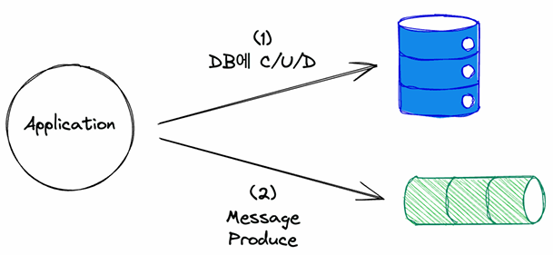
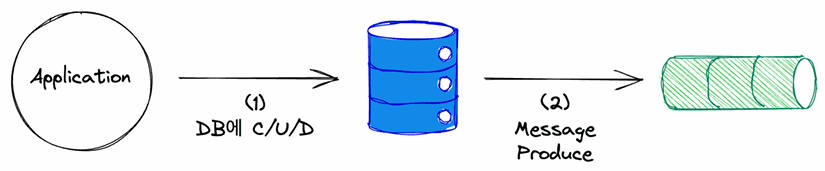
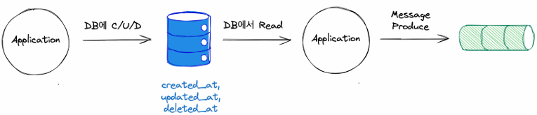
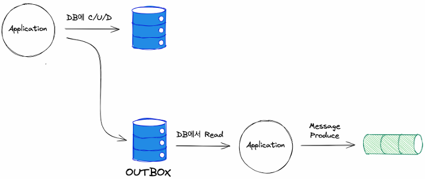

# CDC(Change Data Capture)

CDC(변경 데이터 캡처, Change Data Capture)는 데이터베이스에서 변경된 데이터를 실시간으로 감지하고 이를 외부 시스템으로 전달하는 기술입니다. 기존에는 배치 방식으로 데이터베이스를 주기적으로 조회하여 변경 사항을 동기화했지만, CDC는 트랜잭션 로그를 기반으로 이벤트 기반으로 데이터 변경을 감지하여 빠르게 반영할 수 있습니다.

 - __실시간 데이터 동기화__: 데이터베이스 변경 사항을 빠르게 반영하여 실시간 분석, 로그 처리 등에 활용 가능
 - __데이터 일관성 유지__: 수동 배치 방식보다 최신 데이터를 유지할 수 있음
 - __부하 감소__: CDC는 데이터베이스 트랜잭션 로그를 활용하여 효율적으로 동작
 - __이벤트 기반 아키텍처 지원__: Kafka와 같은 메시지 큐와 결합하면 마이크로서비스 아키텍처에서 데이터 변경 사항을 빠르게 공유 가능


## 1. CDC 개요 및 실무 사례

A팀에서 데이터 원천을 관리하는데, B팀에서 이 데이터를 계속 싱크 받아야 한다면?

 - A팀의 DB에 B팀이 아예 직접 붙어서 서비스에 사용하는 방법
 - A팀의 DB에 B팀이 주기적으로 직접 붙어서 싱크해온 뒤, B팀 자체적으로 구축한 복사본을 사용하는 방법
 - A팀이 Kafka를 통해 메시지 형태로 변경사항을 Produce 해주면, B팀에서 Consume해서 데이터를 준실시간 싱크하는 방법

## 2. 애플리케이션 레벨에서의 CDC vs 인프라 레벨에서의 CDC

 - `애플리케이션 레벨에서의 CDC`
    - DB에 CUD와 Message Produce 진행
    - 2가지에 Dual Write 하게 된다. 휴먼 에러가 발생할 수 있다. (데이터 누락)
    - 2개의 정합성 문제

<div align="center">
    
</div>
<br/>

 - `인프라 레벨에서의 CDC`
    - 애플리케이션에서는 DB에만 CUD
    - 변경 사항에 따라 Message Produce 진행

<div align="center">
    
</div>
<br/>

## 3. 애플리케이션 레벨에서 CDC 직접 구현하기

### 3-1. Dual Write(@Transactional + 메시지 발행)

DB Write 수행 후 메시지를 발행한다. 이때, 메시지를 발행하고 이후 로직이 있을 때 이후 로직에서 에러가 발생하면 DB는 롤백되는데 메시지가 발행되는 상황이 발생할 수 있다. (DB에 반영 안돼고, 카프카 프로듀싱 성공)

 - `MyService`
    - save(Create, Update), delete(Delete)시 메시지 발행
    - DB에 데이터 저장 후 마지막 데이터 상태에 대해서 메시지 발행
```java
@RequiredArgsConstructor
@Service
public class MyServiceImpl implements MyService {

    private final MyJpaRepository myJpaRepository;
    private final MyCdcProducer myCdcProducer;

    @Override
    public List<MyModel> findAll() {
        List<MyEntity> entities = myJpaRepository.findAll();
        return entities.stream().map(MyModelConverter::toModel).toList();
    }

    @Override
    public MyModel findById(Integer id) {
        Optional<MyEntity> entity = myJpaRepository.findById(id);
        return entity.map(MyModelConverter::toModel).orElse(null);
    }

    @Override
    @Transactional
    public MyModel save(MyModel model) {
        OperationType operationType = model.getId() == null ? OperationType.CREATE : OperationType.UPDATE;
        MyEntity entity = myJpaRepository.save(MyModelConverter.toEntity(model));
        MyModel resultModel = MyModelConverter.toModel(entity);
        try {
            myCdcProducer.sendMessage(
                MyModelConverter.toMessage(
                    resultModel.getId(),
                    resultModel,
                    operationType
                )
            );
        } catch (JsonProcessingException e) {
            throw new RuntimeException("Error processing JSON for sendMessage", e);
        }
        return resultModel;
    }

    @Override
    @Transactional
    public void delete(Integer id) {
        myJpaRepository.deleteById(id);
        try {
            myCdcProducer.sendMessage(
                MyModelConverter.toMessage(id, null, OperationType.DELETE)
            );
        } catch (JsonProcessingException e) {
            throw new RuntimeException("Error processing JSON for sendMessage", e);
        }
    }
}
```

### 3-2. ApplicationEvent + TransactionalEventListener

@TransactionalEventListener는 트랜잭션 이벤트 리스너로, 특정 트랜잭션의 상태에 따라 이벤트를 처리할 수 있도록 해주는 기능입니다. 일반적인 @EventListener와 달리 트랜잭션이 성공적으로 커밋된 후에 실행되도록 설정할 수 있습니다.

Spring의 이벤트 시스템에서 이벤트를 발생시키면 @EventListener를 사용하여 이벤트를 처리할 수 있습니다. 하지만 이 방식은 트랜잭션과 별개로 동작하기 때문에, 데이터가 커밋되기 전에 실행될 수도 있습니다.

@TransactionalEventListener를 사용하면 트랜잭션의 상태(커밋 또는 롤백)에 따라 이벤트를 처리할지 결정할 수 있습니다. 따라서 데이터가 커밋된 후 안전하게 실행해야 하는 로직(예: 이메일 전송, 캐시 업데이트, 외부 API 호출 등)에 유용합니다.

DB Write 수행 후 커밋 리스너에 의해서 메시지를 발행한다. 이때, 메시지 발행시 에러가 발생하면 DB에는 저장되는데 메시지가 발행되지 않는 상황이 발생할 수 있다. (DB에는 반영됐지만, 카프카에 프로듀싱 실패)

 - `MyCdcApplicationEvent`
```java
@Getter
public class MyCdcApplicationEvent extends ApplicationEvent {

    private final Integer id;
    private final MyModel myModel;
    private final OperationType operationType;

    public MyCdcApplicationEvent(Object source, Integer id, MyModel myModel, OperationType operationType) {
        super(source);
        this.id = id;
        this.myModel = myModel;
        this.operationType = operationType;
    }
}
```

 - `MyServiceImpl`
    - DB CREATE/UPDATE/DELETE 후에 ApplicationEvent 발행
```java
@RequiredArgsConstructor
@Service
public class MyServiceImpl implements MyService {

    private final MyJpaRepository myJpaRepository;
    private final ApplicationEventPublisher applicationEventPublisher;

    @Override
    @Transactional
    public MyModel save(MyModel model) {
        OperationType operationType = model.getId() == null ? OperationType.CREATE : OperationType.UPDATE;
        MyEntity entity = myJpaRepository.save(MyModelConverter.toEntity(model));
        MyModel resultModel = MyModelConverter.toModel(entity);
        applicationEventPublisher.publishEvent(
            new MyCdcApplicationEvent(
                this,
                resultModel.getId(),
                resultModel,
                operationType
            )
        );
        return resultModel;
    }

    @Override
    @Transactional
    public void delete(Integer id) {
        myJpaRepository.deleteById(id);
        applicationEventPublisher.publishEvent(
            new MyCdcApplicationEvent(
                this,
                id,
                null,
                OperationType.DELETE
            )
        );
    }
}
```

 - `MyCdcApplicationEventListener`
    - 트랜잭션 이벤트 후에 콜백
    - AFTER_COMMIT: (기본값) 트랜잭션이 성공적으로 커밋된 후 실행
    - AFTER_ROLLBACK: 트랜잭션이 롤백된 후 실행
    - AFTER_COMPLETION: 트랜잭션이 커밋되거나 롤백된 후 실행
    - BEFORE_COMMIT: 트랜잭션이 커밋되기 직전 실행
```java
// DB에 저장이 잘 된 이후에 메시지를 발행한다.
@RequiredArgsConstructor
@Component
public class MyCdcApplicationEventListener {

    private final MyCdcProducer myCdcProducer;

    @TransactionalEventListener(phase = TransactionPhase.AFTER_COMMIT)
    @Async
    public void transactionalEventListenerAfterCommit(MyCdcApplicationEvent event) throws JsonProcessingException {
        myCdcProducer.sendMessage(
            MyModelConverter.toMessage(event.getId(), event.getMyModel(), event.getOperationType())
        );
    }
}
```

### 3-3. EntityListener 이용

Spring과 JPA를 사용할 때, 엔티티(Entity)의 라이프사이클 이벤트를 감지하여 특정 로직을 실행할 수 있도록 도와주는 기능이 EntityListener입니다.

EntityListener는 JPA 엔티티에 대한 생성, 수정, 삭제 이벤트를 감지하여 콜백 메서드를 실행할 수 있습니다.

즉, 데이터베이스에 엔티티가 저장되거나 삭제될 때 특정 로직을 실행해야 할 경우 유용합니다.

__@PrePersist, @PreUpdate, @PreRemove 등을 활용하여 데이터 변경 이벤트를 감지하고 외부 시스템으로 전송할 수 있습니다.__

 - `EntityListener 기반 CDC의 활용 사례`
    - 이벤트 스트리밍: 데이터 변경 사항을 Kafka로 전송하여 비동기 처리
    - 감사 로그(Audit Logging): 모든 데이터 변경 사항을 로깅하여 추적 가능
    - ElasticSearch 동기화: DB 변경 사항을 실시간으로 ElasticSearch에 반영
    - 데이터 백업 시스템: 삭제된 데이터를 로그에 기록하여 복구 가능
    - 캐시 무효화(Cache Invalidation): 데이터 변경 시 Redis 등의 캐시를 업데이트

 - `MyService`
```java
@RequiredArgsConstructor
@Service
public class MyServiceImpl implements MyService {

    private final MyJpaRepository myJpaRepository;

    @Override
    public MyModel save(MyModel model) {
        MyEntity entity = myJpaRepository.save(MyModelConverter.toEntity(model));
        return MyModelConverter.toModel(entity);
    }

    @Override
    public void delete(Integer id) {
        myJpaRepository.deleteById(id);
    }
}
```

 - `MyEntityListener`
    - @PrePersist: 엔티티가 저장되기 전 실행
    - @PostPersist: 엔티티가 저장된 후 실행
    - @PreUpdate: 엔티티가 수정되기 전 실행
    - @PostUpdate: 엔티티가 수정된 후 실행
    - @PreRemove: 엔티티가 삭제되기 전 실행
    - @PostRemove: 엔티티가 삭제된 후 실행
    - @PostLoad: 엔티티가 조회된 직후 실행
```java
@Component
public class MyEntityListener {

    @Lazy
    @Autowired
    private MyCdcProducer myCdcProducer;

    // 엔티티가 저장된 후 실행
    @PostPersist
    public void handleCreate(MyEntity myEntity) {
        System.out.println("handleCreate");
        MyModel myModel = MyModelConverter.toModel(myEntity);
        try {
            myCdcProducer.sendMessage(
                MyModelConverter.toMessage(
                    myModel.getId(),
                    myModel,
                    OperationType.CREATE
                )
            );
        } catch (JsonProcessingException e) {
            throw new RuntimeException(e);
        }
    }

    // 엔티티가 수정된 후 실행
    @PostUpdate
    public void handleUpdate(MyEntity myEntity) {
        System.out.println("handleUpdate");
        MyModel myModel = MyModelConverter.toModel(myEntity);
        try {
            myCdcProducer.sendMessage(
                MyModelConverter.toMessage(
                    myModel.getId(),
                    myModel,
                    OperationType.UPDATE
                )
            );
        } catch (JsonProcessingException e) {
            throw new RuntimeException(e);
        }
    }

    // 엔티티가 삭제된 후 실행
    @PostRemove
    public void handleDelete(MyEntity myEntity) {
        System.out.println("handleDelete");
        MyModel myModel = MyModelConverter.toModel(myEntity);
        try {
            myCdcProducer.sendMessage(
                MyModelConverter.toMessage(
                    myModel.getId(),
                    null,
                    OperationType.DELETE
                )
            );
        } catch (JsonProcessingException e) {
            throw new RuntimeException(e);
        }
    }
}
```

### 3-4. 메시지 발행을 별도 테이블에 저장하고 비동기 전송

CDC 이벤트를 별도의 테이블(event_outbox)에 저장한 후, 배치 프로세스 또는 이벤트 큐를 이용하여 비동기 전송하는 방법입니다.

이 패턴을 Outbox 패턴이라고 합니다.

 - `CDCEvent`
    - CDC 이벤트 저장을 위한 Outbox 테이블
```java
@Entity
public class CDCEvent {

    @Id
    @GeneratedValue(strategy = GenerationType.IDENTITY)
    private Long id;

    private String eventType;
    private String payload;
    private LocalDateTime createdAt = LocalDateTime.now();

    public CDCEvent(String eventType, String payload) {
        this.eventType = eventType;
        this.payload = payload;
    }
}
```

 - `OrderService`
    - 트랜잭션내에서 도메인 테이블과 CDCEvent용 테이블에 CRUD 작업 실행
    - 비즈니스용 엔티티 저장과 CDCEvent용 엔티티 저장에 대한 일관성이 보장된다.
```java
@Service
public class OrderService {
    private final OrderRepository orderRepository;
    private final CDCEventRepository cdcEventRepository;

    public OrderService(OrderRepository orderRepository, CDCEventRepository cdcEventRepository) {
        this.orderRepository = orderRepository;
        this.cdcEventRepository = cdcEventRepository;
    }

    @Transactional
    public void createOrder(Order order) {
        orderRepository.save(order);

        // CDC 이벤트를 Outbox 테이블에 저장
        String eventPayload = "{ \"orderId\": " + order.getId() + " }";
        cdcEventRepository.save(new CDCEvent("ORDER_CREATED", eventPayload));
    }
}
```

 - `CDCEventPublisher`
    - 배치 프로세스로 Outbox 테이블의 CDC 이벤트 전송
    - DB 트랜잭션과 함께 CDC 이벤트가 안전하게 저장됨.
    - 메시지 전송이 실패해도 재시도 가능(Outbox 테이블에 데이터가 남아 있음).
    - 트랜잭션 롤백 시 이벤트도 롤백됨 → 데이터 정합성 유지.
```java
@Service
public class CDCEventPublisher {
    private final CDCEventRepository cdcEventRepository;

    public CDCEventPublisher(CDCEventRepository cdcEventRepository) {
        this.cdcEventRepository = cdcEventRepository;
    }

    @Scheduled(fixedRate = 5000) // 5초마다 실행
    public void publishEvents() {
        List<CDCEvent> events = cdcEventRepository.findAll();

        for (CDCEvent event : events) {
            try {
                // Kafka 또는 RabbitMQ 전송
                System.out.println("📡 CDC 메시지 발행: " + event.getPayload());
                // 성공적으로 전송되면 해당 이벤트 삭제
                cdcEventRepository.delete(event);
            } catch (Exception e) {
                System.out.println("⚠️ CDC 메시지 전송 실패: " + e.getMessage());
                // 실패 시 재시도 로직 필요
            }
        }
    }
}
```

### 3-5. Spring Retry를 이용한 재시도 로직 추가

메시지 발행이 실패하면 Spring Retry를 활용하여 자동으로 재시도하도록 설정할 수 있습니다.

 - `CDCEventListener`
    - 메시지 발행이 실패하면 자동으로 재시도됨.
    - 재시도 횟수 및 백오프(대기 시간) 설정 가능.
    - 서버 장애 시 재시도가 중단될 수 있음(배치 방식보다 신뢰성이 낮음).
```java
@Service
public class CDCEventListener {

    @TransactionalEventListener(phase = TransactionPhase.AFTER_COMMIT)
    @Retryable(value = Exception.class, maxAttempts = 3, backoff = @Backoff(delay = 5000))
    public void sendOrderCreatedEvent(OrderCreatedEvent event) {
        System.out.println("📡 CDC 메시지 발행 시도: " + event.getOrder().getId());

        // 메시지 발행 (Kafka, RabbitMQ)
        if (Math.random() > 0.7) { // 테스트용 랜덤 실패 처리
            throw new RuntimeException("🚨 메시지 발행 실패!");
        }

        System.out.println("✅ CDC 메시지 발행 성공: " + event.getOrder().getId());
    }
}
```

## 4. Message Key 명시를 통한 순서 보장

 - `MyCdcProducer`
    - CDC(Change Data Capture)는 데이터마다의 변경 사항 추적이 필요하다.
    - 즉, 하나의 데이터 내에서 변경사항 순서가 중요하다.
    - 이 데이터의 순서를 보장하기 위해서 메시지 키를 Primary Key를 사용할 수 있다.
    - 메시지 키의 기준은 해결하려는 문제마다 다르다. 나잇대별로 선착순 순서가 중요하다면 나이를 키로 잡을 수 있다.
```java
@RequiredArgsConstructor
@Component
public class MyCdcProducer {

    CustomObjectMapper objectMapper = new CustomObjectMapper();

    private final KafkaTemplate<String, String> kafkaTemplate;

    public void sendMessage(MyCdcMessage message) throws JsonProcessingException {
        kafkaTemplate.send(
            Topic.MY_CDC_TOPIC,
            String.valueOf(message.getId()),
            objectMapper.writeValueAsString(message)
        );
    }
}
```

 - `MyCdcConsumer`
```java
@Component
public class MyCdcConsumer {

    private final CustomObjectMapper objectMapper = new CustomObjectMapper();

    @KafkaListener(
        topics = { MY_CDC_TOPIC },
        groupId = "cdc-consumer-group",
        concurrency = "3"
    )
    public void listen(ConsumerRecord<String, String> message, Acknowledgment acknowledgment) throws JsonProcessingException {
        MyCdcMessage myCdcMessage = objectMapper.readValue(message.value(), MyCdcMessage.class);
        System.out.println("[Cdc Consumer] " + myCdcMessage.getOperationType() + " Message arrived! (id: " + myCdcMessage.getId() + ") - " + myCdcMessage.getPayload());
        acknowledgment.acknowledge();
    }
}
```

## 5. Application 레벨에서 CDC를 구현할 그 외 방법

### 5-1. 한계점

 - `애플리케이션 레벨 구현의 한계점`
    - DB에 확실히 반영된 것만 Kafka로 프로듀스하자니, 프로듀스가 누락될 수 있다.
    - Kafka로 프로듀스부터 하자니, DB에 반영되지 않은 변경사항이 Kafka로 먼저 유통되어 버릴 수 있다.
 - `한계가 발생하는 근본적인 이유`
    - 데이터 흐름이 직렬이 아니라 병렬(Dual Write)이다.
    - Write 목적지인 DB와 Kafka에 대한 작업을 하나의 트랜잭션으로 묶을 수 없다.

### 5-1. 해결 방법: 직렬로 바꾸기

처음으로 애플리케이션 레벨에서 DB에 저장한다.

이후, 다른 애플리케이션에서 해당 DB에 주기적으로 접근하는 로직을 만들고, 마지막 접근 시간 이후에 레코드를 가져와서 카프카로 프로듀싱한다.

<div align="center">
    
</div>
<br/>

### 5-2. 해결 방법: 아웃박스 패턴

DB와 Kafka를 트랜잭션 하나로 묶을 수 없다.

이것을 보완하기 위해 보상 트랜잭션(SAGA)이 있지만, 운영하기에 복잡함이 있다.

DB 저장시 Kafka로 프로듀싱을 바로 하지 않고, Outbox라고 하는 별도의 테이블을 만들어서 큐로 대체한다.

 - 별도의 테이블이 필요하다.
 - Outbox 테이블에 데이터가 많이 쌓일 수 있어, 주기적으로 데이터를 정리해주어야 한다.

<div align="center">
    
</div>
