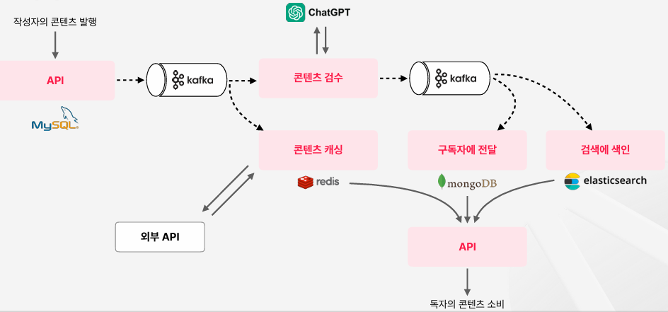

# 콘텐츠 플랫폼 구축하기

 - MySQL, Redis, MongoDB, Elasticsearch, ChatGTP API
 - 실습 환경
    - JDK 17
    - Spring Boot 3.2.0
    - IDE: IntelliJ
 - 인프라
    - Apache Kafka 3.6.0
    - Apache Zookeeper 3.7.2
    - MySQL 8.0.35
    - MongoDB 7.0.3
    - Redis 6.0.20
    - Elasticsearch 7.10.2
    - Logstash 7.10.2
    - Kibana 7.10.2
    - Docker Desktop 4.25.2

```
Root Project
 ├─ adapter
 │   ├─ chat-gpt-client
 │   ├─ elasticsearch
 │   ├─ kafka
 │   ├─ metadata-client
 │   ├─ mongodb
 │   ├─ mysql
 │   └─ redis
 ├─ api
 ├─ common
 ├─ domain
 ├─ usecase
 │   ├─ core
 │   ├─ coupon-usecase
 │   ├─ inspected-post-usecase
 │   ├─ post-resolving-help-usecase
 │   ├─ post-search-usecase
 │   ├─ post-usecase
 │   └─ subscribing-post-usecase
 ├─ worker
 │   ├─ auto-inspection-worker
 │   ├─ content-caching-worker
 │   ├─ content-indexing-worker
 │   ├─ content-subscribing-worker
 │   └─ coupon-issuing-worker
 ├─ build.gradle
 └─ settings.gradle
```

## 1. 요구사항 정리 및 데이터 흐름

 - 유저는 콘텐츠를 발행할 수 있다.
 - 유저는 다른 유저를 구독 가능하며, 구독자는 콘텐츠를 받아볼 수 있다.
 - 카테고리를 통해 콘텐츠를 분류 가능하다.
 - 검색을 통해 콘텐츠를 찾을 수 있다.

 - `요구사항 정리 - 상세 조건 및 주의사항`
    - 콘텐츠는 제목과 내용을 직접 작성하고, 제시된 카테고리 중에서 선택해서 작성한다.
    - 콘텐츠 정보는 우리 팀에서 원천을 직접 관리하고, 반면에 유저 정보와 구독 정보, 카테고리 정보에 대한 원천은 외부 팀의 API 서버를 통해 얻을 수 있다.
        - 외부 API 서버는 결함이 있어서 20%의 빈도로 1초 이상의 Latency가 발생하므로 주의한다.
    - 콘텐츠는 발행됨과 동시에 상세페이지에서 확인 가능하다. 상세페이지에 노출되어야 하는 정보는 제목, 내용, 작성자명, 카테고리명, 등록일시, 수정여부가 있다.
    - 콘텐츠를 발견할 수 있응 탐색지면에서 목록에 노출되어야 하는 정보는 제목, 작성자명, 등록일자이다.
    - 삭제된 콘텐츠는 노출되면 안된다.
    - 삭제되지 않았더라도, 유저가 카테고리를 잘못 등록한 콘텐츠는 탐색지면에서 노출되면 안된다.

 - `데이터 흐름 설계`

<div align="center">
    
</div>
<br/>

## 2. API 엔드포인트 생성 및 Swagger 연동

 - `프로젝트 구조`
```
root
 ├─ adapter
 ├─ api
 ├─ common
 ├─ domain
 ├─ usecase
 ├─ worker
 ├─ build.gradle
 ├─ docker-compose.yml
 └─ settings.gradle
```

### 2-1. 프로젝트 설정 및 준비

 - `루트 프로젝트 - build.gradle`
```groovy
plugins {
	id 'java'
	id 'org.springframework.boot' version '3.2.0'
	id 'io.spring.dependency-management' version '1.1.4'
}

version = '0.0.1-SNAPSHOT'

subprojects {
	apply plugin: 'java'
	apply plugin: 'idea'
	sourceCompatibility = JavaVersion.VERSION_17

	gradle.projectsEvaluated {
		tasks.withType(JavaCompile) {
			options.compilerArgs << '-parameters'
		}
	}

	configurations {
		compileOnly {
			extendsFrom annotationProcessor
		}
	}

	repositories {
		mavenCentral()
	}

	dependencies {
		compileOnly 'org.projectlombok:lombok:1.18.30'
		annotationProcessor 'org.projectlombok:lombok:1.18.30'
	}

	tasks.named('test') {
		useJUnitPlatform()
	}
}
```

 - `common 프로젝트 - build.gradle`
```groovy
plugins {
    id 'java-library'
}

dependencies {
    api 'com.fasterxml.jackson.core:jackson-databind:2.15.0'
    api 'com.fasterxml.jackson.datatype:jackson-datatype-jsr310:2.15.3'
}
```

 - `usecase 프로젝트 - build.gradle`
    - usecase 하위에 여러 도메인별 usecase 프로젝트가 존재
```groovy
subprojects {
    dependencies {
        implementation 'org.springframework.boot:spring-boot-starter:3.2.0'

        implementation(project(":common"))
        implementation(project(":domain"))
    }
}
```

 - `api`
```groovy
dependencies {
    implementation 'org.springframework.boot:spring-boot-starter:3.2.0'
    implementation 'org.springframework.boot:spring-boot-starter-web:3.2.0'
	implementation 'org.springdoc:springdoc-openapi-starter-webmvc-ui:2.2.0'

    implementation(project(":common"))
    implementation(project(":domain"))

    implementation(project(":usecase:post-usecase"))

//    implementation(project(":adapter:mysql"))
}
```

### 2-2. 도메인 모델 정의 (domain 프로젝트)

 - `Post`
```java
// 원천 관리용
@AllArgsConstructor
@NoArgsConstructor
@Getter
public class Post {

    private Long id;
    private String title;
    private String content;
    private Long userId;
    private Long categoryId;
    private LocalDateTime createdAt;
    private LocalDateTime updatedAt;
    private LocalDateTime deletedAt;

    public Post update(String title, String content, Long categoryId) {
        this.title = title;
        this.content = content;
        this.categoryId = categoryId;
        this.updatedAt = LocalDateTime.now();
        return this;
    }

    public Post delete() {
        LocalDateTime now = LocalDateTime.now();
        this.updatedAt = now;
        this.deletedAt = now;
        return this;
    }

    public Post undelete() {
        this.deletedAt = null;
        return this;
    }

    public static Post generate(
        Long userId,
        String title,
        String content,
        Long categoryId
    ) {
        LocalDateTime now = LocalDateTime.now();
        return new Post(null, title, content, userId, categoryId, now, now, null);
    }
}
```

 - `ResolvedPost`
```java
// 서비스용
@Data
@AllArgsConstructor
@NoArgsConstructor
public class ResolvedPost {

    private Long id;
    private String title;
    private String content;
    private Long userId;
    private String userName;
    private Long categoryId;
    private String categoryName;
    private LocalDateTime createdAt;
    private LocalDateTime updatedAt;
    private boolean updated;

    public static ResolvedPost generate(
        Post post,
        String userName,
        String categoryName
    ) {
        return new ResolvedPost(
            post.getId(),
            post.getTitle(),
            post.getContent(),
            post.getUserId(),
            userName,
            post.getCategoryId(),
            categoryName,
            post.getCreatedAt(),
            post.getUpdatedAt(),
            !post.getCreatedAt().equals(post.getUpdatedAt())
        );
    }
}
```

### 2-3. 유즈케이스 정의 (usecase/post-usecase 프로젝트)

 - `PostCreate`
```java
public interface PostCreateUsecase {

    Post create(Request request);

    @Data
    class Request {
        private final Long userId;
        private final String title;
        private final String content;
        private final Long categoryId;
    }
}

@Service
public class PostCreateService implements PostCreateUsecase {
    @Override
    public Post create(Request request) {
        return Post.generate(
            request.getUserId(),
            request.getTitle(),
            request.getContent(),
            request.getCategoryId()
        );
    }
}
```

 - `PostRead`
```java
public interface PostReadUsecase {

    ResolvedPost getById(Long id);
}

@Service
public class PostReadService implements PostReadUsecase {

    @Override
    public ResolvedPost getById(Long id) {
        return null;
    }
}
```

 - `PostUpdate`
```java
public interface PostUpdateUsecase {

    Post update(Request request);

    @Data
    class Request {
        private final Long postId;
        private final String title;
        private final String content;
        private final Long categoryId;
    }
}

@Service
public class PostUpdateService implements PostUpdateUsecase {
    @Override
    public Post update(PostUpdateUsecase.Request request) {
        return null; // TODO
    }
}
```

 - `PostDelete`
```java
public interface PostDeleteUsecase {

    Post delete(Request request);

    @Data
    class Request {
        private final Long postId;
    }
}

@Service
public class PostDeleteService implements PostDeleteUsecase {
    @Override
    public Post delete(PostDeleteUsecase.Request request) {
        return null; // TODO
    }
}
```

### 2-4. API 정의 (api 프로젝트)

 - `Controller용 모델`
```java
@Data
@NoArgsConstructor
public class PostCreateRequest {
    private String title;
    private Long userId;
    private String content;
    private Long categoryId;
}

@Data
@NoArgsConstructor
public class PostUpdateRequest {
    private String title;
    private String content;
    private Long categoryId;
}

@Data
public class PostDto {
    private final Long id;
    private final String title;
    private final String content;
    private final Long userId;
    private final Long categoryId;
    private final LocalDateTime createdAt;
    private final LocalDateTime updatedAt;
    private final LocalDateTime deletedAt;
}

@Data
public class PostInListDto { // 목록에 노출하기 위한 용도의 요약버전
    private final Long id;
    private final String title;
    private final String userName;
    private final LocalDateTime createdAt;
}

@Data
public class PostDetailDto {
    private final Long id;
    private final String title;
    private final String content;
    private final String userName;
    private final String categoryName;
    private final LocalDateTime createdAt;
    private final boolean updated;
}
```

 - `PostController`
```java
@RequiredArgsConstructor
@RestController
@RequestMapping("/posts")
public class PostController {

    private final PostCreateUsecase postCreateUsecase;
    private final PostUpdateUsecase postUpdateUsecase;
    private final PostDeleteUsecase postDeleteUsecase;
    private final PostReadUsecase postReadUsecase;

    @PostMapping
    ResponseEntity<PostDto> createPost(
        @RequestBody PostCreateRequest request
    ) {
        Post post = postCreateUsecase.create(
            new PostCreateUsecase.Request(
                request.getUserId(),
                request.getTitle(),
                request.getContent(),
                request.getCategoryId()
            )
        );
        return ResponseEntity.ok().body(toDto(post));
    }

    @PutMapping("/{postId}")
    ResponseEntity<PostDto> updatePost(
        @PathVariable("postId") Long id,
        @RequestBody PostUpdateRequest request
    ) {
        Post post = postUpdateUsecase.update(
            new PostUpdateUsecase.Request(
                id,
                request.getTitle(),
                request.getContent(),
                request.getCategoryId()
            )
        );
        if (post == null) {
            return ResponseEntity.notFound().build();
        }
        return ResponseEntity.ok().body(toDto(post));
    }

    @DeleteMapping("/{postId}")
    ResponseEntity<PostDto> deletePost(
        @PathVariable("postId") Long id
    ) {
        Post post = postDeleteUsecase.delete(
            new PostDeleteUsecase.Request(
                id
            )
        );
        if (post == null) {
            return ResponseEntity.notFound().build();
        }
        return ResponseEntity.ok().body(toDto(post));
    }

    @GetMapping("/{postId}/detail")
    ResponseEntity<PostDetailDto> readPostDetail(
        @PathVariable("postId") Long id
    ) {
        ResolvedPost resolvedPost = postReadUsecase.getById(id);
        if (resolvedPost == null) {
            return ResponseEntity.notFound().build();
        }
        return ResponseEntity.ok().body(toDto(resolvedPost));
    }

    private PostDto toDto(Post post) {
        return new PostDto(
            post.getId(),
            post.getTitle(),
            post.getContent(),
            post.getUserId(),
            post.getCategoryId(),
            post.getCreatedAt(),
            post.getUpdatedAt(),
            post.getDeletedAt()
        );
    }

    private PostDetailDto toDto(ResolvedPost resolvedPost) {
        return new PostDetailDto(
            resolvedPost.getId(),
            resolvedPost.getTitle(),
            resolvedPost.getContent(),
            resolvedPost.getUserName(),
            resolvedPost.getCategoryName(),
            resolvedPost.getCreatedAt(),
            resolvedPost.isUpdated()
        );
    }
}
```

 - `PostListController`
```java
@RequiredArgsConstructor
@RestController
@RequestMapping("/list")
public class PostListController {

    @GetMapping("/inbox/{userId}")
    ResponseEntity<List<PostInListDto>> listSubscribingPosts(
        @PathVariable("userId") Long userId
    ) {
        return ResponseEntity.internalServerError().build();
    }

    @GetMapping("/search")
    ResponseEntity<List<PostInListDto>> searchPosts(
        @RequestParam("query") String query
    ) {
        return ResponseEntity.internalServerError().build();
    }

    private PostInListDto toDto(ResolvedPost resolvedPost) {
        return new PostInListDto(
            resolvedPost.getId(),
            resolvedPost.getTitle(),
            resolvedPost.getUserName(),
            resolvedPost.getCreatedAt()
        );
    }
}
```

