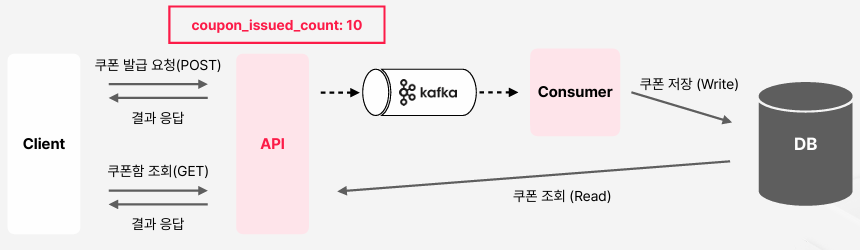

# 선착순 쿠폰 발행 이벤트 대응하기

 - 분산 환경, 동시성, Redis

## 1. 요구사항 정리 및 데이터 흐름 구조화

 - `요구사항`
    - 유저는 쿠폰 발급 요청을 할 수 있다.
    - 발급 가능한 쿠폰 수량은 인당 1개까지이며, 전체 수량은 10개로 정해져 있다. (선착순 10명)
 - `상세조건 및 주의사항`
    - 순간적으로 대량의 요청이 들어올 것이고, 요청량이 많아도 latency 문제가 없어야 한다.
    - 유저가 쿠폰 발급 요청을 하면, 그 요청이 선착순 안에 들었는지 여부를 응답에 포함해줘야 한다.
    - 쿠폰 발급 내역을 저장할 DB는, 이미 전사에서 사용하고 있는 인프라를 활용해야 한다.

## 2. 문제가 발생할 수 있는 요인들

### 2-1. DB UNIQUE 제약 조건

유저당 발급 가능한 쿠폰이 1개이다. 이것을 해결하기 위해 coupon 테이블에 user_id와 coupon_event_id로 UNIQUE 제약 조건을 건다.

 - 대용량 트래픽에서 DB에 부하가 갈 수 있다. 즉, 전사 장애로 번질 수 있다.

<div align="center">
    
</div>
<br/>


### 2-2. ISSUED COUNT를 애플리케이션에서 관리 (로컬 메모리)

발급 갯수를 API 서버내부에서 관리한다. 갯수에 해당하면 DB에 등록한다. 

 - 대용량 트래픽에서 DB에 Write 부하가 갈 수 있다.
 - 로컬 메모리에 COUNT를 관리하여 분산 환경에서 사용할 수 없다.

<div align="center">
    
</div>
<br/>


### 2-3. DB 저장 로직 분리

쿠폰 잔여 갯수가 남아있을 때, Kafka에 메시지를 프로듀싱하고 클라이언트에는 곧바로 선착순안에 들었는지 응답한다.

 - API 서버에서는 발급 갯수에 해당하면 DB에 Write 하지 않고, 카프카로 메시지를 프로듀싱한다.
 - DB Write는 다른 컨슈머 서버에서 처리한다. 클라이언트에게 응답이 빨라진다.
 - 로컬 메모리에 COUNT를 관리하여 분산 환경에서 사용할 수 없다.

<div align="center">
    
</div>
<br/>


### 2-4. 발급 갯수를 Reids로 관리

 - API 서버가 분산 환경에서 다량의 쿠폰 요청을 받는다.
 - 해당 유저가 선착순안에 들었는지만 확인하는 가벼운 로직만 수행하고 클라이언트에 빠르게 응답이 가능하다.
 - 실질적인 쿠폰 발급 로직은 카프카 컨슈머에서 처리된다.

<div align="center">
    
</div>
<br/>

## 3. 분산환경에서 선착순 응모 이벤트 대응이 가능하도록 시스템 만들기

 - MySQL 테이블 생성
 - Domain 모델 정의
 - 쿠폰 이벤트 Port 구현 + 캐싱
 - 쿠폰 발급 히스토리 관리용 Port 구현
 - 쿠폰 발급 히스토리 Use Case 작성
 - 쿠폰 Controller에서 쿠폰 발급 요청 제어
 - 쿠폰 발급 요청 Topic 생성 및 Kafka Produce

### 3-1. MySQL 테이블 생성 (adapter/mysql)

 - `/resources/schema.sql`
```sql
-- coupon_event 테이블 생성
CREATE TABLE coupon_event
(
    id           INT AUTO_INCREMENT PRIMARY KEY COMMENT 'coupon event의 id',
    display_name VARCHAR(100) NOT NULL COMMENT '쿠폰 디스플레이용 이름',
    expires_at   TIMESTAMP    NOT NULL COMMENT '쿠폰 만료기한',
    issue_limit  BIGINT       NOT NULL COMMENT '쿠폰 발급 제한 개수'
);

-- coupon_event 초기 데이터 삽입
INSERT INTO coupon_event (id, display_name, expires_at, issue_limit)
VALUES (1, '[선착순 발급] 무료 광고 1회 쿠폰 (2024년 한정)', '2025-01-01 00:00:00', 10);

-- coupon 테이블 생성
CREATE TABLE coupon
(
    id              INT AUTO_INCREMENT PRIMARY KEY COMMENT 'coupon의 id',
    coupon_event_id INT       NOT NULL COMMENT 'coupon event의 id',
    user_id         INT       NOT NULL COMMENT 'coupon을 발급받은 user id',
    issued_at       TIMESTAMP NOT NULL COMMENT 'coupon 발급 일시',
    used_at         TIMESTAMP COMMENT 'coupon 사용 일시',
    UNIQUE KEY unique_user_id_coupon_event_id (user_id, coupon_event_id),
    FOREIGN KEY (coupon_event_id) REFERENCES coupon_event (id)
);
```

 - `쿠폰 이벤트(Entity & Repository)`
```java
// CouponEventEntity
@NoArgsConstructor
@AllArgsConstructor
@Data
@Entity(name = "coupon_event")
public class CouponEventEntity {

    @Id
    @GeneratedValue(strategy = GenerationType.IDENTITY)
    private Long id;
    private String displayName;
    private LocalDateTime expiresAt;
    private Long issueLimit;
}

// CouponEventJpaRepository
public interface CouponEventJpaRepository extends JpaRepository<CouponEventEntity, Long> { }
```

 - `쿠폰(Entity & Repository)`
```java
// CouponEntity
@NoArgsConstructor
@AllArgsConstructor
@Data
@Entity(name = "coupon")
public class CouponEntity {

    @Id
    @GeneratedValue(strategy = GenerationType.IDENTITY)
    private Long id;
    private Long userId;
    @Column(name = "coupon_event_id")
    private Long couponEventId;
    private LocalDateTime issuedAt;
    private LocalDateTime usedAt;

    @ManyToOne(fetch = FetchType.LAZY)
    @JoinColumn(name = "coupon_event_id", nullable = false, insertable = false, updatable = false)
    private CouponEventEntity couponEvent;
}

// CouponJpaRepository
public interface CouponJpaRepository extends JpaRepository<CouponEntity, Long> {
    List<CouponEntity> findAllByUserId(Long userId);
}
```

 - `컨버터`
```java
public class CouponEntityConverter {

    public static CouponEntity toCouponEntity(Coupon coupon) {
        return new CouponEntity(
            coupon.getId(),
            coupon.getUserId(),
            coupon.getCouponEventId(),
            coupon.getIssuedAt(),
            coupon.getUsedAt(),
            null
        );
    }

    public static Coupon toCouponModel(CouponEntity couponEntity) {
        return new Coupon(
            couponEntity.getId(),
            couponEntity.getUserId(),
            couponEntity.getCouponEventId(),
            couponEntity.getIssuedAt(),
            couponEntity.getUsedAt()
        );
    }

    public static CouponEvent toCouponEventModel(CouponEventEntity couponEventEntity) {
        return new CouponEvent(
            couponEventEntity.getId(),
            couponEventEntity.getDisplayName(),
            couponEventEntity.getExpiresAt(),
            couponEventEntity.getIssueLimit()
        );
    }

    public static ResolvedCoupon toResolvedCouponModel(CouponEntity couponEntity) {
        return new ResolvedCoupon(
            toCouponModel(couponEntity),
            toCouponEventModel(couponEntity.getCouponEvent())
        );
    }
}
```

 - `어댑터 (Port 구현체)`
```java
// 쿠폰 어댑터
@RequiredArgsConstructor
@Component
public class CouponAdapter implements CouponPort {

    private final CouponJpaRepository couponJpaRepository;

    @Override
    public Coupon save(Coupon coupon) {
        CouponEntity couponEntity = couponJpaRepository.save(CouponEntityConverter.toCouponEntity(coupon));
        return CouponEntityConverter.toCouponModel(couponEntity);
    }

    @Override
    public List<ResolvedCoupon> listByUserId(Long userId) {
        List<CouponEntity> couponEntities = couponJpaRepository.findAllByUserId(userId);
        return couponEntities.stream().map(CouponEntityConverter::toResolvedCouponModel).toList();
    }
}

// 쿠폰 이벤트 어댑터
@RequiredArgsConstructor
@Component
public class CouponEventAdapter implements CouponEventPort {

    private final CouponEventJpaRepository couponEventJpaRepository;

    @Override
    public CouponEvent findById(Long id) {
        CouponEventEntity couponEventEntity = couponEventJpaRepository.findById(id).orElse(null);
        if (couponEventEntity == null) {
            return null;
        }
        return CouponEntityConverter.toCouponEventModel(couponEventEntity);
    }
}
```


### 3-2. 쿠폰 도메인 모델 정의 (domain)

 - `CouponEvent`
```java
@AllArgsConstructor
@NoArgsConstructor
@Data
public class CouponEvent {

    private Long id; // coupon event의 id
    private String displayName; // coupon에 대한 노출 이름
    private LocalDateTime expiresAt; // coupon 만료 일시
    private Long issueLimit; // coupon 발급 제한 수

    @JsonIgnore
    public boolean isExpired() {
        return this.expiresAt.isBefore(LocalDateTime.now());
    }

    public static CouponEvent generate(
        String displayName,
        LocalDateTime expiresAt,
        Long issueLimit
    ) {
        return new CouponEvent(null, displayName, expiresAt, issueLimit);
    }
}
```

 - `Coupon`
```java
@AllArgsConstructor
@NoArgsConstructor
@Getter
public class Coupon {

    private Long id; // coupon id (동일한 coupon event라 해도, 발급받은 유저마다 coupon id가 다 다름)
    private Long userId; // coupon을 발급받은 user의 id
    private Long couponEventId; // coupon event의 id
    private LocalDateTime issuedAt; // coupon 발급 일시
    private LocalDateTime usedAt; // coupon 사용 일시

    public Coupon use() {
        this.usedAt = LocalDateTime.now();
        return this;
    }

    public static Coupon generate(
        Long userId,
        Long couponEventId
    ) {
        return new Coupon(null, userId, couponEventId, LocalDateTime.now(), null);
    }
}
```

 - `ResolvedCoupon`
```java
@AllArgsConstructor
@NoArgsConstructor
@Getter
public class ResolvedCoupon {

    private Coupon coupon;
    private CouponEvent couponEvent;

    public boolean canBeUsed() {
        return !this.couponEvent.isExpired() && this.coupon.getUsedAt() == null;
    }

    public static ResolvedCoupon generate(
        Coupon coupon,
        CouponEvent couponEvent
    ) {
        return new ResolvedCoupon(coupon, couponEvent);
    }
}
```

### 3-3. 쿠폰 이벤트 Port (usecase/core)

 - `CouponEventPort`
    - MySQL에서 Adapter 구현
```java
public interface CouponEventPort {
    CouponEvent findById(Long id);
}
```

 - `CouponPort`
    - MySQL에서 Adapter 구현
```java
public interface CouponPort {
    Coupon save(Coupon coupon);
    List<ResolvedCoupon> listByUserId(Long userId);
}
```

 - `CouponIssueRequestHistoryPort`
    - 쿠폰 발급 요청 이력 포트
    - Redis에서 Adapter 구현
```java
public interface CouponIssueRequestHistoryPort {

    // 해당 쿠폰이벤트 내에서, 유저의 발급 요청이력이 없다면 기록
    boolean setHistoryIfNotExists(Long couponEventId, Long userId);

    // 해당 쿠폰이벤트 내에서, 발급 요청을 몇번째로 했는지 확인
    Long getRequestSequentialNumber(Long couponEventId);
}
```

 - `CouponEventCachePort`
    - Redis에서 Adapter 구현
```java
public interface CouponEventCachePort {
    void set(CouponEvent couponEvent);
    CouponEvent get(Long couponEventId);
}
```

### 3-4. 쿠폰 발급 이력 포트 구현 (adapter/redis)

 - `CouponIssueRequestHistoryAdapter`
    - redisTemplate.opsForValue().setIfAbsent()
        - set과 if not exists를 원자적으로 처리한다.
        - redis의 setnx와 동일하다.
        - 중복 요청 확인 (첫 번째 요청인 경우 true, 그 이후 요청인 경우 false)
```java
@RequiredArgsConstructor
@Component
public class CouponIssueRequestHistoryAdapter implements CouponIssueRequestHistoryPort {

    private static final String USER_REQUEST_HISTORY_KEY_PREFIX = "coupon_history.user_request.v1:";
    private static final String REQUEST_COUNT_HISTORY_KEY_PREFIX = "coupon_history.request_count.v1:";
    private static final Long EXPIRE_SECONDS = 60 * 60 * 24 * 7L;  // 일주일

    private final RedisTemplate<String, String> redisTemplate;

    @Override
    public boolean setHistoryIfNotExists(Long couponEventId, Long userId) {
        return redisTemplate.opsForValue().setIfAbsent(
            this.generateUserRequestHistoryCacheKey(couponEventId, userId),
            "1",
            Duration.ofSeconds(EXPIRE_SECONDS)
        );
    }

    @Override
    public Long getRequestSequentialNumber(Long couponEventId) {
        String key = this.generateRequestCountHistoryCacheKey(couponEventId);
        Long requestSequentialNumber = redisTemplate.opsForValue().increment(key);

        if (requestSequentialNumber != null && requestSequentialNumber == 1) { // 만약 키가 처음 생성되었다면
            redisTemplate.expire(key, Duration.ofSeconds(EXPIRE_SECONDS)); // TTL 설정
        }

        return requestSequentialNumber;
    }

    private String generateUserRequestHistoryCacheKey(Long couponEventId, Long userId) {
        return USER_REQUEST_HISTORY_KEY_PREFIX + couponEventId + ":" + userId;
    }

    private String generateRequestCountHistoryCacheKey(Long couponEventId) {
        return REQUEST_COUNT_HISTORY_KEY_PREFIX + couponEventId;
    }
}
```

 - `CouponEventCacheAdapter`
```java
@RequiredArgsConstructor
@Component
public class CouponEventCacheAdapter implements CouponEventCachePort {

    private static final String KEY_PREFIX = "coupon_event.v1:";
    private static final Long EXPIRE_SECONDS = 60 * 2L;  // 2분
    private final CustomObjectMapper objectMapper = new CustomObjectMapper();

    private final RedisTemplate<String, String> redisTemplate;

    @Override
    public void set(CouponEvent couponEvent) {
        String jsonString;
        try {
            jsonString = objectMapper.writeValueAsString(couponEvent);
        } catch (JsonProcessingException e) {
            throw new RuntimeException(e);
        }
        redisTemplate.opsForValue().set(
            this.generateCacheKey(couponEvent.getId()),
            jsonString,
            Duration.ofSeconds(EXPIRE_SECONDS)
        );
    }

    @Override
    public CouponEvent get(Long couponEventId) {
        String jsonString = redisTemplate.opsForValue().get(this.generateCacheKey(couponEventId));
        if (jsonString == null) return null;
        try {
            return objectMapper.readValue(jsonString, CouponEvent.class);
        } catch (JsonProcessingException e) {
            throw new RuntimeException(e);
        }
    }

    private String generateCacheKey(Long couponEventId) {
        return KEY_PREFIX + couponEventId;
    }
}
```

### 3-5. 쿠폰 발급 히스토리 유스케이스 (usecase/coupon-usecase)

 - `CouponIssueHistoryUsecase`
```java
// CouponIssueHistoryUsecase
public interface CouponIssueHistoryUsecase {
    boolean isFirstRequestFromUser(Long couponEventId, Long userId);
    boolean hasRemainingCoupon(Long couponEventId);
}

// CouponIssueHistoryService
@RequiredArgsConstructor
@Service
public class CouponIssueHistoryService implements CouponIssueHistoryUsecase {

    private final CouponIssueRequestHistoryPort couponIssueRequestHistoryPort;
    private final CouponEventPort couponEventPort;
    private final CouponEventCachePort couponEventCachePort;

    @Override
    public boolean isFirstRequestFromUser(Long couponEventId, Long userId) {
        return couponIssueRequestHistoryPort.setHistoryIfNotExists(couponEventId, userId);
    }

    @Override
    public boolean hasRemainingCoupon(Long couponEventId) {
        CouponEvent couponEvent = this.getCouponEventById(couponEventId);
        return couponIssueRequestHistoryPort.getRequestSequentialNumber(couponEventId) <= couponEvent.getIssueLimit();
    }

    private CouponEvent getCouponEventById(Long couponEventId) {
        CouponEvent couponEventCache = couponEventCachePort.get(couponEventId);
        if (couponEventCache != null) {
            return couponEventCache;
        } else {
            CouponEvent couponEvent = couponEventPort.findById(couponEventId);
            if (couponEvent == null) {
                throw new RuntimeException("Coupon event does not exist.");
            }
            couponEventCachePort.set(couponEvent);
            return couponEvent;
        }
    }
}
```

 - `RequestCouponIssueUsecase`
```java
// RequestCouponIssueUsecase
public interface RequestCouponIssueUsecase {
    void queue(Long couponEventId, Long userId);
}

// RequestCouponIssueService
@RequiredArgsConstructor
@Service
public class RequestCouponIssueService implements RequestCouponIssueUsecase {

    private final CouponIssueRequestPort couponIssueRequestPort;

    @Override
    public void queue(Long couponEventId, Long userId) {
        couponIssueRequestPort.sendMessage(userId, couponEventId);
    }
}
```

### 3-6. 쿠폰 Controller에서 쿠폰 발급 요청 제어 (api)

 - `CouponController`
```java
@RequiredArgsConstructor
@RestController
@RequestMapping("/coupons")
public class CouponController {

    private final CouponIssueHistoryUsecase couponIssueHistoryUsecase;
    private final RequestCouponIssueUsecase requestCouponIssueUsecase;

    @PostMapping
    ResponseEntity<String> issue(
        @RequestBody CouponIssueRequest request
    ) {
        // 이미 쿠폰을 발급한 경우
        if (!couponIssueHistoryUsecase.isFirstRequestFromUser(request.getCouponEventId(), request.getUserId())) {
            return ResponseEntity.status(HttpStatus.CONFLICT).body("Already tried to issue a coupon\n");
        }

        // 남은 쿠폰이 없는 경우
        if (!couponIssueHistoryUsecase.hasRemainingCoupon(request.getCouponEventId())) {
            return ResponseEntity.status(HttpStatus.FORBIDDEN).body("Not enough available coupons\n");
        }

        // 쿠폰 발급
        requestCouponIssueUsecase.queue(request.getCouponEventId(), request.getUserId());
        return ResponseEntity.ok().body("Successfully Issued\n");
    }
}
```

### 3-7 쿠폰 발급 요청 Topic 생성 및 Kafka Produce (adapter/kafka)

 - `Topic.java`
```java
public class Topic {
    // ..
    public static final String COUPON_ISSUE_REQUEST = "coupon.request";
}
```

 - `CouponIssueRequestMessage`
```java
@AllArgsConstructor
@NoArgsConstructor
@Data
public class CouponIssueRequestMessage {
    private Long userId;
    private Long couponEventId;

    public static CouponIssueRequestMessage from(Long userId, Long couponEventId) {
        return new CouponIssueRequestMessage(userId, couponEventId);
    }
}
```

 - `CouponIssueRequestAdapter`
```java
@RequiredArgsConstructor
@Component
public class CouponIssueRequestAdapter implements CouponIssueRequestPort {

    private final KafkaTemplate<String, String> kafkaTemplate;
    private final CustomObjectMapper objectMapper = new CustomObjectMapper();

    @Override
    public void sendMessage(Long userId, Long couponEventId) {
        CouponIssueRequestMessage message = CouponIssueRequestMessage.from(userId, couponEventId);
        try {
            kafkaTemplate.send(COUPON_ISSUE_REQUEST, message.getUserId().toString(), objectMapper.writeValueAsString(message));
        } catch (JsonProcessingException e) {
            throw new RuntimeException(e);
        }
    }
}
```
