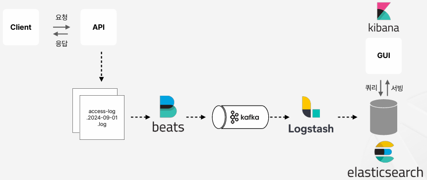

# 로그 수집 파이프라인

 - Elasticsearch, Logstash, Kibana

## 1. 요구사항 정리 및 데이터 흐름 구조화

 - 요구사항 정리
    - 유저가 API에 접근한 기록에 대해 일단위로 모아 로그를 남긴다.
    - 로그 수집 파이프라인은 높은 신뢰성(고가용성)을 필요로 한다.
    - 수집된 로그를 시계열로 시각화해볼 수 있다.

<div align="center">
    
</div>
<br/>

## 2. Filebeat를 통한 로그 수집 및 Kafka Produce

 - Tomcat access log 적재
 - Kafka topic 만들기 (토픽명: access-log)
 - filebeat.yml 작성 및 볼륨 마운트
 - filebeat docker container 띄우기

### 2-1. Tomcat access log 적재 (api)

 - `application.yml`
```yml
server:
  tomcat:
    basedir: .data/tomcat
    accesslog:
      enabled: true
      directory: logs
      suffix: .log
      prefix: access_log
      pattern: "%h %l %u %t \"%r\" %s %b %D \"%{Referer}i\" \"%{User-Agent}i\""
```
### 2-2. fileat 컨테이너 띄우기

 - `filebeat.yml`
    - *.log 파일을 읽어서 Kafka의 access-log로 발행한다.
```yml
filebeat.inputs:
  - type: log
    enabled: true
    paths:
      - /usr/share/filebeat/logs/*.log

output.kafka:
  hosts: ["kafka1:19092", "kafka2:19092", "kafka3:19092"]
  topic: "access-log"
  partition.round_robin:
    reachable_only: true
  required_acks: 1
  compression: gzip
  max_message_bytes: 1000000
```

 - `docker-compose.yml`
```yml
version: '3'
services:
  filebeat:
    image: 'docker.elastic.co/beats/filebeat:7.10.2'
    container_name: filebeat
    volumes:
      - ./.data/tomcat/logs:/usr/share/filebeat/logs
      - ./.data/filebeat/data:/usr/share/filebeat/data
      - ./filebeat.yml:/usr/share/filebeat/filebeat.yml
    depends_on:
      - logstash
      - zookeeper
      - kafka1
      - kafka2
      - kafka3
```

## 3. Logstash를 통한 Kafka Consume 및 Elasticsearch 색인

 - logstash.conf 작성 및 볼륨 마운트 
 - logstash docker container 띄우기 
 - index template 작성 및 alias 지정

### 3-1. Logstash 컨테이너 띄우기

 - `logstash.conf`
    - filter.grok: 비정형화 데이터를 정형화 정규표현식처럼 파싱
```conf
input {
    kafka {
        bootstrap_servers => "kafka1:19092,kafka2:19092,kafka3:19092"
        topics => ["access-log"]
        group_id => "logstash"
        consumer_threads => 3
        auto_offset_reset => "earliest"
        codec => "json"
        type => "kafka"
    }
}

filter {
    grok {
        match => { "message" => "%{IPORHOST:client_ip} - - \[%{HTTPDATE:logged_at}\] \"%{WORD:http_method} %{URIPATH:request} HTTP/%{NUMBER:http_version}\" %{NUMBER:response_code} %{NUMBER:bytes} %{NUMBER:duration} \"%{DATA:referrer}\" \"%{DATA:user_agent}\"" }
    }
    if "_grokparsefailure" in [tags] {
        drop {}
    }
    date {
        match => [ "logged_at", "dd/MMM/yyyy:HH:mm:ss Z" ]
        target => "logged_at"
    }
    mutate {
        remove_field => [ "message" ]
    }
}

output {
    elasticsearch {
        hosts => ["elasticsearch:9200"]
        index => "access-log-%{+YYYY-MM-dd}"
    }
}
```

 - `docker-compose.yml`
```yml
version: '3'
services:
  logstash:
    image: 'docker.elastic.co/logstash/logstash:7.10.2'
    container_name: logstash
    ports:
      - "5044:5044"
    volumes:
      - ./logstash.conf:/usr/share/logstash/pipeline/logstash.conf:ro
    depends_on:
      - elasticsearch
      - zookeeper
      - kafka1
      - kafka2
      - kafka3
```

### 3-2. index template 작성 및 alias 지정

 - 인덱스 이름이 계속해서 날짜가 포함된다. 이름이 매번 바뀌고 애플리케이션에서 사용하기 힘들다.
 - 인덱스의 스키마를 지정하지 않으면 자동으로 생성된다.
 - index template 기능으로 alias(별칭) 지정과 mapping(매핑) 정보를 지정할 수 있다.

```javascript
POST _template/access-log-index-template
{
  "index_patterns": [
    "access-log-*"
  ],
  "aliases": {
    "access-log": {}
  },
  "mappings": {
    "properties": {
      "@timestamp": {
        "type": "date"
      },
      "@version": {
        "type": "keyword"
      },
      "agent": {
        "properties": {
          "ephemeral_id": {
            "type": "keyword"
          },
          "hostname": {
            "type": "keyword"
          },
          "id": {
            "type": "keyword"
          },
          "name": {
            "type": "keyword"
          },
          "type": {
            "type": "keyword"
          },
          "version": {
            "type": "keyword"
          }
        }
      },
      "bytes": {
        "type": "keyword"
      },
      "client_ip": {
        "type": "keyword"
      },
      "duration": {
        "type": "keyword"
      },
      "ecs": {
        "properties": {
          "version": {
            "type": "keyword"
          }
        }
      },
      "host": {
        "properties": {
          "name": {
            "type": "keyword"
          }
        }
      },
      "http_method": {
        "type": "keyword"
      },
      "http_version": {
        "type": "keyword"
      },
      "input": {
        "properties": {
          "type": {
            "type": "keyword"
          }
        }
      },
      "log": {
        "properties": {
          "file": {
            "properties": {
              "path": {
                "type": "keyword"
              }
            }
          },
          "offset": {
            "type": "long"
          }
        }
      },
      "message": {
        "type": "text"
      },
      "port": {
        "type": "keyword"
      },
      "referrer": {
        "type": "text"
      },
      "request": {
        "type": "text"
      },
      "response_code": {
        "type": "keyword"
      },
      "timestamp": {
        "type": "date",
        "format": "dd/MMM/yyyy:HH:mm:ss Z"
      },
      "type": {
        "type": "keyword"
      },
      "user_agent": {
        "type": "text"
      }
    }
  }
}
```

## 4. Kibana에서 로그 시각화

 - index pattern 생성 
 - visualize

### 4-1. index pattern 생성 

 - Kibana 접속 > Kibana > Index Paatterns > Create index pattern
    - Index pattern name: access-log
    - Time field: logged_at
    
