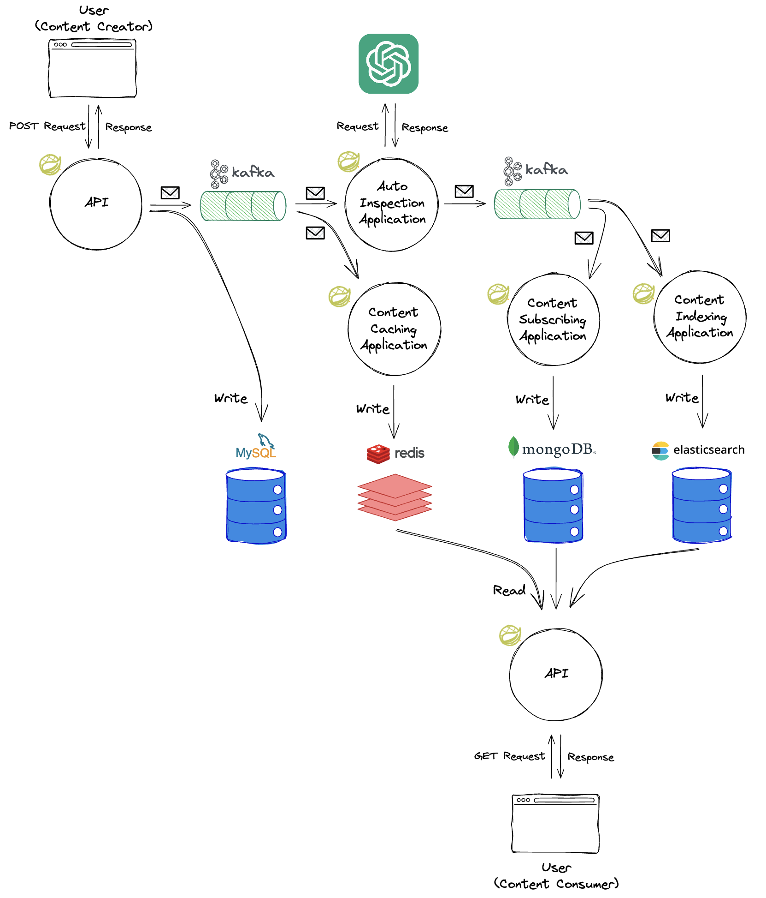
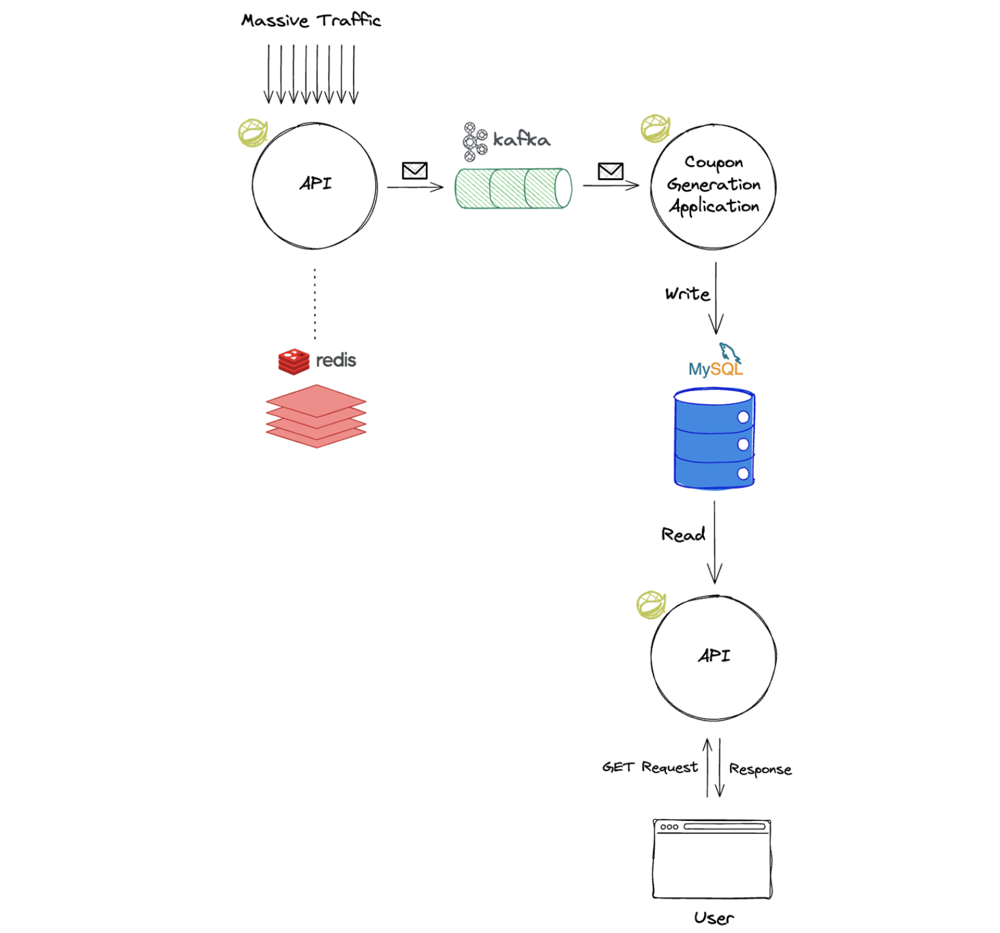
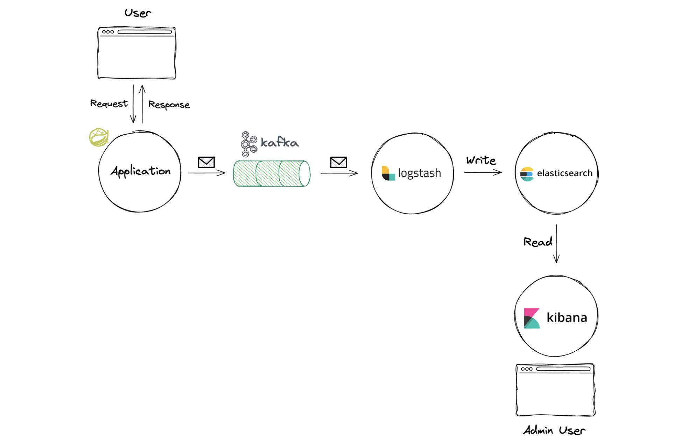

# 백엔드 개발자를 위한 Kafka 실습

## 링크

 - 깃허브: https://github.com/HyunSangHan/fastcampus-kafka-message-queue/tree/release
 - 깃허브: https://github.com/HyunSangHan/fastcampus-kafka-event-driven-architecture/tree/release
 - 링크드인: https://www.linkedin.com/in/hyunsanghan

## 사용 기술 스택

 - 실습 환경
    - JDK 17
    - Spring Boot 3.2
    - IDE: IntelliJ
 - 인프라
    - Apache Kafka 3.6.0
    - Apache Zookeeper 3.7.2
    - MySQL 8.0.35
    - Docker Desktop
 - 주요 라이브러리
    - srping-kafka
   
## 프로젝트 소개

 - `콘텐츠 플랫폼 구축`
   - MySQL에 콘텐츠 원천데이터 저장 및 Kafka Produce
   - ChatGPT API를 활용한 콘텐츠 자동검수 시스템 구축 및 검수결과 Kafka Produce
   - MongoDB에 구독 콘텐츠 저장 및 피드 서비스 노출
   - Redis 캐싱 레이어 구축 및 콘텐츠 캐싱 실시간 갱신
   - Elasticsearch에 콘텐츠 실시간 색인 및 검색 서비스 노출
<div align="center">
   
</div>

 - `선착순 쿠폰 발행 이벤트 대응`
   - Redis를 이용한 선착순 갯수 제한
   - Kafka를 이용한 트래픽 처리 (실제 쿠폰 발행 로직은 컨슈머에서 수행)
<div align="center">
   
</div>

 - `실시간 로그 수집 파이프라인 구축`
   - Filebeat를 통한 로그 수집
   - Logstash를 통한 입출력 프로세싱
   - Elasticsearch에 색인
   - Kibana에서 로그 시각화
   - 로그 연동해보기
<div align="center">
   
</div>

## 프로젝트 구조

```
root
 ├─ adapter
 │   ├─ chat-gpt-client
 │   ├─ elasticsearch
 │   ├─ kafka
 │   ├─ metadata-client
 │   ├─ mongodb
 │   ├─ mysql
 │   ├─ redis
 │   └─ build.gradle
 ├─ api
 ├─ common
 ├─ domain
 ├─ usecase
 │   ├─ core
 │   ├─ coupon-usecase
 │   ├─ inspected-post-usecase
 │   ├─ post-resolving-help-usecase
 │   ├─ post-search-usecase
 │   ├─ post-usecase
 │   ├─ subscribing-post-usecase
 │   └─ build.gradle
 ├─ worker
 │   ├─ auto-inspection-worker      // 원본 콘텐츠 검수 워커 (Kafka Produce)
 │   ├─ content-caching-worker      // 원본 콘텐츠 캐싱 워커 (Redis Write)
 │   ├─ content-indexing-worker     // 검수된 콘텐츠 검색용 인덱싱 워커 (Elasticsearch Write)
 │   ├─ content-subscribing-worker  // 검수된 콘텐츠를 구독자 구독함에 저장 (MongoDB Write)
 │   ├─ coupon-issuing-worker       // 쿠폰 발급 워커 (MySQL Write)
 │   └─ build.gradle
 ├─ build.gradle
 └─ settings.gradle
```

### 패키지 구조

```
/src/main/java/com/도메인
 ├─ XxxApplication
 ├─ api
 │   ├─ controller
 │   └─ model
 ├─ common
 ├─ domain
 │   ├─ coupon
 │   ├─ inspectedpost
 │   └─ post
 ├─ usecase
 │   ├─ core/port
 │   ├─ coupon
 │   ├─ inspectedpost
 │   ├─ postresolvinghelp
 │   ├─ postsearch
 │   ├─ post
 │   └─ subscribingpost
 └─ worker
     ├─ autoinspection/consumer
     ├─ contentcaching/consumer
     ├─ contentindexing/consumer
     ├─ contentsubscribing/consumer
     └─ couponissuing/consumer
```

## 엔드포인트

- Swagger
  - http://localhost:8080
- Kafka
  - http://localhost:9092
- Kafka UI
  - http://localhost:8989
- Mysql
  - http://localhost:3306
  - root password: `1234`
  - database: `campus`
  - User/PW: `myuser`/`mypassword`
- MongoDB
  - http://localhost:27017
- Redis
  - http://localhost:6379
- Elastic Stack
  - Elasticsearch
    - http://localhost:9200
  - Kibana
    - http://localhost:5601