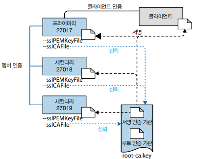

# 몽고DB 보안 소개

## 1. 몽고db 인증과 권한

### 인증 메커니즘

몽고DB 클러스터에서 권한을 활성화하면, 인증이 적용되고 사용자는 역할에 따라 권한이 부여된 작업만 수행할 수 있다.

 - 커뮤니티 버전은 SCRAM과 x.509 인증서 인증을 지원한다.
 - 엔터프라이즈는 케르베로스 인증과 LDAP 프록시 인증을 지원한다.

### 권한

몽고DB에 사용자를 추가할 떄는 특정 데이터베이스에  사용자를 생성해야 한다. 이는 사용자의 인증 데이터베이스이며, 어느 데이터베이스든 이 용도로 사용할 수 있다.

 - read: 모든 비시스템 컬렉션 및 system.indexes, system.js, system.namespaces와 같은 시스템 컬렉션의 데이터를 읽는다.
 - readWrite: read와 동일한 권한을 부여하며, 모든 비시스템 컬렉션 및 system.js 컬렉션의 데이터를 수정할 수 있는 기능을 제공한다.
 - dbAdmin: 스키마 관련 작업, 인덱싱, 통계 수집과 같은 관리 작업을 수행한다.
 - userAdmin: 현재 데이터베이스에서 역할과 사용자를 생성하고 수정한다.
 - dbOwner: readWrite, dbAdmin, userAdmin 역할이 부여한 권한을 결합한다.
 - clusterManager: 클러스터상에서 관리와 모니터링 작업을 수행한다.
 - clusterMonitor: 몽고DB 클라우드 매니저와 옵스 매니저 모니터링 에이전트 같은 모니터링 도구에 대한 읽기 전용 접근을 제공한다.
 - hostManager: 서버를 모니터링하고 관리한다.
 - clusterAdmin: clusterManager, clusterMonitor, hostManager 역할이 부여한 권한과 dropDatabase 작업을 결합한다.
 - backup: 몽고DB 클라우드 매니저 백업 에이전트 혹은 옵스 매니저 백업 에이전트를 사용하는 권한이나, mongodump를 사용해 전체 moongod 인스턴스를 백업하는 권한을 충분히 제공한다.
 - restore: system.profile 컬렉션 데이터를 포함하지 않는 백업으로부터 데이터를 복원하는 데 필요한 권한을 제공한다.
 - readAnyDatabase: local과 config를 제외한 모든 데이터베이스에서 read와 동일한 권한과 더불어 클러스터 전체에 대한 listDatabases 작업을 제공한다.
 - readWriteAnyDatabase: local과 config를 제외한 모든 데이터베이스에서 readWrite와 동일한 권한과 더불어 클러스터 전체에 대한 listDatabases 작업을 제공한다.
 - dbAdminAnyDatabase: local과 config를 제외한 모든 데이터베이스에서 dbAdmin과 동일한 권한과 더불어 클러스터 전체에 대한 listDatabases 작업을 제공한다.
 - root: readWriteAnyDatabase, dbAdminAnyDatabase, userAdminAnyDatabase, clusterAdmin, restore, backup 역할이 결합된 작업과 모든 리소스에 대한 접근을 제공한다.

### 멤버와 클라이언트를 인증하기 위해 x.509 인증서 사용하기

모든 운영 환경 몽고DB 클러스터는 여러 멤버로 구성된다. 따라서 클러스터를 보호하려면 클러스터 내에서 통신하는 모든 서비스가 서로 인증해야 한다. 복제 셋의 각 멤버는 데이터를 교환하려면 다른 멤버와 인증해야 한다. 마찬가지로 클라이언트는 통신하는 프라이머리 및 세컨더리와 인증해야 한다.

<div align="center">
    
</div>
<br/>

## 2. 몽고DB 인증 및 전송 계층 암호화에 대한 지침

### CA 수립하기

 - `루트CA 생성`
```bash
# 변수 초기화
dn_prefix="/C=US/ST=NY/L=New York/0=MongoDB"
ou_member="MyServers"
ou_client="MyClients"
mongodb_server_hosts=( "server1" "server2" "server3" )
mongodb_client_hosts=( "client1" "client2" )
mongodb_port=27017

# 키 쌍을 만들고 root-ca.key 파일에 저장
openssl genrsa -out root-ca.key 4096

# 인증서를 생성하는 데 사용할 OpenSSL 설정을 저장할 구성 파일 생성
[ policy_match ]
countryName = match
stateOrProvinceName = match
organizationName = match
organizationUnitName = optional
commonName = supplied
emailAddress = optional

..

# openssl req 명령을 사용해 루트 인증서 생성
openssl req -new -x509 -days 1826 -key root-ca.key -out root-ca.crt -config openssl.cnf -subj "$dn_prefix/CN=ROOTCA"

# 인증서 내용 확인
openssl x509 -noout -text -in root-ca.crt
```

 - `서명을 위한 중간 CA 생성`
```bash
openssl genrsa -out signing-ca.key 4096

openssl req -new -key signing-ca.key -out signing-ca.csr \
    -config openssl.cnf -subj "$dn_prefix/CN=CA-SIGNER"

openssl x509 -req -days 730 -in signing-ca.csr -CA root-ca.crt -CAkey \
    root-ca.key -set_serial 01 -out signing-ca.crt -extfile openssl.cnf \
    -extensions v3_ca
```

 - `루트 인증서와 서명 인증서를 단일 pem 파일로 연결`
```bash
cat root-ca.crt > root-ca.pem
cat signing-ca.crt >> root-ca.pem
```
