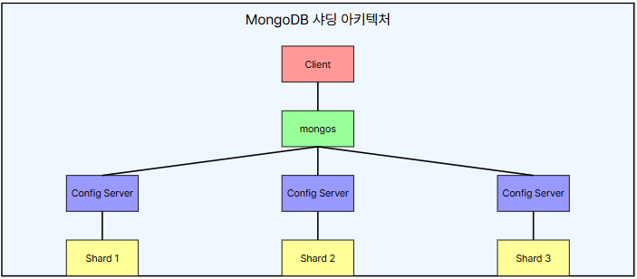

# 몽고DB 샤딩

 - https://www.jaenung.net/tree/1764?srsltid=AfmBOoo9-fUYeyhoMUJRcfWRmmDfl4ma0JTHpbsMc8aj0YcEu5e4ctrF
 - https://chjs93.tistory.com/29

## 1. 샤딩

샤딩은 데이터를 작은 단위(Shard) 로 나누어 여러 서버(Shard Server)에 분산 저장하는 방식이다. 이를 통해 단일 서버의 저장 및 처리 부담을 줄이고 성능을 향상 시킬 수 있다.

 - 데이터가 커질수록 하나의 서버에 저장하는 것이 비효율적
 - 트래픽이 증가 하면 단일 서버가 이를 감당하지 못함
 - 데이터가 많아지면 메모리, 디스크, 네트워크 I/O 가 병목이 됨
 - 샤딩을 통해 여러 서버에 부하 분산(Load Balancing) 가능

## 2. 샤딩 아키텍처

클라이언트는 mongos와 직접 통신하며, mongos는 요청을 적절한 샤드로 라우팅합니다. Config 서버는 각 샤드의 데이터 분포 정보를 저장하고 관리합니다.

 - `샤드(Shard)`
    - 실제 데이터를 저장하는 서버 또는 서버 그룹
    - MongoDB에서는 샤드를 Replica Set 으로 구성하여 가용성을 보장함
    - 각 샤드는 데이터의 일부를 저장
 - `컨피그 서버(Config Server)`
    - 클러스터 전체의 메타데이터 및 샤드 정보 를 관리하는 서버
    - 샤드 키 범위 및 데이터의 위치 정보를 저장
 - `몽고 라우터(Mongos)`
    - 클라이언트와 샤드 간의 트래픽을 라우팅하는 역할
    - 애플리케이션은 Mongos를 통해 데이터를 읽고 씀
    - 사용자는 Mongos를 단일 진입점(Entry Point)으로 사용 하여 샤딩된 데이터가 분산되어 있다는 것을 알 필요 없음

<div align="center">
    
</div>
<br/>

## 3. 샤딩 키

샤딩 키는 MongoDB가 데이터를 여러 샤드에 분산하는 데 사용하는 필드 또는 필드의 조합입니다. 샤딩 키 선택은 성능과 확장성에 큰 영향을 미치므로 신중하게 결정해야 합니다.

 - 데이터를 여러 샤드에 분산할 때 기준이 되는 인덱스 필드
 - 샤드 키를 기준으로 데이터를 적절히 나눠서 저장
 - 좋은 샤딩 키의 특성
    - 높은 카디널리티(Cardinality): 많은 고유 값을 가짐
    - 균등한 데이터 분포
    - 쓰기 작업의 고른 분산
    - 효율적인 쿼리 지원

## 4. 샤딩 방식

 - `Range-based Sharding (범위 기반 샤딩)`
    - 특정 값의 범위(Range) 를 기준으로 데이터를 나눔
    - 예: user_id 를 샤드 키로 사용하면, 1~10000 은 샤드 A, 10001~20000 은 샤드 B에 저장
    - 장점: 데이터 검색 시 특정 범위 쿼리에 최적화됨
    - 단점: 데이터가 한쪽 샤드에 몰릴 가능성 있음 (Hotspot 문제)
 - `Hash-based Sharding (해시 기반 샤딩)`
    - 샤드 키 값을 해싱(Hashing) 하여 균등하게 분배
    - 예: user_id 값을 해시 함수로 변환하여 샤드에 분산 저장
    - 장점: 샤드 간 데이터가 고르게 분산됨 (Hotspot 문제 최소화)
    - 단점: 범위 검색이 어려울 수 있음

## 5. 샤딩 클러스터 구축

 - `MongoDB 샤딩 전체 구조`
    - Mongos → Config 서버에서 샤드 정보 확인 → 해당 샤드에서 데이터 처리
    - Config 서버: 샤드 정보 관리 (Replica Set 필수)
    - Shard 서버: 실제 데이터 저장 (Replica Set 필수)
    - Mongos: 클라이언트와 샤드 간 라우팅 담당
    - 샤드 키 를 사용해 데이터를 분산 저장
    - 샤딩을 설정하면 MongoDB는 자동으로 데이터를 여러 샤드에 분배
```
+-------------------------------+
|        Mongos (라우터)        |
|     - 포트 27017               |
+-------------------------------+
            |
            ▼
+-------------------------------------+
|        Config 서버 (메타데이터)      |
| - config1:27019                     |
| - config2:27019                     |
| - config3:27019                     |
+-------------------------------------+
            |
            ▼
+-------------------------------------+
|        Shard 서버 (데이터 저장)      |
| - shardReplSet1                     |
|   - shard1:27018                     |
|   - shard2:27018                     |
|   - shard3:27018                     |
+-------------------------------------+
```

### 5-1. 사전 준비

 - MongoDB 서버 설치 (최소 3대 이상 권장)
 - 충분한 저장 공간과 메모리
 - 안정적인 네트워크 환경
 - MongoDB 설정 파일 준비

### 5-2. Config 서버 설정

Config 서버는 일반적으로 3개의 인스턴스로 구성된 복제 세트로 설정합니다.

Config 서버(Config Server) 는 샤드 클러스터의 메타데이터(샤드 키 범위, 샤드 위치 등)를 저장하는 역할을 한다. Config 서버는 Replica Set 으로 구성해야 하며, 3개 이상의 노드를 권장 한다. (최소 1개 가능하지만 비권장)

 - `mongod.conf`
```conf
storage:
  dbPath: /var/lib/mongodb
  journal:
    enabled: true

systemLog:
  destination: file
  logAppend: true
  path: /var/log/mongodb/mongod.log

net:
  port: 27019
  bindIp: 0.0.0.0

replication:
  replSetName: configReplSet

sharding:
  clusterRole: configsvr
```

 - `Config 서버 접속 후 복제 셋 초기화`
```javascript
mongod --configsvr --replSet configReplSet --port 27019 --dbpath /data/configdb
mongosh --port 27019

rs.initiate(
  {
    _id: "configReplSet",
    configsvr: true,
    members: [
      { _id : 0, host : "config1:27019" },
      { _id : 1, host : "config2:27019" },
      { _id : 2, host : "config3:27019" }
    ]
  }
)
```

### 5-3. 샤드 서버 설정

샤드 서버(Shard Server) 는 실제 데이터를 저장하는 노드이며, 각 샤드는 Replica Set으로 운영하는 것이 일반적 이다.

 - `mongod.conf`
```conf
storage:
  dbPath: /var/lib/mongodb
  journal:
    enabled: true

systemLog:
  destination: file
  logAppend: true
  path: /var/log/mongodb/mongod.log

net:
  port: 27018
  bindIp: 0.0.0.0

replication:
  replSetName: shardReplSet1

sharding:
  clusterRole: shardsvr
```

 - `샤드 서버 접속 후 복제 셋 초기화`
```javascript
mongod --shardsvr --replSet shardReplSet1 --port 27018 --dbpath /data/shard1
mongosh --port 27018

rs.initiate({
  _id: "shardReplSet1",
  members: [
    { _id: 0, host: "shard1:27018" },
    { _id: 1, host: "shard2:27018" },
    { _id: 2, host: "shard3:27018" }
  ]
})
```

### 5-4. Mongos 라우터 설정

 - `conf`
```conf
systemLog:
  destination: file
  logAppend: true
  path: /var/log/mongodb/mongos.log

net:
  port: 27017
  bindIp: 0.0.0.0

sharding:
  configDB: configReplSet/config1:27019,config2:27019,config3:27019
```

 - `CLI로 라우터 설정`
```javascript
mongos --configdb configReplSet/config1:27019,config2:27019,config3:27019 --port 27017
```

### 5-5. 샤드 추가

mongos에 연결한 후 샤드를 클러스터에 추가한다.

```javascript
mongosh --port 27017
sh.addShard("shardReplSet1/shard1:27018,shard2:27018,shard3:27018")
sh.status() // 샤딩 상태 확인
```

### 5-6. 데이터베이스 및 컬렉션 샤딩 활성화

```javascript
// 특정 데이터베이스에 샤딩 활성화
sh.enableSharding("mydatabase")

// 특정 컬렉션에 샤딩 활성화(+ 샤딩 키 지정)
sh.shardCollection("mydatabase.mycollection", { "userId": "hashed" })
```
