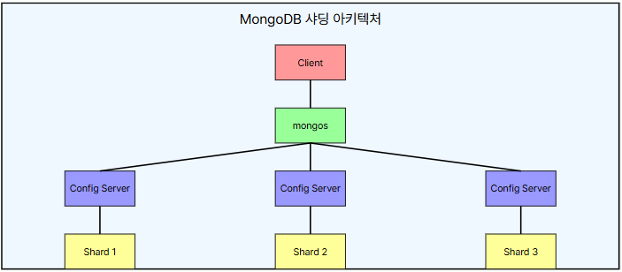

# 몽고DB 샤딩


샤딩(Sharding)은 MongoDB에서 대량의 데이터를 여러 서버에 분산 저장하는 방법입니다. 이는 데이터가 증가함에 따라 단일 서버의 저장 용량과 성능 한계를 극복하기 위해 사용됩니다.

## 1. 몽고DB 샤딩 구성 요소

 - `몽고드 라우터(Mongos)`
    - 애플리케이션이 몽고DB 샤드 클러스터에 접근할 때 사용하는 쿼리 라우터 역할
    - 클라이언트의 요청을 적절한 샤드로 라우팅함
    - 여러 개의 mongos 인스턴스를 배포하여 부하 분산 가능
 - `컨피그 서버(Config Server)`
    - 샤딩 메타데이터 저장 (각 샤드의 데이터 분포 정보 관리)
    - 일반적으로 3개 이상의 컨피그 서버를 사용하여 고가용성을 유지
 - `샤드 서버(Shard Server)`
    - 데이터를 실제로 저장하는 서버
    - 여러 개의 샤드가 존재하며, 각각 독립적인 데이터베이스 인스턴스를 가짐
    - 샤드는 일반적으로 __레플리카 셋(Replica Set)__ 으로 구성되어 데이터 복제 및 장애 복구 기능을 제공

<div align="center">
    
</div>
<br/>

## 2. 샤딩 키와 샤딩 전략

샤딩을 구현할 때는 샤드 키를 기준으로 데이터를 어떻게 분배할 것인지 결정해야 합니다. 몽고DB에서는 다음 두 가지 샤딩 전략을 제공합니다.

### 2-1. 샤드 키(Shard Key)

 - 데이터를 샤드에 분산 저장하기 위한 기준이 되는 키
 - 효율적인 샤딩을 위해 균등하게 분포되는 필드를 선택하는 것이 중요
 - 예: _id, userId, region 등

### 2-2. 해시 샤딩(Hash Sharding)

 - 샤드 키의 값을 __해싱(Hashing)__하여 데이터를 균등하게 분배
 - 특정 키의 값이 편향되지 않도록 보장함
 - 장점: 데이터가 고르게 분포되어 샤드 간 로드 밸런싱이 용이
 - 단점: 특정 범위의 데이터를 조회하는 경우 여러 샤드를 조회해야 하므로 성능 저하 가능

### 2-3. 범위 샤딩(Range Sharding)

 - 샤드 키의 값 범위(Range)에 따라 데이터를 분배
 - 예를 들어 userId가 1000~2000이면 샤드 A, 2001~3000이면 샤드 B에 저장하는 방식
 - 장점: 범위 쿼리(예: 특정 날짜 범위의 데이터 조회)가 빠름
 - 단점: 특정 샤드에 데이터가 집중될 가능성이 있음 (샤드 불균형)

## 3. 샤딩 클러스터 구축

 - `샤딩 환경 구성 순서`
    - Config 서버 구성
    - 샤드 서버 구성
    - Mongos 서버 구성
    - 샤딩 활성화 및 데이터 분산 설정

### 3-1. Config 서버 구성

Config 서버는 샤드 클러스터의 메타데이터(샤드 정보, 데이터 분포 등)를 관리합니다.

MongoDB 3.2 이상에서는 Config 서버도 레플리카 셋(Replica Set) 으로 구성해야 합니다.

```javascript
// 1. Config 서버 시작
// --configsvr: Config 서버 시작 옵션
// --replSet cfgReplSet: 레플리카 셋으로 설정(해당 옵션을 주어야 레플리카셋 멤버 등록 가능)
// --dbpath /data/configdb: 데이터 저장 경로
// --port 27019: 프로세스 포트
mongod --configsvr --replSet cfgReplSet --dbpath /data/configdb --port 27019 --bind_ip 0.0.0.0

// 2. Config 서버 접속
mongo --port 27019

// 3. Cofig 서버 레플리카 셋 초기화
rs.initiate({
    _id: "cfgReplSet",
    configsvr: true,
    members: [
        { _id: 0, host: "config1:27019" },
        { _id: 1, host: "config2:27019" },
        { _id: 2, host: "config3:27019" }
    ]
})

// 4. 설정 확인
rs.status()
```

### 3-2. 샤드 서버(Shard) 구성

샤드는 실제 데이터를 저장하는 서버이며, 각 샤드는 보통 레플리카 셋으로 구성됩니다.

```javascript
// 1. Shard 서버 시작
// --shardsvr: 샤드 서버로 설정
// --replSet shardReplSet1: 레플리카 셋으로 설정(해당 옵션을 주어야 레플리카셋 멤버 등록 가능)
// --dbpath /data/shard1: 데이터 저장 경로
// --port 27018: 프로세스 포트
mongod --shardsvr --replSet shardReplSet1 --dbpath /data/shard1 --port 27018 --bind_ip 0.0.0.0

// 2. Shard 서버 접속
mongo --port 27018

// 3. Shard 서버 레플리카 셋 초기화
rs.initiate({
    _id: "shardReplSet1",
    members: [
        { _id: 0, host: "shard1:27018" },
        { _id: 1, host: "shard2:27018" },
        { _id: 2, host: "shard3:27018" }
    ]
})

// 4. 설정 확인
rs.status()
```

### 3-3. Mongos 서버 구성

Mongos는 클라이언트와 샤드 서버 사이에서 쿼리를 라우팅하는 역할을 합니다.

```javascript
// 1. Mongos 서버 시작
// --configdb cfgReplSet/config1:27019,config2:27019,config3:27019 → Config 서버 목록 설정
// --port 27017: 프로세스 포트
mongos --configdb cfgReplSet/config1:27019,config2:27019,config3:27019 --bind_ip 0.0.0.0 --port 27017
```

### 3-4. 샤딩 활성화 및 데이터 분산 설정

```javascript
// 1. Mongos 서버에 접속
mongo --host mongos --port 27017

// 2. 샤드 추가
sh.addShard("shardReplSet1/shard1:27018,shard2:27018,shard3:27018")
sh.addShard("shardReplSet2/shard4:27018,shard5:27018,shard6:27018")

// 3. DB 샤딩 활성화 (특정 데이터베이스에 샤딩 활성화)
sh.enableSharding("myDatabase")

// 4. 컬렉션 샤딩 활성화 (특정 컬렉션에 샤딩 활성화 및 샤딩 키 지정)
// myDatabase.myCollection: 샤딩 대상 컬렉션
sh.shardCollection("myDatabase.myCollection", { userId: "hashed" })
// sh.shardCollection("myDatabase.myCollection", { createdAt: 1 }) // 범위 샤딩

// 5. 샤딩 확인
sh.status()
```

### 3-5. Spring 애플리케이션에서 MongoDB 제어하기

#### MongoDB 클라이언트 설정

 - `build.gradle`
    - MongoDB 의존성 추가
```groovy
dependencies {
    implementation 'org.springframework.boot:spring-boot-starter-data-mongodb'
}
```

 - `application.yml 기반 설정`
    - mongos1:27017,mongos2:27017,mongos3:27017: Mongos 서버 주소 목록 (고가용성 지원)
    - myDatabase: 샤딩된 MongoDB 데이터베이스
    - replicaSet=cfgReplSet: Config 서버의 레플리카 셋 사용 설정
    - auto-index-creation: true: 자동 인덱스 생성
```yml
spring:
  data:
    mongodb:
      uri: mongodb://mongos1:27017,mongos2:27017,mongos3:27017/myDatabase?replicaSet=cfgReplSet
      database: myDatabase
      auto-index-creation: true
```

 - `Java 기반 설정`
    - MongoClients.create(...)로 Mongos 서버 연결
    - ServerAddress("mongos1", 27017) 등의 Mongos 주소 등록
    - MongoTemplate을 빈으로 등록하여 MongoDB 접근
```java
import com.mongodb.MongoClientSettings;
import com.mongodb.ServerAddress;
import com.mongodb.client.MongoClient;
import com.mongodb.client.MongoClients;
import org.springframework.context.annotation.Bean;
import org.springframework.context.annotation.Configuration;
import org.springframework.data.mongodb.core.MongoTemplate;

import java.util.Arrays;

@Configuration
public class MongoConfig {

    @Bean
    public MongoClient mongoClient() {
        return MongoClients.create(
            MongoClientSettings.builder()
                .applyToClusterSettings(builder -> builder.hosts(Arrays.asList(
                    new ServerAddress("mongos1", 27017),
                    new ServerAddress("mongos2", 27017),
                    new ServerAddress("mongos3", 27017)
                )))
                .build()
        );
    }

    @Bean
    public MongoTemplate mongoTemplate(MongoClient mongoClient) {
        return new MongoTemplate(mongoClient, "myDatabase");
    }
}
```

#### MongoDB CRUD

 - `Repository 정의`
```java
import org.springframework.data.mongodb.repository.MongoRepository;
import org.springframework.stereotype.Repository;
import java.util.List;

@Repository
public interface UserRepository extends MongoRepository<User, String> {

    // 기본 제공되는 CRUD 메서드 외에 추가적인 쿼리 메서드 정의 가능

    // 특정 userId로 조회 (샤딩 키 기반 검색)
    User findByUserId(String userId);

    // 특정 이름을 가진 모든 사용자 조회
    List<User> findByName(String name);

    // 나이가 특정 값 이상인 사용자 조회
    List<User> findByAgeGreaterThanEqual(int age);

    // 이메일이 특정 값과 일치하는 사용자 삭제
    void deleteByEmail(String email);
}

```

 - `Entity 정의`
```java
import org.springframework.data.annotation.Id;
import org.springframework.data.mongodb.core.index.Indexed;
import org.springframework.data.mongodb.core.mapping.Document;

@Getter
@Setter
@NoArgsConstructor
@AllArgsConstructor
@Document(collection = "users")
public class User {
    @Id
    private String id;

    @Indexed(unique = true)
    private String userId;

    private String name;
    private int age;
}
```

 - `Service 정의`
```java
/**
 * MongoTemplate CRUD
 * mongoTemplate.save(user) → MongoDB에 데이터 저장
 * mongoTemplate.findOne(query, User.class) → 단일 사용자 조회
 * mongoTemplate.find(query, User.class) → 여러 사용자 조회
 * mongoTemplate.findAndModify(query, update, User.class) → 사용자 정보 수정
 * mongoTemplate.remove(query, User.class) → 사용자 삭제
 **/

import org.springframework.data.mongodb.core.MongoTemplate;
import org.springframework.data.mongodb.core.query.Criteria;
import org.springframework.data.mongodb.core.query.Query;
import org.springframework.data.mongodb.core.query.Update;
import org.springframework.stereotype.Service;

import java.util.List;

@RequiredArgsConstructor
@Service
public class UserService {

    private final MongoTemplate mongoTemplate;

    // 🔹 1. 사용자 생성 (Create)
    public User createUser(String userId, String name, int age, String email) {
        User user = new User(userId, name, age, email);
        return mongoTemplate.save(user); // MongoDB에 저장
    }

    // 🔹 2. 사용자 조회 (Read)
    public User getUserByUserId(String userId) {
        Query query = new Query();
        query.addCriteria(Criteria.where("userId").is(userId)); // userId 기반 검색
        return mongoTemplate.findOne(query, User.class);
    }

    public List<User> getUsersByName(String name) {
        Query query = new Query();
        query.addCriteria(Criteria.where("name").is(name)); // name이 같은 사용자 검색
        return mongoTemplate.find(query, User.class);
    }

    public List<User> getUsersByAgeGreaterThan(int age) {
        Query query = new Query();
        query.addCriteria(Criteria.where("age").gt(age)); // 나이가 age보다 큰 사용자 조회
        return mongoTemplate.find(query, User.class);
    }

    // 🔹 3. 사용자 업데이트 (Update)
    public User updateUser(String userId, String newName, int newAge, String newEmail) {
        Query query = new Query();
        query.addCriteria(Criteria.where("userId").is(userId)); // userId 기반 검색

        Update update = new Update();
        update.set("name", newName);
        update.set("age", newAge);
        update.set("email", newEmail);

        return mongoTemplate.findAndModify(query, update, User.class); // 변경 후 저장
    }

    // 🔹 4. 사용자 삭제 (Delete)
    public void deleteUserByUserId(String userId) {
        Query query = new Query();
        query.addCriteria(Criteria.where("userId").is(userId));
        mongoTemplate.remove(query, User.class);
    }
}

/**
 * XxxRepository CRUD
 * findByUserId(String userId) → 샤드 키 기반 단건 조회 (빠름)
 * findByName(String name) → 이름이 같은 사용자 목록 조회
 * findByAgeGreaterThanEqual(int age) → 특정 나이 이상인 사용자 조회
 * deleteByEmail(String email) → 특정 이메일을 가진 사용자 삭제
 **/

import org.springframework.stereotype.Service;
import java.util.List;
import java.util.Optional;

@RequiredArgsConstructor
@Service
public class UserService {
    
    private final UserRepository userRepository;

    // 🔹 1. 사용자 저장 (Create)
    public User createUser(String userId, String name, int age, String email) {
        User user = new User(userId, name, age, email);
        return userRepository.save(user); // MongoDB에 저장
    }

    // 🔹 2. 사용자 조회 (Read)
    public Optional<User> getUserById(String id) {
        return userRepository.findById(id); // ID 기반 조회
    }

    public User getUserByUserId(String userId) {
        return userRepository.findByUserId(userId); // userId(샤드 키)로 조회
    }

    public List<User> getUsersByName(String name) {
        return userRepository.findByName(name); // 이름으로 조회
    }

    // 🔹 3. 사용자 업데이트 (Update)
    public User updateUser(String userId, String newName, int newAge, String newEmail) {
        User user = userRepository.findByUserId(userId);
        if (user != null) {
            user.setName(newName);
            user.setAge(newAge);
            user.setEmail(newEmail);
            return userRepository.save(user); // 변경 후 저장
        }
        return null; // 사용자가 존재하지 않음
    }

    // 🔹 4. 사용자 삭제 (Delete)
    public void deleteUserById(String id) {
        userRepository.deleteById(id); // ID 기반 삭제
    }

    public void deleteUserByEmail(String email) {
        userRepository.deleteByEmail(email); // 이메일 기반 삭제
    }
}
```

#### MongoDB 집계 프레임워크

 - 예시 쿼리: https://stackoverflow.com/questions/59697496/how-to-do-a-mongo-aggregation-query-in-spring-data
```java
// @Aggregation 어노테이션 이용
public interface SalesPoRepository extends MongoRepository<SalesPo, String> {
    @Aggregation(pipeline = {
        """
        { $project: {
            month: { $month: "$poDate" },
            year: { $year: "$poDate" },
            amount: 1,
            poDate: 1
        } }
        """,
        """
        { $match: { $and : [{ year: ?0 }, { month: ?1 }] } }
        """,
        """
        { $group: {
            "_id": {
                month: { $month: "$poDate" },
                year: { $year: "$poDate" }
            },
            totalPrice: { $sum: { $toDecimal: "$amount" } }
        } }
        """,
        """
        { $project: {
            _id: 0,
            totalPrice: { $toString: "$totalPrice" }
        } }
        """
    })
    AggregationResults<SumPrice> sumPriceThisYearMonth(Integer year, Integer month);
}

// Java 객체 이용
@Service
public class OrderService {

    private final MongoTemplate mongoTemplate;

    public List<SumPrice> sumPriceThisYearMonth(Integer year, Integer month) {
        // 1. $project - 필요한 필드만 추출
        ProjectionOperation projectStage = Aggregation.project()
                .andExpression("month(poDate)").as("month")
                .andExpression("year(poDate)").as("year")
                .andInclude("amount", "poDate");

        // 2. $match - 특정 연도와 월을 가진 문서 필터링
        MatchOperation matchStage = Aggregation.match(
                Criteria.where("year").is(year)
                        .and("month").is(month)
        );

        // 3. $group - 연도와 월별로 금액 합산
        GroupOperation groupStage = Aggregation.group("year", "month")
                .sum(ConvertOperators.ToDecimal.toDecimal("$amount")).as("totalPrice");

        // 4. $project - 결과 필드 수정
        ProjectionOperation finalProjectStage = Aggregation.project()
                .andExclude("_id")
                .and(ConvertOperators.ToString.toString("$totalPrice")).as("totalPrice");

        // 5. Aggregation 실행
        Aggregation aggregation = Aggregation.newAggregation(
                projectStage,
                matchStage,
                groupStage,
                finalProjectStage
        );

        return mongoTemplate.aggregate(aggregation, "orders", SumPrice.class).getMappedResults();
    }

    public List<SumPrice> sumPriceThisYearMonth(Integer year, Integer month) {
        Aggregation aggregation = Aggregation.newAggregation(
                Aggregation.project()
                        .andExpression("month(poDate)").as("month")
                        .andExpression("year(poDate)").as("year")
                        .andInclude("amount", "poDate"),

                Aggregation.match(
                        Criteria.where("year").is(year)
                                .and("month").is(month)
                ),

                Aggregation.group("year", "month")
                        .sum(ConvertOperators.ToDecimal.toDecimal("$amount")).as("totalPrice"),

                Aggregation.project()
                        .andExclude("_id")
                        .and(ConvertOperators.ToString.toString("$totalPrice")).as("totalPrice")
        );

        return mongoTemplate.aggregate(aggregation, "orders", SumPrice.class).getMappedResults();
    }
}
```
