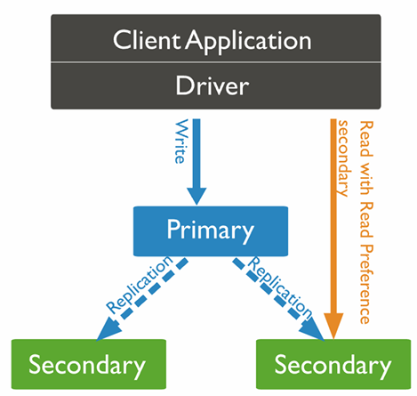
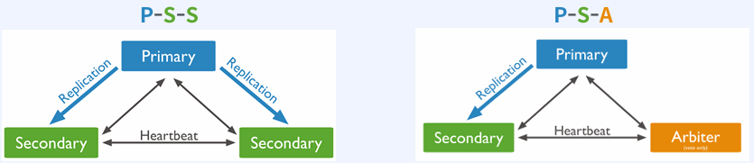
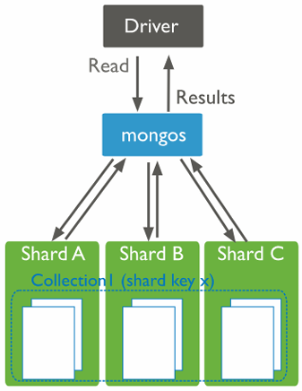

# MongoDB 개요

## MongoDB

MongoDB는 NoSQL (Not Only SQL) 데이터베이스의 일종으로, 문서(document) 지향 데이터 모델을 사용하는 오픈 소스 데이터베이스입니다. MongoDB는 데이터 저장 및 관리를 위해 테이블과 행을 사용하는 전통적인 관계형 데이터베이스(RDBMS)와는 달리, JSON 또는 BSON 형식의 __문서(document)__ 를 사용합니다.

 - __문서 지향(Document-Oriented) 데이터 모델__
    - MongoDB는 데이터를 JSON과 유사한 BSON (Binary JSON) 형식으로 저장합니다.
    - 하나의 문서(document)는 다양한 필드와 데이터를 포함할 수 있으며, 관계형 데이터베이스의 레코드(row)와 유사합니다.
    - 문서 내에 중첩 데이터 구조를 포함할 수 있어 복잡한 데이터를 직관적으로 표현할 수 있습니다.
 - __스키마리스(Schema-less) 구조__
    - MongoDB는 고정된 스키마를 강요하지 않으므로, 데이터 모델링이 유연합니다.
    - 서로 다른 구조를 가진 문서를 동일한 컬렉션(collection)에 저장할 수 있습니다.
 - __컬렉션(Collection)__
    - 컬렉션은 관계형 데이터베이스의 테이블과 유사한 개념으로, 여러 문서를 그룹화한 논리적 단위입니다.
 - __수평적 확장(Scalability)__
    - MongoDB는 샤딩(sharding)을 통해 데이터베이스를 여러 서버에 분산하여 저장 및 처리할 수 있습니다.
    - 이를 통해 대규모 데이터와 트래픽을 효율적으로 처리할 수 있습니다.
 - __고성능__
    - MongoDB는 데이터 삽입, 조회, 업데이트, 삭제와 같은 기본 작업에서 높은 성능을 제공합니다.
    - 메모리 기반 데이터 처리를 통해 읽기 및 쓰기 속도를 최적화합니다.
 - __유연한 데이터 처리__
    - 다양한 데이터 타입과 구조를 쉽게 다룰 수 있습니다.
    - MapReduce와 같은 복잡한 데이터 처리도 지원합니다.
 - __쿼리 언어__
    - MongoDB는 SQL 대신 JSON 형식의 쿼리를 사용합니다.
    - 필터링, 정렬, 집계 등의 기능을 쉽게 수행할 수 있습니다.

### MongoDB의 장단점

 - __장점__
    - 데이터 접근성과 가시성이 좋다.
    - Join 없이 조회가 가능해서 응답 속도가 일반적으로 빠르다.
    - 스키마 변경에 공수가 적다.
    - 스키마가 유연해서 데이터 모델을 App의 요구사항에 맞게 데이터를 수용할 수 있다.
    - HA와 Sharding에 대한 솔루션을 자체적으로 지원하고 있어 Scale-Out이 간편하고, 확장시 Application의 변경사항이 없다.
 - __단점__
    - 데이터의 중복이 발생한다.
    - 스키마가 자유롭지만, 스키마 설계를 잘해야 성능 저하를 피할 수 있다.

### MongoDB 구조

 - `MongoDB와 RDBMS 비교`

|RDBMS|MongoDB|
|------|---|
|Cluster|Cluster|
|Database|Database|
|Table|Collection|
|Row|Document|
|Column|Field|

 - `기본 Database`
    - __admin__
        - 인증과 권한 부여 역할
        - 일부 관리 작업을 하려면 admin Database에 대한 접근이 필요하다.
    - __local__
        - 모든 mongod instance는 local database를 소유한다.
        - oplog와 같은 replication 절차에 필요한 정보를 저장한다.
        - startup_log와 같은 instance 진단 정보를 저장한다.
        - local databas 자체를 복제되지 않는다.
    - __config__
        - sharded cluster에서 각 shard의 정보를 저장한다.
```bash
show databases
```


 - `Collection`
    - 동적 스키마를 갖고 있어 스키마를 수정하려면 필드 값을 추가/수정/삭제하면 된다.
    - Collection 단위로 Index를 생성할 수 있다.
    - Collection 단위로 Shard를 나눌 수 있닫.
```bash
# 컬렉션 목록 확인
show collections

# 도큐먼트 삽입(스키마 자동 생성)
db.message.insertOne({
    user: "tom",
    age: "23",
    log: "Hello MongoDB"
})
```

 - `Document`
    - JSON 형태로 표현하고 BSON(Binary JSON) 형태로 저장한다.
    - 모든 Document에는 "_id" 필드가 있고, 없이 생성하면 ObjectId 타입의 고유한 값을 저장한다.
    - 생성 시, 상위 구조인 Database나 Collection이 없다면 먼저 생성하고 Docuemnt를 생성한다.
    - Document의 최대 크기는 16MB 이다.

 - `정리`
    - Database > Collection > Document > Field 순으로 구조 형성
    - admin, cofig, local database는 MongoDB를 관리하는데 사용
    - Collection은 동적 스키마를 갖는다
    - Document는 JSON 형태로 표현되고 BSON 형태로 저장
    - Document는 고유한 "_id" 필드를 항상 갖고 있음
    - Document의 최대 크기는 16MB

## MongoDB 배포 형태

### Standalone Deployment (단일 서버 배포)

단일 MongoDB 인스턴스를 사용하는 가장 기본적인 배포 형태입니다.

 - __구성__: MongoDB 서버가 하나의 머신(서버)에 설치되어 실행됩니다.
 - __장점__: 설정이 간단하고 테스트나 개발 환경에서 사용하기 적합합니다.
 - __단점__: 서버에 장애가 발생하면 데이터베이스가 중단되므로 고가용성을 보장하지 못합니다.
 - __사용 사례__: 개발 환경, 간단한 테스트나 프로토타입 개발

### Replica Set (복제본 세트)

데이터의 고가용성과 복구 기능을 제공하기 위해 여러 MongoDB 인스턴스를 복제하는 배포 형태입니다.

Replica Set은 local database의 Oplog Collection을 통해 복제를 수행한다.

 - __구성__
    - 하나의 Primary Node와 여러 개의 Secondary Node로 구성됩니다.
    - Primary Node는 읽기/쓰기 작업을 처리하고, Secondary Node는 Primary를 복제하여 데이터를 유지합니다.
    - Primary가 장애를 일으키면 Secondary 중 하나가 자동으로 Primary로 승격됩니다.
 - __장점__
    - 장애 복구(Failover) 및 고가용성(High Availability) 제공
    - 데이터를 복제하므로 백업과 데이터 보호 강화
 - __단점__
    - 설정이 Standalone보다 복잡
    - 여러 노드를 운영해야 하므로 리소스 요구가 증가
 - __사용 사례__
    - 실시간 애플리케이션
    - 데이터 손실 방지가 중요한 애플리케이션
    - 읽기 요청을 Secondary Node로 분산해 성능 개선 가능
 - `Primary Node`
    - Read/Write 요청 모두 처리
    - Write를 처리하는 유일한 노드
    - Replica Set에 하나만 존재
 - `Secondary Node`
    - Read에 대한 요청만 처리
    - 복제를 통해 Primary와 동일한 데이터 셋을 유지
    - Replica Set에 여러개 존재
 - `Arbiter Node`
    - Primary와 Secondary와 다르게 데이터를 가지지 않고, Primary 선출에만 사용된다.
    - 비용 문제로 서버를 구매하기 부담스러울 때 리소스가 작은 서버를 이용하여 Primary 선출을 보장하기 위해 사용

```bash
# local db 접속
use local

# Collection 목록 확인
show collections

# oplog.rs 확인
db.oplog.rs.find({ns: "db명.collection명"})
```

<div align="center">
    <br/>
    
</div>
<br/>

### Sharded Cluster (샤딩 클러스터)

데이터를 여러 서버에 분산(샤딩)하여 대규모 데이터를 처리하는 데 적합한 배포 형태입니다.

 - __구성__
    - Shard: 데이터를 분산 저장하는 서버 그룹 (MongoDB 인스턴스)
    - Config Server: 클러스터의 메타데이터를 관리
    - Query Router (mongos): 애플리케이션과 클러스터 간의 인터페이스 역할
 - __장점__
    - 데이터가 여러 샤드에 분산되어 대규모 데이터 처리 및 저장 가능
    - 트래픽 분산으로 성능 향상
 - __단점__
    - 설정과 관리가 복잡
    - 샤드 키(Shard Key) 설계가 중요하며, 잘못 설계하면 성능 문제 발생
 - __사용 사례__
    - 빅데이터 처리
    - 고성능을 요구하는 대규모 애플리케이션
    - 데이터 세트가 단일 서버의 저장 용량을 초과하는 경우
 - `샤딩 전략`
    - __Range-Based Sharding (범위 기반 샤딩)__
        - 작동 방식
            - 샤드 키 값의 범위를 기준으로 각 샤드에 데이터를 분배합니다.
            - 예: 샤드 키가 날짜(orderDate)인 경우, 2024년 1월 데이터는 샤드 A, 2024년 2월 데이터는 샤드 B에 저장.
        - 장점
            - 특정 범위의 데이터에 대해 효율적으로 쿼리 가능.
            - 순차 데이터(예: 날짜, ID)를 처리하는 데 유리.
        - 단점
            - 데이터가 특정 범위에 집중되면 샤드 간 부하가 불균형해질 가능성이 높음.
            - 특정 샤드에 작업이 집중되면 Hot Spot(핫 스팟) 문제가 발생.
    - __Hash-Based Sharding (해시 기반 샤딩)__
        - 작동 방식
            - 샤드 키 필드 값에 해시 알고리즘을 적용해 데이터를 균등하게 분배합니다.
            - 예: 사용자 ID를 해싱하여 데이터를 각 샤드에 분산.
        - 장점
            - 데이터가 고르게 분산되므로 부하 균형 유지.
            - 특정 샤드에 데이터가 집중되는 문제를 방지.
        - 단점
            - 범위 기반 쿼리가 비효율적일 수 있음 (샤드 전체에서 데이터를 조회해야 함).
            - 해시된 샤드 키는 직관적인 데이터 분포 파악이 어려움.
    - __Zone-Based Sharding (영역 기반 샤딩)__
        - 특정 샤드에 특정 데이터를 할당하는 전략으로, 지리적 위치나 특정 조건에 따라 데이터를 분배합니다.
        - 작동 방식
            - 샤드 키 값과 데이터의 조건을 기반으로 **존(zone)**을 정의.
            - 특정 영역(zone)에 속한 데이터는 특정 샤드에 저장.
            - 예: 지역(미국, 유럽, 아시아) 기반으로 데이터를 분리.
        - 장점
            - 데이터의 지리적 근접성 보장 (예: 사용자 지역에 따라 가까운 서버에서 데이터 제공).
            - 데이터 보관 요구 사항(규제 준수 등)에 유리.
        - 단점
            - 존에 속한 데이터가 불균형해질 경우, 특정 샤드에 부하가 집중될 수 있음.
            - 설정이 복잡.

<div align="center">
    
</div>
<br/>

### Replica Set vs Sharded Cluster 배포

가능한 Replica Set으로 배포하고, 서비스의 요구사항이 Replica Set으로 충족하지 못하면 Sharded Cluster를 고려한다.

 - 예시
    - 매일 1GB씩 데이터가 증가하고 3년간 보관 -> 환경에 따라 다르다.
    - Write 요청이 압도적으로 많은 서비스 -> Sharded Cluster
    - 논리적인 데이터베이스가 많은 경우 -> 여러 Replica Set으로 분리

|배포형태|장점|단점|
|---|---|---|
|Replica Set|운영이 쉽다<br/>장애 발생시 문제 해결 및 복구가 쉽다.<br/>서버 비용이 적게 든다.<br/>성능이 좋다.<br/>개발시 설계가 용이하다.|Read에 대한 분산이 가능하지만, Write에 대한 분산은 불가능하다.|
|Sharded Cluster|Scale-Out이 가능하다.<br/>Write에 대한 분산이 가능하다.|Replica Set의 모든 장점이 상대적으로 단점이 된다.|

