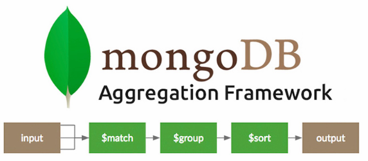

# Document Query 실습

 - SQL과 MongoDB 비교: https://www.mongodb.com/docs/manual/reference/sql-comparison/

## 기본 CRUD

 - `Insert`
```javascript
// Insert One
db.employees.insertOne({
    name: "lake",
    age: 21,
    dept: "Database",
    joinDate: new ISODate("2022-10-05"),
    salary: 400000,
    bonus: null
});

// Insert Many
db.employees.insertMany([
    {
        name: "ocean",
        age: 45,
        dept: "Network",
        joinDate: new ISODate("1999-11-15"),
        salary: 10000,
        resignationDate: new ISODate("2002-12-23"),
        bonus: null
    },
    {
        name: "river",
        age: 34,
        dept: "DevOps",
        isNegotiating: true,
    },
]);
```

 - `Update`
```javascript
// 이름이 river인 사람의 정보 수정
// unset은 해당 필드를 제거
db.employees.updateOne(
    { name: "river" },
    {
        $set: {
            salary: 350000,
            dept: "Database",
            joinDate: new ISODate("2022-12-31"),
        },
        $unset: {
            isNegotiating: "",
        },
    }
);

// UpdateMany
db.employees.updateMany(
    { resignationDate: { $exists: false }, joinDate: { $exists: true } },
    {
        $mul: { salary: Decimal128("1.1") },
    }
);

db.employees.updateMany(
    { resignationDate: { $exists: false }, bonus: { $exists: true } },
    {
        $set: { bonus: 100000 },
    }
);
```

 - `Delete`
```javascript
// Delete One
db.employees.deleteOne({ name: "river" });

// Delete Many
db.employees.deleteMany({});
```

 - `Drop Collection`
```javascript
db.employees.drop();
```

 - `Find`
```javascript
use sample_guides
db.planets.find();
db.planets.find({});

// name이 Mars인 도큐먼트 조회
db.planets.find({name: "Mars"});

// hasRings가 true이고, orderFromSun이 6보다 작거나 같은 도큐먼트 조회
db.planets.find({hasRings: true, orderFromSun: {$lte: 6}})
db.planets.find({
    $and: [
        {hasRings: true},
        {orderFromSun: {$lte: 6}}
    ]
})

// hasRings가 false가 아니거나, orderFromSun이 6보다 큰 도큐먼트 조회
db.planets.find({
    $or: [
        {hasRings: {$ne: false}},
        {orderFromSun: {$gt: 6}}
    ]
})

// mainAtmosphere 배열안에 O2가 포함된 도큐먼트 조회
db.planets.find({mainAtmosphere: {$in: ['O2']}})
```

## 유용한 Query 함수들

 - 컬렉션: https://www.mongodb.com/ko-kr/docs/manual/reference/method/js-collection/

 - `bulkWrite`
    - 대량 쓰기 작업 기능 제공
```javascript
db.bulk.bulkWrite(
	[
		{insertOne: {doc: 1, order: 1}},
		{insertOne: {doc: 2, order: 2}},
		{insertOne: {doc: 3, order: 3}},
		{insertOne: {doc: 4, order: 4}},
		{insertOne: {doc: 4, order: 5}},
		{insertOne: {doc: 5, order: 6}},
		{
			deleteOne: {
				filter: {doc: 3}
			}
		},
		{
			updateOne: {
				filter: { doc: 2 },
				update: {
					$set: {doc: 12}
				}
			}
		}
	]
)

db.bulk.bulkWrite(
	[
		{insertOne: {doc: 1, order: 1}},
		{insertOne: {doc: 2, order: 2}},
		{insertOne: {doc: 3, order: 3}},
		{insertOne: {doc: 4, order: 4}},
		{insertOne: {doc: 4, order: 5}},
		{insertOne: {doc: 5, order: 6}},
		{
			updateOne: {
				filter: { doc: 2 },
				update: {
					$set: {doc: 3}
				}
			}
		},
		{
			deleteMany: {
				filter: {doc: 3}
			}
		},
	],
	{ordered: false}
)
```

 - `Count Documents`
```javascript
// 실제 도큐먼트 갯수 반환
db.bulk.countDocuments()

// 예상되는 도큐먼트 갯수 반환
db.bulk.estimatedDocumentCount()
```

 - `Distinct`
    - 지정된 필드에 고유한 값을 가진 문서의 배열을 반환
```javascript
db.bulk.distinct("doc")
```

 - `Find And Modify`
    - 하나의 문서를 원자 단위로 수정하고 반환
```javascript
db.bulk.findAndModify({
	query: { doc: 4 },
	update: { $inc: {doc: 1} }
})

db.bulk.findAndModify({
	query: { doc: 5 },
	sort: {order: -1},
	update: { $inc: {doc: 1} }
})

db.sequence.insertOne({ seq: 0 })

db.sequence.findAndModify({
	query: {},
	sort: { seq: -1 },
	update: { $inc: {seq: 1}}
})
```

 - `Get Index`
    - 인덱스 확인
```javascript
db.bulk.createIndex({ doc: 1 })
db.bulk.getIndexes()
```

 - `Replace One`
```javascript
db.bulk.updateOne({ doc: 1 }, { $set: { _id: 1 } })
db.bulk.replaceOne({ doc: 1 }, {doc: 13})
```

## 배열과 내장 Document를 다루는 방법

 - `내장 도큐먼트 다루기`
```javascript
use sample_supplies
show collections

// 내장 도큐먼트 조회
db.sales.findOne({
	"customer.email": "keecade@hem.uy"
})
db.sales.findOne({
	"customer.age": {$lt: 20}
})
```

 - `배열 다루기`
```javascript
// 예제 데이터 넣기
db.inventory.insertMany([
	{ item: "journal", qty: 25, tags: ["blank", "red"], dim_cm: [ 14, 21 ] },
	{ item: "notebook", qty: 50, tags: ["red", "blank"], dim_cm: [ 14, 21 ] },
	{ item: "paper", qty: 100, tags: ["red", "blank", "plain"], dim_cm: [ 14, 21 ] },
	{ item: "planner", qty: 75, tags: ["blank", "red"], dim_cm: [ 22.85, 30 ] },
	{ item: "postcard", qty: 45, tags: ["blue"], dim_cm: [ 10, 15.25 ] },
	{ item: "postcard", qty: 45, tags: ["blue", "red"], dim_cm: [ 13, 14 ] }
]);

// 순서와 값이 모두 동일해야 조회된다.
db.inventory.find({
	tags: ['red', 'blank']
})

// 순서와 상관없이 'red'와 'blank'가 모두 들어가 있는 도큐먼트 조회
db.inventory.find({
	tags: { $all: ['red', 'blank'] }
})

// 'red'나 'blank'가 하나라도 있는 도큐먼트 조회
db.inventory.find({
	tags: { $in: ['red', 'blank'] }
})

// 배열 요소 중 하나라도 blue라면 만족
db.inventory.find({
	tags: 'blue'
})

// 배열 요소 중 하나라도 15보다 크면 만족
db.inventory.find({
	dim_cm: {$gt: 15}
})

// 배열 요소 중에 15보다 큰게 하나라도 만족하고, 20보다 작은게 하나라도 만족하면 true
// $gt:15를 배열안에 in 조건, $lt:20을 배열안에 in 조건이라고 보면됨
db.inventory.find({
	dim_cm: {$gt: 15, $lt: 20}
})

// 배열 요소중 하나라도 해당 조건에 모두 만족하는 경우 true
db.inventory.find({
	dim_cm: {$elemMatch: {$gt: 15, $lt: 20}}
})

// 배열의 특정 위치에 조건 주기
// 배열의 첫 번째 요소가 20보다 작으면 만족
db.inventory.find({
	"dim_cm.1": {$lt: 20}
})

// 배열 크기 조건
db.inventory.find({
	tags: {$size: 3}
})

// 배열 요소 중에 이름이 binder이고 quantity가 6보다 작거나 같은 도큐먼트
db.sales.find({
	items: {
		$elemMatch: {
			name: "binder",
			quantity: {$lte: 6}
		}
	}
})

// 프로젝션을 이용하여 조건에 만족하는 첫 번쨰 요소만을 조회
db.sales.find(
	{
		items: {
			$elemMatch: {
				name: "binder",
				quantity: {$lte: 6}
			}
		}
	},
	{
		saleDate: 1,
		"items.$": 1,
		storeLocation: 1,
		customer: 1
	}
)
```

 - `배열 다루기 (Update)`
```javascript
// 예제 데이터 등록
db.students.insertMany([
	{_id: 1, grades: [85, 80, 80]},
	{_id: 2, grades: [88, 90, 92]},
	{_id: 3, grades: [85, 100, 90]}
])

// grades가 80인 요소의 값 변경
db.students.updateOne(
	{ _id: 1, grades: 80 },
	{$set: {"grades.$": 82}}
)

// 조건에 맞는 전체 요소 값 변경
db.students.updateMany(
	{},
	{$inc: {"grades.$[]": 10}}
)


// 예제 데이터 등록
db.students.insertMany([
	{
		_id: 4,
		grades: [
			{ grade: 80, mean: 75, std: 8 },
			{ grade: 85, mean: 90, std: 5 },
			{ grade: 85, mean: 85, std: 8 },
		]
	}
])

// grades.grade가 85인 첫 번째 해당하는 요소의 값 변경
db.students.updateOne(
	{ _id: 4, "grades.grade": 85 },
	{$set: {"grades.$.std": 6}}
)

// 배열 전체 값 변경
db.students.updateOne(
	{ _id: 4, grades: {$elemMatch: {grade: {$gte: 85}}} },
	{$set: {"grades.$[].grade": 100}}
)


// 예제 데이터 등록
db.students.insertMany([
	{
		_id: 6,
		grades: [
			{ grade: 90, mean: 75, std: 8 },
			{ grade: 87, mean: 90, std: 6 },
			{ grade: 85, mean: 85, std: 8 },
		]
	}
])

// 배열 요소의 값이 87보다 큰 요소만 100으로 변경
db.students.updateMany(
	{ _id: 6 },
	{ $set: {"grades.$[element].grade": 100}},
	{ arrayFilters: [{"element.grade": {$gte: 87}}] }
)


// 예제 데이터 등록
db.students.insertOne(
	{
		_id: 7,
	grades : [
		{ type: "quiz", questions: [ 10, 8, 5 ] },
		{ type: "quiz", questions: [ 8, 9, 6 ] },
		{ type: "hw", questions: [ 5, 4, 3 ] },
		{ type: "exam", questions: [ 25, 10, 23, 0 ] },
	]
	}
)

// 배열 요소의 값이 8보다 크거나 같은 요소에 대해서 2씩 증가
db.students.updateOne(
	{ _id: 7 },
	{ $inc: { "grades.$[].questions.$[score]": 2 } },
	{arrayFilters: [{score: {$gte: 8}}]}
)


// 예제 데이터 등록
db.shopping.insertMany([
	{
		_id: 1,
		cart: ['bannana', 'cheeze', 'milk'],
		coupons: ['10%', '20%', '30%']
	},
	{
		_id: 2,
		cart: [],
		coupons: []
	}
])

// 배열에 해당 값이 없는 경우에만 삽입
db.shopping.updateOne(
	{ _id: 1 },
	{$addToSet: {cart: 'beer'}}
)

// ❌ 배열안에 배열 자체가 들어간다.
db.shopping.updateOne(
	{ _id: 1 },
	{$addToSet: {cart: ['beer', 'candy']}}
)

// ✔ $each를 이용한다.
db.shopping.updateOne(
	{ _id: 1 },
	{ $addToSet: { cart: { $each: ['beer', 'candy'] } } }
)

// 배열의 특정 요소 추출
db.shopping.updateOne(
	{ _id: 1 },
	{$pull: {cart: 'beer'}}
)
db.shopping.updateOne(
	{ _id: 1 },
	{$pull: {cart: {$in: [['beer', 'candy'], 'milk']}}}
)

// 배열의 양쪽 끝에 값 추출
db.shopping.updateOne(
	{ _id: 1 },
	{$pop: {cart: -1}}
)
db.shopping.updateOne(
	{ _id: 1 },
	{$pop: {cart: 1, coupons: -1}}
)

// 배열의 마지막에 값 등록
db.shopping.updateOne(
	{ _id: 1 },
	{$push: {cart: 'popcorn'}}
)
db.shopping.updateOne(
	{ _id: 1 },
	{ $push: { coupons: { $each: ['25%', '35%'] } } }
)

// 위치를 지정하여 넣기
db.shopping.updateMany(
	{},
	{
		$push: {
			coupons: {
				$each: ['90%', '70%'],
				$position: 0
			}
		}
	}
)

// 배열의 크기가 5개로 제한
db.shopping.updateMany(
	{},
	{
		$push: {
			coupons: {
				$each: ['15%', '20%'],
				$position: 0,
				$slice: 5
			}
		}
	}
)

db.shopping.updateMany(
	{},
	{
		$push: {
			coupons: {
				$each: ['90%', '99%'],
				$position: -1,
				$sort: -1,
				$slice: 5
			}
		}
	}
)
```

## Query 예제

```javascript
// sample_mflix 데이터베이스의 movies collection 전체를 조회
use sampple_mflix
show collections

// movies collection의 Document 수 조회
db.movies.countDocuments()

// movies collection 전체를 조회하는데, title, year, genres, runtime, rated 필드를 출력하고 _id 필드는 출력하지 않는다.
db.movies.find(
	{},
	{
		title: 1,
		year: 1,
		genres: 1,
		runtime: 1,
		rated: 1,
		_id: 0
	}
)

// movies collection에서 runtime이 100분 이하인 Document를 조회한다.
db.movies.find(
	{ 
		runtime: { $lte: 100 }
	}
)

// movies collection에서 runtime이 100분 이하이고 genres에 Drama가 포함되는 Document를 조회한다.
db.movies.find(
	{
		runtime: { $lte: 100 },
		genres: "Drama"
	}
)

// movies collection에서 runtime이 100분 이하이고 genres가 유일하게 Drama인 Document를 조회한다.
// 같은 필드를 조건에 넣으면 마지막 필드만 검색조건으로 사용된다.
db.movies.find(
	{
		$and: [
			{ runtime: { $lte: 100 } },
			{ genres: 'Drama' },
			{ genres: { $size: 1 } }
		]
	}
)

// moveies collection에서 runtime이 100분이하이고 type이 series가 아니고 개봉년도가 2015년 이상이거나 1925년 이하 영화를 찾는다.
db.movies.find(
	{
		$and: [
			{ runtime: { $lte: 100 } },
			{ type: { $ne: 'series' } },
			{
				$or: [
					{year: {$lte: 1925}},
					{ year: { $gte: 2015 } }
				]
			}
		]
	},
	{
		runtime: 1, type: 1, year: 1
	}
).sort({ year: -1 })

// movies collection에서 viewer 평가가 4.5 이상이거나 critic 평가가 9.5 이상인 영화를 찾고 runtime이 가장 긴 순서대로 5개 document를 출력한다.
// 필드는 title, runtime, tomatoes, _id 필드를 출력한다.
db.movies.find(
	{
		$or: [
			{ "tomatoes.viewer.rating": { $gte: 4.5 } },
			{ "tomatoes.critic.rating": { $gte: 9.5 } },

		]
	},
	{
		title: 1,
		runtime: 1,
		tomatoes: 1
	}
).sort(
	{
		runtime: -1
	}
).limit(5)

// sample_restuarants database의 restaurants collection에서 Queens에 있는 음식점 중에, A grade가 없는 음식점을 찾는다.
db.restaurants.find(
	{
		borough: "Queens",
		"grades.grade": { $ne: 'A' },
		grades: {$size: 3}
	},
	{
		grades: 1, _id: 0
	}
)

// restaurants collection에서 Queens에 있는 음식점 중에, A와 Z가 같이 있는 음식점을 찾는다.
db.restaurants.find({
	$and: [
		{ borough: "Queens" },
		{grades: {$elemMatch: {grade: 'A'}}},
		{grades: {$elemMatch: {grade: 'Z'}}}
	]
})

// restaurants collection에서 Queens에 있는 음식점 중에, 
// grades의 score가 하나라도 70 이상인 document를 조회하고 
// grades 배열에는 70이 넘는 document 하나만 출력한다.(나머지 필드는 그대로 출력한다.)
db.restaurants.find(
	{
		borough: "Queens",
		"grades.score": {$gte: 70}
	},
	{
		address: 1,
		borough: 1,
		cuisine: 1,
		"grades.$": 1,
		name: 1,
		restaurant_id: 1
	}
)
```

## 집계 프레임워크 Aggregation

 - MongoDB 2.2+ 제공
 - Aggregation은 Find 함수로 처리할 수 없는, SQL의 GROUP BY와 JOIN 구문 같은 복잡한 데이터 분석 기능을 제공한다.
 - Aggregation Framework는 Pipeline 형태를 갖춘다.

```javascript
/*
 * SELECT productName, SUM(quantity) AS sumQuantity
 * FROM orders
 * WHERE status = 'urgent'
 * GROUP BY productName
 */
db.orders.aggregate([
	{ $match: {status: "urgent"} },
	{ $group: {
		_id: "$productName",
		sumQuantity: { $sum: "$quantity" }
	}}
])
```

<div align="center">
	
</div>
<br/>

### 자주 사용되는 Aggregation Stage

```javascript
// 예제 데이터 등록
db.orders.insertMany( [
	{ _id: 0, name: "Pepperoni", size: "small", price: 19,
	  quantity: 10, date: ISODate( "2021-03-13T08:14:30Z" ) },
	{ _id: 1, name: "Pepperoni", size: "medium", price: 20,
	  quantity: 20, date : ISODate( "2021-03-13T09:13:24Z" ) },
	{ _id: 2, name: "Pepperoni", size: "large", price: 21,
	  quantity: 30, date : ISODate( "2021-03-17T09:22:12Z" ) },
	{ _id: 3, name: "Cheese", size: "small", price: 12,
	  quantity: 15, date : ISODate( "2021-03-13T11:21:39.736Z" ) },
	{ _id: 4, name: "Cheese", size: "medium", price: 13,
	  quantity:50, date : ISODate( "2022-01-12T21:23:13.331Z" ) },
	{ _id: 5, name: "Cheese", size: "large", price: 14,
	  quantity: 10, date : ISODate( "2022-01-12T05:08:13Z" ) },
	{ _id: 6, name: "Vegan", size: "small", price: 17,
	  quantity: 10, date : ISODate( "2021-01-13T05:08:13Z" ) },
	{ _id: 7, name: "Vegan", size: "medium", price: 18,
	  quantity: 10, date : ISODate( "2021-01-13T05:10:13Z" ) }
])

// size가 medium인 피자를 찾고,
// name으로 그루핑, quantity의 합계
db.orders.aggregate([
	{
		$match: {
			 size: "medium"
		 }
	},
	{
		$group: {
			_id: { $getField: "name" },
			totalQuantity: {
				$sum: {$getField: "quantity"}
			}
		}
	}
 ])

// getField는 $이름으로 생략할 수 있다.
db.orders.aggregate([
	{
		$match: {
			 size: "medium"
		 }
	},
	{
		$group: {
			_id: "$name",
			totalQuantity: {
				$sum: "$quantity"
			}
		}
	}
])

// 2020-01-30 ~ 2022-01-30 인 데이터 조회
// date로 그루핑, totalOrderVaule와 averageOrderQuantity를 조회
db.orders.aggregate([
	{
		$match: {
			date: {
				$gte: new ISODate("2020-01-30"),
				$lt: new ISODate("2022-01-30")
			 }
		 }
	},
	{
		$group: {
			_id: {
				$dateToString: {
					format: "%Y-%m-%d", date: "$date"
				}
			},
			totalOrderVaule: {
				$sum: {
					$multiply: ["$price", "$quantity"]
				}
			},
			averageOrderQuantity: {
				$avg: "$quantity"
			}
		}	 
	},
	{
		$sort: {
			totalOrderVaule: -1
		}
	}
 ])


// 예제 데이터 등록
db.books.insertMany([
	{ "_id" : 8751, "title" : "The Banquet", "author" : "Dante", "copies" : 2 },
	{ "_id" : 8752, "title" : "Divine Comedy", "author" : "Dante", "copies" : 1 },
	{ "_id" : 8645, "title" : "Eclogues", "author" : "Dante", "copies" : 2 },
	{ "_id" : 7000, "title" : "The Odyssey", "author" : "Homer", "copies" : 10 },
	{ "_id" : 7020, "title" : "Iliad", "author" : "Homer", "copies" : 10 }
])

// 저자(author)로 그루핑, books 필드에 배열 형태로 조회
db.books.aggregate([
	{
		$group: {
			_id: "$author",
			books: {
				$push: "$title"
			}
		}
	}
])

// $$는 변수를 표현, $$ROOT는 시스템 변수로 도큐먼트 정보가 들어간다.
db.books.aggregate([
	{
		$group: {
			_id: "$author",
			books: {
				$push: "$$ROOT"
			},
			totalCopies: {
				$sum: "$copies"
			}
		}
	}
])

//
db.books.aggregate([
	{
		$group: {
			_id: "$author",
			books: {
				$push: "$$ROOT"
			}
		}
	},
	{
		$addFields: {
			totalCopies : {$sum: "$books.copies"}
		}
	}
])
```

 - `Join 예시`
```javascript
db.orders.drop()

db.orders.insertMany([
    { "productId" : 1,   "price" : 12,   },
    { "productId" : 2,   "price" : 20,   },
    { "productId" : 3,   "price" : 80,   }
])

 
db.products.insertMany([
    { "id" : 1,  "instock" : 120 },  
    { "id" : 2,  "instock" : 80  }, 
    { "id" : 3,  "instock" : 60  }, 
    { "id" : 4,  "instock" : 70  }
])

// $expr를 배열에 사용하면 결과가 상이하다. $unwind를 추가로 사용한다.
db.orders.aggregate([
	{
		$lookup: {
			from: 'products',
			localField: 'productId',
			foreignField: 'id',
			as: 'data'
		}
	},
	{
		$unwind: '$data'
	},
	{
		$match: {
			$expr: {
				$lt: ['$data.instock', '$price']
			}
		}
	}
])

// 3개만 확인
db.listingsAndReviews.aggregate([
	{
		$sample: {size: 3}
	},
	{
		$project: {
			name: 1,
			summary: 1
		}
	}
])

// 리뷰가 많은 순서대로 5개만 (페이징)
db.listingsAndReviews.aggregate([
	{
		$match: {
			property_type: "Apartment"
		}
	},
	{
		$sort: {
			number_of_reviews: -1
		}
	},
	{
		$skip: 0
	},
	{
		$limit: 5
	},
	{
		$project: {
			name: 1,
			number_of_reviews: 1
		}
	}
])
```

