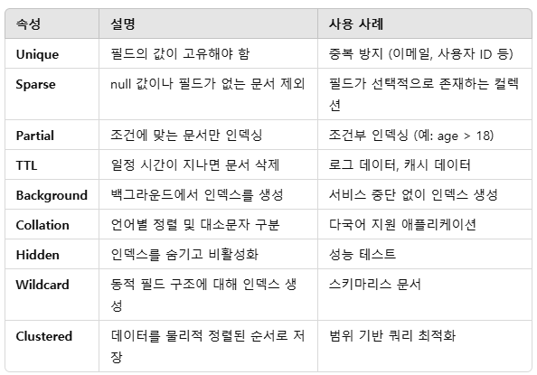

# MongoDB의 다양한 Index

## MongoDB의 Index 기본 구조와 효율적인 탐색

Index는 쿼리 성능을 최적화하기 위해 사용되는 데이터 구조입니다. 인덱스를 사용하면 특정 조건에 맞는 데이터를 빠르게 조회할 수 있으며, 이는 대량의 데이터를 검색하는 데 중요한 역할을 합니다.

MongoDB의 인덱스는 특정 필드의 값과 해당 문서의 위치를 기록한 데이터 구조입니다. 이를 통해 검색 시 전체 컬렉션을 스캔하는 Collection Scan 대신, 인덱스를 이용해 원하는 데이터를 빠르게 찾을 수 있습니다.

 - __장점__
    - 빠른 검색: 인덱스를 사용하면 데이터를 빠르게 검색할 수 있습니다.
    - 성능 최적화: 쿼리의 실행 시간을 단축하고, CPU 및 I/O 리소스를 절약합니다.
    - 정렬 속도 향상: 인덱스를 통해 데이터를 효율적으로 정렬할 수 있습니다.
    - 중복 방지: 고유 인덱스를 설정하여 중복 데이터를 방지할 수 있습니다.
 - __단점__
    - 저장 공간 사용: 인덱스는 추가 저장 공간을 차지합니다.
    - 쓰기 성능 저하: 데이터를 삽입, 수정, 삭제할 때 인덱스를 동시에 업데이트해야 하므로 쓰기 성능이 저하될 수 있습니다.
    - 인덱스 유지 비용: 불필요한 인덱스는 성능을 저하시키므로 필요한 인덱스만 유지해야 합니다.
```javascript
// 인덱스 확인
db.collection.getIndexes();

// 인덱스 삭제
db.collection.dropIndex("index_name");

// 모든 인덱스 삭제
db.collection.dropIndexes();

// 인덱스 생성
db.collection.createIndex({ fieldName: 1 });
```


### 인덱스 종류

<div align="center">
    
</div>
<br/>

 - `Single Field Index (단일 필드 인덱스)`
    - 하나의 필드에 대해 인덱스를 생성합니다.
    - 필드의 값을 기준으로 문서를 빠르게 검색합니다.
```javascript
db.collection.createIndex({ fieldName: 1 }); // 오름차순 인덱스
```

 - `Compound Index (복합 인덱스)`
    - 두 개 이상의 필드를 결합하여 인덱스를 생성합니다.
    - 쿼리 조건에 여러 필드가 포함되어 있을 때 사용됩니다.
```javascript
// field1은 오름차순, field2는 내림차순으로 정렬됩니다.
db.collection.createIndex({ field1: 1, field2: -1 });
```

 - `Multikey Index (다중 키 인덱스)`
    - 배열 필드에 인덱스를 생성할 때 사용됩니다.
    - 배열의 각 요소에 대해 인덱스를 생성합니다.
    - 하나의 필드에 두 개 이상의 Multikey Index를 설정할 수 없습니다.
```javascript
db.collection.createIndex({ tags: 1 }); // 배열 필드에 인덱스 생성
```

 - `Text Index (텍스트 인덱스)`
    - 문자열 데이터를 전체 텍스트 검색할 수 있도록 인덱스를 생성합니다.
    - text 인덱스는 텍스트 필드의 내용을 기반으로 검색합니다.
    - 하나의 컬렉션당 하나의 text 인덱스만 생성할 수 있습니다.
```javascript
db.collection.createIndex({ description: "text" });
```

 - `Geospatial Index (지리적 인덱스)`
    - 지리적 좌표 데이터를 저장하고 검색할 때 사용됩니다.
    - 2d Index: 평면 좌표계에서 사용.
    - 2dsphere Index: 지구와 같은 구형 좌표계에서 사용.
```javascript
db.collection.createIndex({ location: "2dsphere" });
```

 - `Hashed Index (해시 인덱스)`
    - 필드의 값을 해시(Hash)로 변환해 인덱스를 생성합니다.
    - 균등하게 분산된 값을 가진 필드에 사용됩니다.
```javascript
db.collection.createIndex({ fieldName: "hashed" });
```

 - `Unique Index (고유 인덱스)`
    - 필드의 값이 고유(unique)해야 함을 보장하는 인덱스입니다.
    - 중복된 값을 삽입할 수 없게 제한합니다.
```javascript
db.collection.createIndex({ email: 1 }, { unique: true });
```

### 인덱스의 다양한 속성

MongoDB의 Index에는 다양한 속성이 있으며, 이를 활용하면 인덱스의 동작과 제약 조건을 세부적으로 설정할 수 있습니다. 이 속성들은 쿼리 성능 최적화, 데이터 무결성 유지, 저장 공간 관리 등 다양한 용도로 사용됩니다.

 - `Unique Index (고유 인덱스)`
    - 인덱스가 설정된 필드에 중복된 값이 존재하지 않도록 보장합니다.
    - 유니크 제약 조건을 적용하면 중복 데이터 삽입 시 오류가 발생합니다.
    - 고유 인덱스는 데이터 무결성을 보장합니다.
    - 중복된 값을 허용하지 않습니다.
```javascript
db.collection.createIndex({ email: 1 }, { unique: true });
```

 - `Sparse Index (스파스 인덱스)`
    - null 값을 가지거나 필드가 존재하지 않는 문서는 인덱스에 포함하지 않습니다.
    - 필드가 선택적으로 존재하는 경우 유용합니다.
    - 인덱스의 크기를 줄일 수 있어 저장 공간이 절약됩니다.
    - 주의: Sparse Index는 존재하지 않는 필드를 기준으로 쿼리할 경우 주의가 필요합니다.
```javascript
db.collection.createIndex({ age: 1 }, { sparse: true });
```

 - `Partial Index (부분 인덱스)`
    - 인덱스 생성 시 조건을 지정하여 특정 조건에 맞는 문서만 인덱스에 포함합니다.
    - 불필요한 문서를 제외하여 인덱스 크기를 줄일 수 있습니다.
    - 조건에 맞는 문서만 인덱스에 포함되므로 저장 공간이 절약됩니다.
    - 조건을 만족하지 않는 문서는 인덱싱되지 않습니다.
```javascript
db.collection.createIndex(
  { age: 1 },
  { partialFilterExpression: { age: { $gt: 18 } } }
);
```

 - `TTL Index (Time-To-Live 인덱스)`
    - 문서를 일정 시간이 지나면 자동으로 삭제하는 만료 시간을 설정합니다.
    - 로그 데이터, 캐시 데이터 등 유효 기간이 있는 데이터를 다룰 때 유용합니다.
    - MongoDB의 백그라운드 작업으로 문서를 삭제합니다.
    - Date 타입 필드만 TTL 인덱스에 사용할 수 있습니다.
```javascript
db.collection.createIndex({ createdAt: 1 }, { expireAfterSeconds: 3600 });
```

 - `Background Indexing (백그라운드 인덱싱)`
    - 백그라운드에서 인덱스를 생성하여 데이터베이스의 쓰기 및 읽기 작업을 차단하지 않습니다.
    - 대규모 컬렉션에 인덱스를 생성할 때 유용합니다.
    - 백그라운드 인덱싱은 성능 저하를 최소화하지만, 작업이 더 오래 걸릴 수 있습니다.
    - MongoDB 4.2 이상에서는 인덱스 생성이 기본적으로 백그라운드에서 수행됩니다. 그전까지 해당 옵션을 설정하지 않으면 Index가 생서오딜 떄까지 Lock이 걸려서 Read/Write가 막혔다.
```javascript
db.collection.createIndex({ name: 1 }, { background: true });
```

 - `Collation (문자 정렬 인덱스)`
    - 문자 데이터를 언어별 정렬 순서와 대소문자 구분 여부를 지정하는 기능입니다.
    - 다국어 지원이 필요한 애플리케이션에 유용합니다.
    - 텍스트 데이터를 언어별로 정렬하고 비교할 수 있습니다.
```javascript
// locale: 언어 코드 (예: en - 영어, ko - 한국어).
// strength: 비교 강도 (1 - 대소문자 무시, 2 - 악센트와 대소문자 무시).
db.collection.createIndex(
  { name: 1 },
  { collation: { locale: "en", strength: 2 } }
);
```

 - `Hidden Index (숨겨진 인덱스)`
    - 인덱스를 삭제하지 않고 숨겨서 비활성화합니다.
    - 성능 테스트 시 인덱스의 영향을 평가하는 데 유용합니다.
    - 인덱스를 숨기면 쿼리 플래너가 해당 인덱스를 사용하지 않습니다.
    - 나중에 다시 활성화할 수 있습니다.
```javascript
db.collection.createIndex({ age: 1 }, { hidden: true });
```

 - `Wildcard Index (와일드카드 인덱스)`
    - 필드 이름이 동적으로 변하는 문서에 대해 동적 인덱스를 생성합니다.
    - 주로 동적 스키마 구조에서 사용됩니다.
    - 필드 이름을 미리 알 수 없는 경우 유용하지만, 인덱스 크기가 커질 수 있습니다.
```javascript
// $**는 모든 필드와 하위 필드를 인덱싱합니다.
db.collection.createIndex({ "$**": 1 });
```

