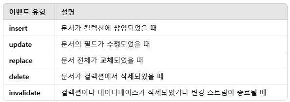

# Advanced Querying

## lookup

MongoDB의 __$lookup__ 은 Aggregation Framework에서 제공하는 조인(Join) 기능으로, 두 개의 컬렉션을 결합(조인)할 때 사용됩니다. 이는 관계형 데이터베이스(RDBMS)의 JOIN과 유사하지만, MongoDB는 NoSQL 데이터베이스이기 때문에 lookup을 통해 컬렉션 간의 관계를 설정하고 데이터를 함께 조회할 수 있습니다.

```javascript
/*
 * SELECT *, (
 *      SELECT ARRAY_AGG(*)
 *      FROM <collection to join>
 *      WHERE <foreignField> = <collection.localField>
 *      ) AS <output array field>
 * FROM collection;
 */
{
  $lookup: {
    from: "joinedCollection",       // 조인할 컬렉션 이름
    localField: "fieldInCurrent",   // 현재 컬렉션의 필드 (조인 키)
    foreignField: "fieldInJoined",  // 조인할 컬렉션의 필드 (조인 키)
    as: "outputField"               // 결과를 저장할 필드 이름 (배열 형태)
  }
}
```

 - `실습`
```javascript
// 예제 데이터 등록
db.restaurants.insertMany( [
   {
      _id: 1,
      name: "American Steak House",
      food: [ "filet", "sirloin" ],
      beverages: [ "beer", "wine" ]
   },
   {
      _id: 2,
      name: "Honest John Pizza",
      food: [ "cheese pizza", "pepperoni pizza" ],
      beverages: [ "soda" ]
   }
] )

db.orders.insertMany( [
   {
      _id: 1,
      item: "filet",
      restaurant_name: "American Steak House"
   },
   {
      _id: 2,
      item: "cheese pizza",
      restaurant_name: "Honest John Pizza",
      drink: "lemonade"
   },
   {
      _id: 3,
      item: "cheese pizza",
      restaurant_name: "Honest John Pizza",
      drink: "soda"
   }
] )

// restaurants 도큐먼트의 orders 필드가 배열 형태로 추가된다.
db.restaurants.aggregate([
    {
        $lookup: {
            from: "orders",
            localField: "name",
            foreignField: "restaurants_name",
            as: "orders"
        }
    }
])

// orders가 배열 형태였는데, $unwind로 분리
// restaurants * orders가 갯수만큼 도큐먼트가 조회
db.restaurants.aggregate([
    {
        $lookup: {
            from: "orders",
            localField: "name",
            foreignField: "restaurants_name",
            as: "orders"
        }
    }
    {
        $unwind: "$orders"
    }
])

// 상점의 판매 food, beverages에 주문 상품이 포함된 것 조회
db.restaurants.aggregate([
    {
        $lookup: {
            from: "orders",
            localField: "name",
            foreignField: "restaurants_name",
            as: "orders"
        }
    }
    {
        $unwind: "$orders"
    },
    {
        $match: {
            $expr: {
                $and: [
                    {$in: ["$orders.item", "$food"]},
                    {$in: ["$orders.drink", "$beverages"]},
                ]
            }
        }
    }
])

// 결과를 다시 그루핑
db.restaurants.aggregate([
    {
        $lookup: {
            from: "orders",
            localField: "name",
            foreignField: "restaurants_name",
            as: "orders"
        }
    }
    {
        $unwind: "$orders"
    },
    {
        $match: {
            $expr: {
                $and: [
                    {$in: ["$orders.item", "$food"]},
                    {$in: ["$orders.drink", "$beverages"]},
                ]
            }
        }
    },
    {
        $group: {
            _id: "$_id",
            name: {$first: "$name"},
            food: {$first: "$food"},
            beverages: {$first: "$beverages"},
            orders: {
                $push: "$orders"
            }
        }
    }
])

//
db.restaurants.aggregate([
    {
        $lookup: {
            from: "orders",
            let: {
                name_var: "$name",
                beverages_lst: "$beverages",
                food_list: "$food"
            },
            pipeline: [
                {
                    $match: {
                        $expr: {
                            $and: [
                                {
                                    $eq: [
                                    "$$name_var",
                                    "$restaurant_name"
                                    ]
                                },
                                {
                                    $in: [
                                        "$drink",
                                        "$$beveragees_lst"
                                    ]
                                },
                                {
                                    $in: [
                                        "$item",
                                        "$$food_lst"
                                    ]
                                }
                            ]
                        }
                    }
                }
            ],
            as: "orders"
        }
    }
])
```

## json 형태로 데이터 추출 및 삽입

 - https://www.mongodb.com/try/download/database-tools
    - mongoimport
    - mongoexport
```bash
# 사용법 조회
./mongoexport --help

# DB의 특정 컬렉션을 dump.json으로 덤프
./mongoexport --uri="{MONGO_HOST}" -u {USER_NAME} -d {DB_NAME} -c {COLLECTION_NAME} -o dump.json

# dump.json 파일 내용을 DB의 컬렉션으로 넣기
./mongoimport --uri="{MONGO_HOST}" -u {USER_NAME} -d {DB_NAME} -c {COLLECTION_NAME} dump.json
```

## 지역기반 Query

 - https://www.mongodb.com/ko-kr/docs/manual/geospatial-queries/
 - https://www.mongodb.com/ko-kr/docs/manual/reference/geojson

### GeoJson 객체

```javascript
// Point
{ type: "Point", coordinates: [ 40, 5 ] }

// LineString
{ type: "LineString", coordinates: [ [ 40, 5 ], [ 41, 6 ] ] }

// Polygon
{ type: "LineString", coordinates: [ [ 40, 5 ], [ 41, 6 ] ] }

{
  type : "Polygon",
  coordinates : [
     [ [ 0 , 0 ] , [ 3 , 6 ] , [ 6 , 1 ] , [ 0 , 0 ] ],
     [ [ 2 , 2 ] , [ 3 , 3 ] , [ 4 , 2 ] , [ 2 , 2 ] ]
  ]
}
```

### 지리공간 쿼리 연산자

 - $geoIntersects: GeoJSON 도형과 교차하는 도형을 선택합니다. 2dsphere 인덱스는 $geoIntersects를 지원합니다.
 - $geoWithin: 경계 GeoJSON 지오메트리 내의 지오메트리를 선택합니다. 2dsphere 및 2d 인덱스는 $geoWithin를 지원합니다.
 - $near: 점 근처에 있는 지리 공간적 객체를 반환합니다. 지리 공간적 공간 인덱스가 필요합니다. 2dsphere 및 2d 인덱스는 $near를 지원합니다.
 - $nearSphere: 구의 점에 근접한 지리 공간적 객체를 반환합니다. 지리 공간적 공간 인덱스가 필요합니다. 2dsphere 및 2d 인덱스는 $nearSphere를 지원합니다.
```javascript
// 다각형 교차
db.places.find(
   {
     loc: {
       $geoIntersects: {
          $geometry: {
             type: "Polygon" ,
             coordinates: [
               [ [ 0, 0 ], [ 3, 6 ], [ 6, 1 ], [ 0, 0 ] ]
             ]
          }
       }
     }
   }
)

// 다각형 내 존재하는 도큐먼트
db.places.find(
   {
     loc: {
       $geoWithin: {
          $geometry: {
             type : "Polygon" ,
             coordinates: [ [ [ 0, 0 ], [ 3, 6 ], [ 6, 1 ], [ 0, 0 ] ] ]
          }
       }
     }
   }
)

// 지정된 GeoJSON 지점에서 최소 1000 미터, 최대 5000미터 떨어진
// 문서를 가장 가까운 것부터 가장 먼것까지 정렬하여 반환
db.places.find(
   {
     location:
       { $near :
          {
            $geometry: { type: "Point",  coordinates: [ -73.9667, 40.78 ] },
            $minDistance: 1000,
            $maxDistance: 5000
          }
       }
   }
)
```

## Change Streams

Change Streams는 MongoDB에서 실시간 데이터 변경 사항을 감지하고 스트리밍할 수 있는 기능입니다. 이는 MongoDB 3.6부터 도입된 기능으로, 복제본 세트(Replica Set) 또는 샤딩된 클러스터(Sharded Cluster) 환경에서 작동하며, 컬렉션 또는 데이터베이스의 문서 변경 사항을 구독하고 실시간으로 처리할 수 있습니다.

 - https://www.mongodb.com/ko-kr/docs/manual/changeStreams/
 - Change Streams는 MongoDB에서 문서의 삽입(Insert), 수정(Update), 삭제(Delete) 같은 변경 이벤트를 실시간으로 스트리밍하는 기능입니다.
 - 데이터베이스에 발생한 변경 사항을 이벤트 기반으로 클라이언트에 전달합니다.

<div align="center">
    
</div>
<br/>

### Change Streams 동작 원리

 - Oplog 사용
    - MongoDB의 복제본 세트는 변경 사항을 __oplog (operation log)__ 에 기록합니다.
    - Change Streams는 이 oplog를 모니터링하고, 변경 사항을 이벤트 형태로 전달합니다.
 - 이벤트 필터링
    - Change Streams는 특정 컬렉션 또는 데이터베이스에서 발생하는 변경 사항만 필터링해서 구독할 수 있습니다.
 - 실시간 이벤트 제공
    - 클라이언트는 변경 사항을 실시간으로 구독하고 필요한 작업(예: 알림 전송, 캐시 업데이트 등)을 수행할 수 있습니다.

### Change Stream 사용 예시

 - `Change Stream 구독하기`
    - 컬렉션에 대한 변경 사항 감지
```javascript
const { MongoClient } = require('mongodb');

async function monitorCollection() {
  const uri = "mongodb://localhost:27017";
  const client = new MongoClient(uri);

  try {
    await client.connect();
    const db = client.db("testDB");
    const collection = db.collection("testCollection");

    // Change Stream 시작
    const changeStream = collection.watch();

    console.log("Change Stream 시작. 변경 사항을 모니터링 중...");
    changeStream.on("change", (change) => {
      console.log("변경 사항 감지:", change);
    });

  } catch (err) {
    console.error(err);
  }
}

monitorCollection();
```

 - `필터링된 Change Stream`
```javascript
const pipeline = [
  { $match: { "operationType": "insert" } } // 삽입 이벤트만 감지
];

const changeStream = collection.watch(pipeline);

changeStream.on("change", (change) => {
  console.log("삽입 이벤트 감지:", change);
});
```

 - `데이터베이스 수준의 Change Stream`
    - 데이터베이스 전체에 대한 변경 사항 감지
```javascript
const db = client.db("testDB");
const changeStream = db.watch();

changeStream.on("change", (change) => {
  console.log("데이터베이스 변경 사항 감지:", change);
});
```

 - `전체 클러스터 Change Stream`
    - MongoDB 4.0부터는 샤딩된 클러스터에서도 Change Streams를 사용할 수 있습니다.
```javascript
const changeStream = client.watch();

changeStream.on("change", (change) => {
  console.log("클러스터 변경 사항 감지:", change);
});
```
