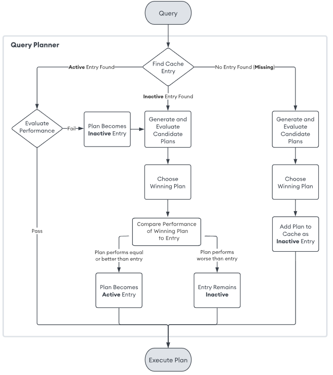

# Query 성능 분석

## Query Planner Logic

```
1. -> db.test.find({a:1}) -> 느린 응답
query -> disk -> cache -> return

2. -> db.test.find({a:1}) -> 빠른 응답
query -> cache -> return
```

<div align="center">
    
</div>
<br/>

## Query Plan 읽는 방법

 - `explain 메서드`
    - queryPlanner (기본값): 쿼리가 어떻게 실행될지에 대한 계획만 보여줌
    - executionStats: 실제 실행 결과와 통계를 포함
    - allPlansExecution: 모든 실행 계획과 통계를 보여줌
```javascript
db.collection.find({ field: "value" }).explain("executionStats");
```

### Query Plan의 주요 요소

 - `queryPlanner`
    - plannerVersion: 쿼리 플래너 버전
    - namespace: 쿼리가 실행된 컬렉션 이름
    - indexFilterSet: 인덱스 필터가 적용되었는지 여부
    - parsedQuery: MongoDB가 이해한 형태의 쿼리
    - winningPlan: 실행된 최종 쿼리 계획
    - rejectedPlans: 고려되었으나 사용되지 않은 다른 계획들
 - `winningPlan`
    - winningPlan은 MongoDB가 최적의 쿼리 계획으로 선택한 플랜
    - stage: 실행 단계(예: COLLSCAN, IXSCAN 등)
        - COLLSCAN: 컬렉션 전체 스캔
        - IXSCAN: 인덱스 스캔
        - FETCH: 데이터를 인덱스를 통해 가져옴
    - inputStage: 다음 단계로 데이터를 전달하는 이전 단계
```javascript
{
  "stage": "FETCH",
  "inputStage": {
    "stage": "IXSCAN",
    "keyPattern": { "field": 1 },
    "indexName": "field_1",
    "direction": "forward"
  }
}
```
 - `executionStats`
    - 쿼리가 실행된 결과와 통계
    - nReturned: 반환된 문서 수
    - executionTimeMillis: 쿼리 실행 시간(밀리초)
    - totalKeysExamined: 인덱스에서 검사한 키 수
    - totalDocsExamined: 검사한 문서 수
```javascript
{
  "executionTimeMillis": 5,
  "nReturned": 10,
  "totalKeysExamined": 10,
  "totalDocsExamined": 10
}
```

### Query Plan 예시

 - `예시 쿼리 플랜`
    - 인덱스 사용: IXSCAN 단계에서 age_1_city_1 복합 인덱스를 사용.
    - 효율성: totalKeysExamined(7) 대비 totalDocsExamined(5)가 적어 효율적으로 작동.
    - 최적화 필요 없음: 실행 시간이 짧고 반환된 결과도 기대치에 부합.
```javascript
// 쿼리 및 실행 계획
db.users.find({ age: { $gte: 30 }, city: "Seoul" }).explain("executionStats");

// 실행 계획 출력
{
  "queryPlanner": {
    "winningPlan": {
      "stage": "FETCH",
      "inputStage": {
        "stage": "IXSCAN",
        "keyPattern": { "age": 1, "city": 1 },
        "indexName": "age_1_city_1",
        "direction": "forward",
        "indexBounds": {
          "age": [ "[30, Infinity)" ],
          "city": [ "\"Seoul\"" ]
        }
      }
    }
  },
  "executionStats": {
    "executionTimeMillis": 3,
    "nReturned": 5,
    "totalKeysExamined": 7,
    "totalDocsExamined": 5
  }
}
```

## Query 성능 최적화 예시(Aggregation)

 - `Aggregation 예시`
    - $match
        - 특정 조건에 맞는 데이터를 필터링
        - MongoDB의 일반적인 쿼리 조건을 사용
    - $unwind
        - 배열 필드를 분해하여 여러 문서로 확장
        - 배열의 각 요소가 별도 문서로 변환
    - $lookup
        - 다른 컬렉션과 조인
        - from: 조인할 컬렉션
        - localField와 foreignField를 매핑
    - $project
        - 출력 필드를 지정하거나 새로운 필드를 생성
        - 필요 없는 필드는 제외
```javascript
// account에 대해서 symbol로 그룹핑
// 회사 거래별 누적 수량
// 그중에서 상위 3개
// msft에 대한 값만 추출
// customer 정보와 account 정보도 함께 출력
db.transactions.aggregate([
    // 1. transactions 배열을 분해하여 각 배열 요소를 개별 문서로 만든다.
    // 예를 들어, transactions 배열에 3개의 항목이 있다면, 문서가 3개로 늘어난다.
    {
        $unwind: "$transactions"
    },
    // 2. 각 계좌와 주식 심볼별로 현재 보유량 계산
    {
        $group: {
            // account_id와 transactions.symbol을 기준으로 그룹화
            _id: {
                account_id: "$account_id",
                symbol: "$transactions.symbol"
            },
            // currentHolding을 계산
            currentHolding: {
                // transactions.transaction_code가 "buy"인 경우, 거래량(amount)을 더함
                // "sell"인 경우, 거래량에 -1을 곱하여 더함
                $sum: {
                    $cond: [
                        {
                            $eq: [
                                "$transactions.transaction_code",
                                "buy"
                            ]
                        },
                        "$transactions.amount",
                        {
                            $multiply: [
                                "$transactions.amount",
                                -1
                            ]
                        }
                    ]
                }
            }
        }
    },
    // 3. msft에 대한 값만 추출
    // 그룹화된 결과에서 symbol이 "msft"인 문서만 필터링
    {
        $match: {
            "_id.symbol": "msft"
        }
    },
    // customer 정보와 account 정보도 함께 출력
    {
        $lookup: {
            // account_id를 기준으로 transactions와 accounts를 매핑
            from: "accounts",
            localField: "_id.account_id",
            foreignField: "account_id",
            as: "account_info",
            pipeline: [
                {
                    // accounts 컬렉션과 customers 컬렉션을 조인.
                    // 각 계좌에 연결된 고객 정보를 가져옴
                    // username만 선택
                    $lookup: {
                        from: "customers",
                        localField: "account_id",
                        foreignField: "accounts",
                        as: "customer_info",
                        pipeline: [
                            {
                                $project: {
                                    username: 1,
                                    _id: 0
                                }
                            }
                        ]
                    }
                },
                // $project: 계좌 ID(account_id)와 _id 제거
                {
                    $project: {
                        _id: 0,
                        account_id: 0
                    }
                },
                // $unwind: 배열로 반환된 customer_info를 분해
                {
                    $unwind: "$customer_info"
                }
            ]
        }
    },
    // 첫 번째 $lookup에서 생성된 account_info 배열을 분해
    // 각 계좌의 정보가 개별 문서로 확장
    {
        $unwind: "$account_info"
    },
    {
        $proejct: {
            _id: 0
            user: "$account_info.customer_info.username",
            account_id: "$_id.account_id",
            symbol: "$_id.symbol",
            currentHolding: 1,
            account_info: {
                limit: 1,
                products: 1
            }
        }
    },
    // currentHolding으로 정렬
    {
        $sort: {
            ccurentHolding: -1
        }
    },
    // 3개만 제한
    {
        $limit: 3
    }
])

// 아래 과정을 $lookup 전으로 이동하면 성능 향상 가능
// currentHolding으로 정렬
{
    $sort: {
        ccurentHolding: -1
    }
},
// 3개만 제한
{
    $limit: 3
}
```

## Query 성능 최적화 (Index Bound)

 - `예시 데이터 등록`
    - indexBounds란 인덱스 키 탐색 범위를 나타낸다.
    - 일반 필드는 상관없지만, 멀티 키 인덱스를 사용시 주의가 필요하다.
```javascript
db.survey.insertMany([
    {item: "ABC", ratings: [2, 9], category_id: 10},
    {item: "XYZ", ratings: [4, 3], category_id: 10},
    {item: "ABC", ratings: [9], category_id: 20},
    {item: "ABC", ratings: [9, 10], category_id: 30},
    {item: "ABC", ratings: [2, 4], category_id: 30},
])

for (var i = 0; i < 15; i++) {
    arr = []
    db.survey.find({}, { _id: 0 }).forEach(function (document) {
        arr.push(document);
    })
    db.survey.insertMany(arr)
}

db.survey.createIndex({category_id: 1})
db.survey.find({
    category_id: {
        $gt: 15,
        $lt: 25
    }
}).explain('executionStats')

db.survey.createIndex({ratings: 1})
// $elemMatch를 이용하지 않고, 단순 조회시
// 배열안에 각 요소별로 2가지 조건에 만족하지 않더라도,
// $gt 조건이 요소에 하나라도 맞고, $lt 조건이 요소에 하나라도 맞으면 조회된다.
// 즉, 3보다 작은 요소가 존재하고, 6보다 작은 요소가 존재하면 만족
db.survey.find({
    ratings: {
        $gt: 3,
        $lt: 6
    }
}).explain('executionStats')
```

 - `예시 쿼리`
```javascript
// $elemMatch를 이용하면 인덱스 바운드를 막을 수 있다.
// $elemMatch는 요소 중에 $gt, $lt 두 가지 조건을 모두 만족하는 요소가 하나라도 있으면 조회된다.
// 즉, 3보다 작고 6보다 작은 요소가  하나라도 존재하면 만족
db.survey.find({
    ratings: {
        $elemMatch: {
            $gt: 3,
            $lt: 6
        }
    }
}).explain('executionStats')

// 모든 요소가 3보다 크거나 같고, 6보다 작거야 같을 때 만족하는 경우
// indexBounds: { ratings: [ '[MinKey, 6]', '(inf.0, MaxKey] ' ] }
// 성능 개선이 필요
db.survey.find({
    // 6보다 크지 않고, 3보다 작지 않다.
    // 조건을 역으로 줘서 조회한다.
    $and: [
        {
            ratings: {
                $not: {
                    $lt: 3
                }
            }
        },
        {
            ratings: {
                $not: {
                    $gt: 6
                }
            }
        }
    ]
}).explain('executionStats')

// $elemMatch를 이용한 조건을 하나더 주어 쿼리 튜닝
db.survey.find({
    // 6보다 크지 않고, 3보다 작지 않다.
    $and: [
        {
            ratings: {
                $elemMatch: {
                    $gte: 3,
                    $lte: 6
                }
            }
        }
        {
            ratings: {
                $not: {
                    $lt: 3
                }
            }
        },
        {
            ratings: {
                $not: {
                    $gt: 6
                }
            }
        }
    ]
}).explain('executionStats')
```
