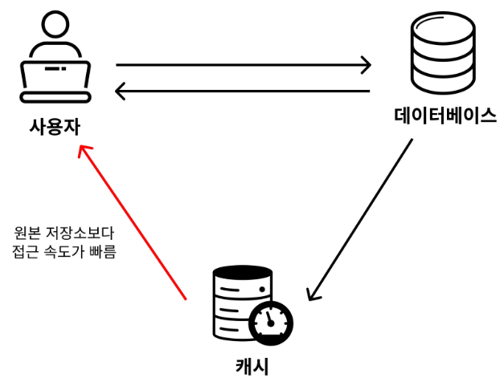
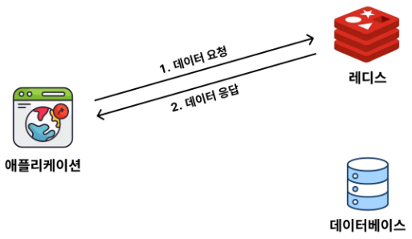
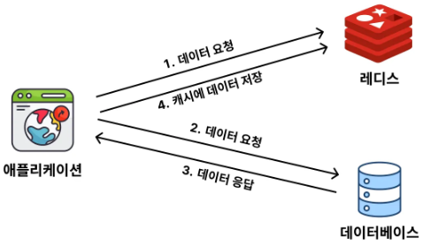
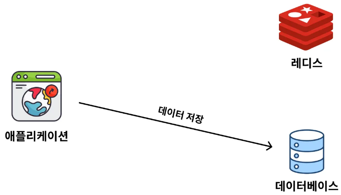

# Redis 캐싱 전략

## 1. 캐시(Cache), 캐싱(Caching) 이란?

 - __캐시(Cache)란, 원본 저장소보다 빠르게 가져올 수 있는 임시 데이터 저장소를 의미한다.__
 - __캐싱(Caching)이란, 캐시(Cache, 임시 데이터 저장소)에 접근해서 데이터를 빠르게 가져오는 방식을 의미한다.__

    

 

## 2. 데이터를 캐싱할 때 사용하는 전략(Cache Aside, Write Around)

레디스를 캐시로 쓸 때 어떤 방식으로 사용할 지 전략이 다양하다. 기본적으로 Cache Aside와 Write Around 전략이 가장 많이 사용되고 있다.

### 2-1. Cache Aside (= Look Aside, Lazy Loading) 전략

데이터를 조회할 때 주로 사용하는 전략이 Cache Aside 전략이다. Look Aside 전략 또는 Lazy Loading 전략이라고 부른다.  

 - __데이터가 캐시에 없을 때 데이터베이스에서 데이터를 가져와 캐시에 저장하는 방식__
    - 애플리케이션이 데이터를 요청할 때 캐시에서 먼저 데이터를 조회한다.
    - 캐시에 데이터가 없다면 데이터베이스에서 데이터를 가져와 캐시에 저장하고, 애플리케이션은 그 데이터를 반환한다.
    - 데이터가 변경되면 캐시의 데이터는 무효화하거나 직접 갱신해야 한다.

#### 캐시에 데이터가 있을 경우 (= Cache Hit)

 - 데이터를 요청했을 때 캐시에 데이터가 있는 경우 Cache Hit 라고 한다.

    

 

#### 캐시에 데이터가 없을 경우 (= Cache Miss)

 - 데이터를 요청했을 때 캐시에 데이터가 없는 경우 Cache Miss 라고 한다.

    

 

### 2-2. Write Around

Cache Aside 전략이 데이터를 어떻게 조회할 지에 대한 전략이었다면, Write Around 전략은 데이터를 어떻게 쓸 지(저장, 수정, 삭제)에 대한 전략이다. Write Around 전략은 Cache Aside 전략과 같이 자주 활용되는 전략이다.

 - Write Around 전략은 생각보다 너무 간단하다. 데이터를 저장할 때는 레디스에 저장하지 않고 데이터베이스에만 저장하는 방식이다. 그러다 데이터를 조회할 때 레디스에 데이터가 없으면 데이터베이스로부터 데이터를 조회해와서 레디스에 저장시켜주는 방식이다.
 - __Write Around 전략은 쓰기 작업(저장, 수정, 삭제)을 캐시에는 반영하지 않고, DB에만 반영하는 방식을 뜻한다.__

    

 

### 2-3. 다양한 캐싱 전략

 - __Cache Aside (Lazy Loading)__
    - 데이터가 캐시에 없을 때 데이터베이스에서 데이터를 가져와 캐시에 저장하는 방식
    - 장점: 필요한 경우에만 캐시를 사용하여 메모리를 효율적으로 관리할 수 있다.
    - 단점: 캐시 미스(cache miss) 시 초기 요청이 느려질 수 있다.
 - __Write Through__
    - 데이터를 데이터베이스와 캐시에 동시에 쓰는 방식
    - 장점: 항상 최신 데이터가 캐시에 유지되므로 일관성이 높다.
    - 단점: 데이터가 자주 쓰이거나 업데이트될 경우 캐시와 데이터베이스의 동시 업데이트로 인해 쓰기 성능이 낮아질 수 있다.
 - __Write Behind (Write Back)__
    - 캐시에 데이터를 먼저 저장하고, 일정 시간이 지나거나 캐시가 꽉 찰 때 데이터베이스로 데이터를 비동기적으로 기록하는 방식
    - 장점: 쓰기 성능이 매우 빠르다.
    - 단점: 캐시에만 존재하는 데이터가 손실될 위험이 있으며, 데이터베이스와의 일관성이 유지되지 않을 수 있다.
 - __Read Through__
    - 캐시에 데이터가 없을 경우 애플리케이션이 아닌 캐시가 데이터베이스에서 데이터를 가져오는 방식
    - 장점: 데이터베이스에 직접 접근하지 않고 캐시에서만 데이터를 조회할 수 있어 애플리케이션 코드가 단순해진다.
    - 단점: 캐시에 데이터가 없는 경우 초기 요청이 느려질 수 있다.
 - __Refresh Ahead__
    - 캐시가 만료되기 전에 Redis가 미리 데이터를 다시 캐시에 로드하는 방식
    - 장점: 캐시 미스가 줄어들어 조회 성능이 높아진다.
    - 단점: 자주 갱신되는 데이터의 경우 불필요한 캐시 갱신이 발생할 수 있다.

### 2-4. Redis 캐싱 전략 선택 시 고려 사항

 - __데이터 일관성__: 데이터베이스와 캐시의 동기화를 유지하는 것이 중요한 경우 Write Through나 Write Behind 전략을 고려할 수 있다.
 - __트래픽 패턴__: 읽기 트래픽이 많으면 Cache Aside나 Read Through가 적합하며, 쓰기 트래픽이 많으면 Write Behind가 적합하다.
 - __데이터 갱신 주기__: 자주 업데이트되는 데이터는 TTL이나 Refresh Ahead를 활용하여 최신성을 유지할 수 있다.

## 3. Cache Aside, Write Around 전략의 한계점 / 해결 방법

### 3-1. Cache Aside, Write Around 전략의 한계점

 - __캐시된 데이터와 DB 데이터가 일치하지 않을 수 있다.__
    - write Around 전략에 따르면 데이터를 수정할 때 DB만 업데이트를 시키기 때문에 기존에 저장된 레디스의 데이터 값과 db의 데이터 값은 다를 수 밖에 없다.
 - __캐시에 저장할 수 있는 공간이 비교적 작다.__
    - DB는 디스크(Disk)에 저장해서 많은 양을 저장하기 용이하지만, 캐시는 메모리(RAM)에 저장하기 때문에 DB에 비해 많은 양의 데이터를 저장할 수가 없다.

### 3-2. 해결 방법

 - __캐시된 데이터와 DB 데이터가 일치하지 않을 수 있다.__

캐시와 DB의 데이터를 일치시키기 위해, 데이터를 수정할 때마다 동시에 업데이트 시키면 성능적으로 느려진다. 그렇다고 성능 향상을 위해 DB의 데이터만 업데이트 시키면 캐시와 DB의 데이터가 일치하지 않게 된다.

하지만, 어쩔 수 없다. 어떤 선택을 하든 기회 비용(Trade Off)이 발생한다. 무언가를 얻으면 무언가를 포기해야 한다. 따라서 데이터 조회 성능 개선 목적으로 레디스를 쓰는 경우에는 데이터의 일관성을 포기하고 성능 향상을 택한 것이다.

이러한 이유로 이해 캐시를 적용시키기 위해 적절한 데이터는 아래와 같다.

 - 자주 조회되는 데이터
 - 잘 변하지 않는 데이터
 - 실시간으로 정확하게 일치하지 않아도 되는 데이터

장기간 데이터가 일치하지 않는 건 문제가 될 수 있다. 따라서, 적절한 주기로 데이터를 동기화 시켜주어야 한다. 이때 활용하는 기능이 레디스의 TTL 기능(만료 시간 설정)이다.

일정 시간이 지나면 데이터가 캐시에서 삭제된다. 그럼 특정 사용자가 조회하는 순간 Cache Miss가 발생하며, DB의 데이터를 새로 조회해서 캐시에 데이터를 넣게 된다.

 - __캐시에 저장할 수 있는 공간이 비교적 작다.__

TTL 기능(만료 시간 설정)을 활용하면 캐시의 공간을 효율적으로 쓸 수 있다. 자주 조회하지 않는 데이터는 만료 시간에 의해 데이터가 삭제된다.

## 4. 캐싱으로 조회 성능 개선을 하기 전 SQL 튜닝을 먼저해야 한다.

### 4-1. 데이터 조회 성능을 개선하는 방법

 - SQL 튜닝
 - 캐싱 서버 활용 (Redis 등)
 - 레플리케이션 (Master/Slave 구조)
 - 샤딩
 - DB 스케일 업(CPU, Memory, SSD 등 하드웨어 업그레이드)

### 4-2. 많은 성능 개선 방법 중 SQL 튜닝을 먼저 고려해야 하는 이유

 - SQL 튜닝을 제외한 나머지 방법은 추가적인 시스템을 구축해야 한다. 따라서 금전적, 시간적 비용이 추가적으로 발생한다. 또한 조금 더 복잡해진 시스템 구조로 인해 관리 비용이 늘어난다. 그에 비해 SQL 튜닝은 기존의 시스템 변경 없이 성능을 개선할 수 있다.
 - 근본적인 문제를 해결하는 방법이 SQL 튜닝일 가능성이 높다. SQL 자체가 비효율적으로 작성됐다면 아무리 시스템적으로 성능을 개선한다고 하더라도 한계가 있다. 하지만, SQL 튜닝을 통해 기본적으로 성능을 향상시킨다면, 시스템적인 성능 개선이 필요없거나 훨씬 간단한 개선으로 큰 성능 개선 효과를 얻을 수 있다.
