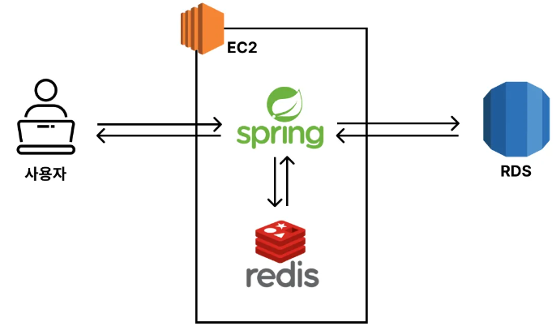

# AWS EC2에서 Redis 활용하기

## 1. AWS 비용

 - __EC2 비용__
    - EC2 인스턴스 (t3a.small) : 시간당 0.026 USD (24시간당 약 800원)
    - 데이터 전송 비용 : 1 GB당 0.1368 USD (1GB당 약 200원)
    - Public IPv4 비용 : 시간당 0.005 USD (24시간당 약 200원)
 - __RDS__
    - RDS 인스턴스 (t3.micro) : 시간당 0.026 USD (24시간당 약 800원)
    - 스토리지 비용 : GB-월당 0.131 USD (20GB-24시간당 약 200원)
    - Public IPv4 비용 : 시간당 0.005 USD (24시간당 약 200원)
 - __ElasitCache__
    - 캐시 (cache.t3micro) : 시간당 0.025 USD (24시간당 약 800원)
 - __비용 확인__
    - 결제 대시보드 > 청구서 > 서비스별 요금

## 2. Spring Boot를 활용한 아키텍처 구성

<div align="center">
    
</div>
<br/>

## 3. AWS 설정

### 3-1. EC2, RDS 생성 및 설정

```
1. EC2 생성하기
 - EC2 Ubuntu OS, t3a.small 인스턴스 생성
 - VPC는 기존 설정으로 사용하고, 보안 그룹 생성(8080 TCP)

2. RDS 생성하기
 - MySQL 프리미터
 - 퍼블릭 엑세스 허용
 - 추가 구성 -> 초기 데이터베이스 이름 설정
 - 보안 그룹 -> 3306 포트 허용
```

### 3-2. EC2에 Spring Boot 프로젝트 올리기

 - EC2 라이브러리 설치
```bash
# Redis 설치
$ sudo apt update
$ sudo apt install redis

# JDK 설치
$ sudo apt install openjdk-17-jdk
$ java -version
```

 - application.yml에 운영 환경 정보 추가
```yml
# local 환경
spring:
  profiles:
    default: local
  datasource:
    url: jdbc:mysql://localhost:3306/mydb
    username: root
    password: password
    driver-class-name: com.mysql.cj.jdbc.Driver
  jpa:
    hibernate:
      ddl-auto: update
    show-sql: true
  data:
    redis:
      host: localhost
      port: 6379

logging:
  level:
    org.springframework.cache: trace 

---
# prod 환경
spring:
  config:
    activate:
      on-profile: prod
  datasource:
    url: jdbc:mysql://{rds 주소}:3306/mydb
    username: admin
    password: password
```

 - EC2로 프로젝트 실행
```bash
# Github에 코드가 존재하는 경우 클론
$ git clone {Github Repository 주소}
$ cd {프로젝트 경로}

# 서버 실행시키기
$ ./gradlew clean build -x test 
$ cd build/libs
$ java -jar -Dspring.profiles.active=prod {빌드된 jar 파일명}
```
