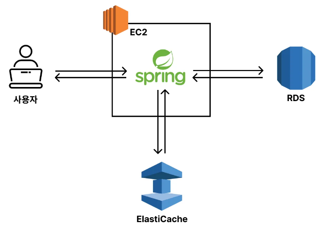
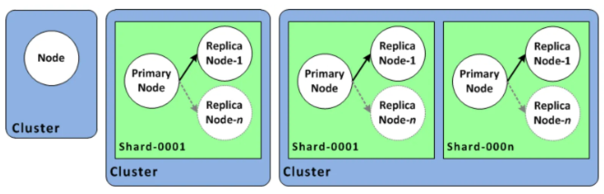

# AWS ElastiCache 활용하기

## 1. AWS ElastiCache

AWS ElastiCache는 AWS에서 제공하는 관리형 인메모리 캐싱 서비스로, 데이터베이스의 성능을 개선하고 애플리케이션의 응답 시간을 줄이는 데 사용된다.

일일이 Redis를 설치하고 셋팅하고 관리하면서 확장까지 하려면 신경쓸 게 생각보다 많다. 하지만 ElastiCache를 사용하면 셋팅도 쉽게할 수 있고, 확장도 쉽게 할 수 있고, 기본적인 모니터링 기능도 제공해주고, 장애가 날 가능성도 훨씬 적다.

 - Redis와 Memcached라는 두 가지 오픈 소스 인메모리 데이터 스토어 엔진을 지원
    - __Redis__: 복잡한 데이터 구조(리스트, 세트, 해시 등)를 저장하고 Pub/Sub 기능을 제공하는 고급 인메모리 데이터 저장소로 데이터의 지속성과 복제 기능을 지원한다.
    - __Memcached__: 간단한 키-값 캐시로, 메모리 효율이 좋고 단순한 구조의 데이터를 캐싱하는 데 적합하다.
 - __고속의 데이터 접근__: 데이터가 메모리에 저장되기 때문에 매우 빠르게 접근할 수 있으며, 이는 I/O를 수반하는 디스크 기반 데이터베이스와 비교하여 속도가 월등히 빠르다.
 - __관리형 서비스__: AWS에서 자동으로 클러스터와 노드의 설정, 소프트웨어 패치, 백업 등을 관리해 주어 운영 부담을 줄여준다.
 - __확장성__: 노드를 수평적으로 확장하거나, Redis의 샤딩 기능을 이용하여 수백 기가바이트에 이르는 데이터 세트를 분산하여 처리할 수 있다.
 - __고가용성__: Redis 클러스터는 다중 AZ 배포 및 자동 장애 조치를 지원하여 가용성을 높일 수 있다. 또한, Redis 복제를 통해 장애 발생 시 데이터를 보호할 수 있다.

## 2. 아키텍처 구성

<div align="center">
    
</div>
<br/>

## 3. AWS ElastiCache 세팅하기

 - `ElastiCache 생성하기`
    - 클러스터란 여러 캐시 서버를 이루는 한 단위의 그룹이다. 하나의 캐시 서버를 노드라고 얘기한다.
    - 다중 AZ(Multi AZ)는 여러 Region에 캐시 서버를 나눠서 셋팅해두는 것이다. 특정 Region에서 재난이 발생해 서비스가 중단될 수도 있는 걸 방지하는 기능이다. 하지만 재난이 발생할 가능성은 아주 적은데 비해서 비용은 추가로 발생하기 때문에, 재난으로 인해 서비스가 중단되는 게 치명적인 경우가 아니면 사용하지 말자.
    - 자동 장애 조치(Failover)는 클러스터 내부에 특정 노드(Node)가 장애가 났을 때 정상 노드(Node)로 교체하는 기능이다. 쉽게 얘기해서 내부에 장애가 일어나면 스스로 고치는 기능이다. (복제본이 0개이면 failover 처리가 되지 않는다.)
    - ElastiCache는 노드당 가격을 먹인다. 즉, 복제본의 수가 늘어날 수록 비용이 늘어난다.
```
1. 지금 시작 > Redis OSS
 - 구성
    - 배포 옵션: 자체 캐시 설계
    - 생성 방법: 클러스터 캐시
 - 클러스터 모드
    - 비활성화
 - 클러스터 정보
    - 이름: instagram-cache-server
    - 설명:
 - 위치
    - 위치: AWS 클라우드
    - 다중 AZ: 사용 체크 해제
    - 자동 장애 조치: 사용 체크
 - 클러스터 설정
    - 엔진 버전: 7.1
    - 포트: 6379
    - 노드 유형: t3.micro
    - 복제본 개수: 0
 - 연결
    - 네트워크 유형: IPv4
    - 서브넷 그룹: 새 서브넷 그룹 생성
    - 이름: instagram-subnet-group
    - VPC ID: 기본 VPC
 - 보안 그룹
    - EC2에서 미리 보안 그룹을 생성한다.
        - 보안 그룹 이름: redis-cache-server-security-group
        - 인바운드 규칙: 6379에 모든 IP
 - 백업
    - 미체크
```

<div align="center">
    
</div>
<br/>

## 4. EC2에서 ElastiCache 접속하기

```bash
redis-cli -h {ElasticCache 호스트 주소}
```

## 5. Spring Boot에 ElastiCache 연결하기

 - `application.yml`
```yml
# local 환경
..

---
# prod 환경
spring:
  config:
    activate:
      on-profile: prod
  datasource:
    url: jdbc:mysql://{rds 주소}:3306/mydb
    username: admin
    password: password
  data:
    redis:
      host: {elasti cache 주소}
      port: 6379
```
